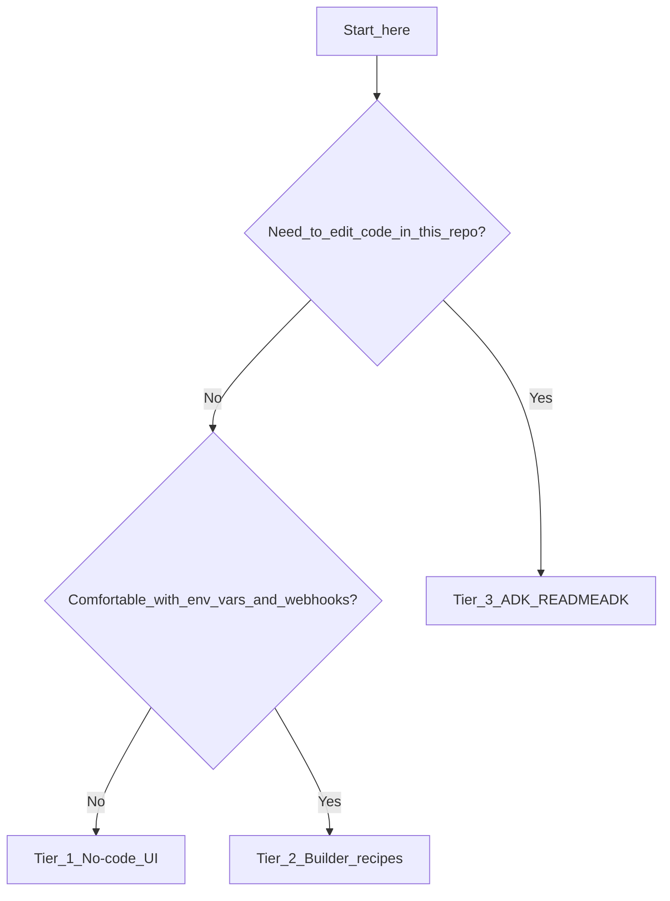

# READMEEXPERIENCE — Three paths, one platform

**FulliO / fork positioning:** one stack, **three on-ramps**—beautified **no-code** for operators, **minimal-code** recipes for technical founders and agencies, and a full **agentic dev kit** for engineers and IDE agents. Strategy detail: [READMEPLANNING.md](READMEPLANNING.md) §8. Tracked work: epic **DX-01** in [READMEPLANTOEXECUTE.md](READMEPLANTOEXECUTE.md).

**Navigation:** full doc index → [DOCS.md](DOCS.md).

---

## Masterful quality bar (what “beautified” means)

These are **targets** for product and docs; track gaps in **DX-01** packages in [READMEPLANTOEXECUTE.md](READMEPLANTOEXECUTE.md).

| Tier | Experience | Content and trust |
|------|------------|-------------------|
| **No-code** | One obvious next step after login; errors are **what to fix**, not stack traces | Templates and copy feel **industry-aware** ([READMEPLANNING.md](READMEPLANNING.md) §6); Web Call works before PSTN |
| **Builder** | Every external integration is a **recipe** with copy fields, not a PDF appendix | OpenAPI is the contract; [recipes/](recipes/) stay in sync with real routes |
| **ADK** | **[READMEADK.md](READMEADK.md)** is complete enough that an IDE agent needs **no** tribal knowledge | Regenerate clients after API changes; MCP and REST documented together |

**Accessibility:** Tier 1 should remain usable with keyboard and screen readers as the editor shell improves (**WE-01-A11Y**).

---

## Pick your path (about one minute)

| Persona | You want… | Start here | Primary execution ID |
|---------|-----------|------------|----------------------|
| **Operator, IC, non-dev founder** | Templates, Web test, publish—**no JSON** | [§ No-code journey](#no-code-journey-first-successful-web-call) | `DX-01-NOCODE` |
| **Technical founder, agency, “glue” engineer** | Env vars, webhooks, embed, `curl`—**minimal code** | [§ Builder journey](#builder-journey-minimal-code) + OpenAPI | `DX-01-BUILDER` |
| **Product engineer, automation, coding agent** | REST, WebSockets, **MCP**, fork changes, CI | [READMEADK.md](READMEADK.md) | `DX-01-ADK` |

You can **move up** tiers anytime (same org, same workflows)—the diagram in READMEPLANNING §8 shows “graduate” from no-code toward ADK.

### Which tier am I? (decision flow)

- **Tier 1:** stay in the dashboard; ignore OpenAPI until you are curious.
- **Tier 2:** use [recipes/](recipes/) and `{BACKEND}/api/v1/openapi.json`—still no fork required.
- **Tier 3:** clone the fork, MCP, CI — [READMEADK.md](READMEADK.md).

### When to move up a tier

| Situation | Move to |
|-----------|---------|
| UI validation blocks you and you need raw workflow JSON | Tier 3 or **WE-01-DUALMODE** (form + raw tabs) |
| You need scripted deploys, Terraform, or custom middleware | Tier 3 |
| Embed + one phone number is enough | Stay Tier 2 — [recipes/embed-widget.md](recipes/embed-widget.md), [recipes/inbound-pstn.md](recipes/inbound-pstn.md) |
| You only need Web Call demos for stakeholders | Tier 1 |

### Short FAQ

- **Do I need the repo for Tier 1?** No on a hosted product; yes for self-host ([READMEBUILDME.md](READMEBUILDME.md)).
- **Is Tier 2 “low code” or “no code”?** You may never open Python—only HTTPS, env vars, and copy-paste from [recipes/](recipes/).
- **Where is MCP?** Tier 3 — `{BACKEND}/api/v1/mcp` ([READMELEARNME.md](READMELEARNME.md) §10).

---

## No-code journey (first successful Web call)

**Masterful bar:** calm UI, plain-language errors, template-first when [marketplace](READMEPLANNING.md) ships; you never need the repo for day-one value on a hosted product.

1. **Run** the stack or open your hosted dashboard ([READMEBUILDME.md](READMEBUILDME.md) §2–4).
2. **Sign up** — org and user created ([api/routes/auth.py](api/routes/auth.py)).
3. **Create a workflow** — name, use case, or start from a template when available ([READMEPLANNING.md](READMEPLANNING.md) §6, epic **MK-01**).
4. **Connect credentials** in the UI (LLM/STT/TTS/telephony BYOK as needed).
5. **Open Web Call** from the workflow — confirm two-way audio ([READMELEARNME.md](READMELEARNME.md) §4).
6. **Fix** any validation messages in the editor until publish is allowed.
7. **Publish**, then share **embed** or **phone** flows when ready ([api/routes/workflow_embed.py](api/routes/workflow_embed.py), telephony routes in [READMELEARNME.md](READMELEARNME.md)).

**Roadmap polish:** marketplace browse (**MK-01-BROWSE**), editor shell (**WE-01-SHELL**), dual form/raw mode (**WE-01-DUALMODE**).

---

## Builder journey (minimal code)

**Masterful bar:** every integration is a **recipe** with copy-paste env vars, one webhook URL, and a **single** OpenAPI tag to read—not a fifty-page PDF.

1. Complete **steps 1–2** of the no-code path (account + org).
2. Note your **workflow id** from the URL (`/workflow/{id}`) or from the list API (see [READMEADK.md](READMEADK.md) `GET /api/v1/workflow/fetch`).
3. Export **`BACKEND`** (public API base) and obtain a **JWT** (login) or use org API keys per [READMEBUILDME.md](READMEBUILDME.md).
4. Hit **OpenAPI**: `{BACKEND}/api/v1/openapi.json` — import into Postman or Insomnia.
5. **Embed:** create an embed token in the UI; use the script from [api/routes/workflow_embed.py](api/routes/workflow_embed.py) responses ([READMELEARNME.md](READMELEARNME.md) §13).
6. **PSTN:** point your carrier webhook to `/api/v1/telephony/...` paths documented in [READMELEARNME.md](READMELEARNME.md) §4 and [READMEBUILDME.md](READMEBUILDME.md) API index.
7. **Iterate** with campaigns, tools, and KB without cloning Pipecat—until you need Tier 3.

**Starter recipes (builder tier):**

- [recipes/embed-widget.md](recipes/embed-widget.md) — site widget + embed token  
- [recipes/inbound-pstn.md](recipes/inbound-pstn.md) — inbound PSTN webhook pattern  
- [recipes/outbound-campaign.md](recipes/outbound-campaign.md) — campaigns overview  
- Index: [recipes/README.md](recipes/README.md)

---

## ADK journey (IDE + API + MCP)

**Masterful bar:** one file (**READMEADK.md**) lists every surface; coding agents can drive the platform from OpenAPI + MCP without guesswork.

1. **Clone** your fork; follow [READMEBUILDME.md](READMEBUILDME.md) split-stack dev.
2. Keep **[READMEADK.md](READMEADK.md)** open: health, **`{BACKEND}/api/v1/openapi.json`**, auth, **MCP + REST copy-paste** (same file), and example `curl`.
3. Run **`npm run generate-client`** in [ui/](ui/) after any backend route change (see [ui/AGENTS.md](ui/AGENTS.md)).
4. Use **`{BACKEND}/api/v1/mcp`** for agentic tool flows — **READMEADK.md** (MCP Python) + [READMELEARNME.md](READMELEARNME.md) §10.
5. Point **Cursor / Copilot** at [AGENTS.md](AGENTS.md) + OpenAPI JSON.
6. **Pull upstream** on dedicated branches ([READMEBUILDME.md](READMEBUILDME.md) §6) before large feature work.
7. **Ship** and log **DX-01** / **WE-01** / **MK-01** IDs in [READMENEWRELEASES.md](READMENEWRELEASES.md).

---

## Related docs

| Doc | Role |
|-----|------|
| [READMEPLANNING.md](READMEPLANNING.md) §6 | Vertical catalog, marketplace |
| [READMEPLANTOEXECUTE.md](READMEPLANTOEXECUTE.md) | Epics **MK-01**, **WE-01**, **DX-01** |
| [READMELEARNME.md](READMELEARNME.md) | Architecture |
| [READMEBUILDME.md](READMEBUILDME.md) | Ops, env, upstream |
