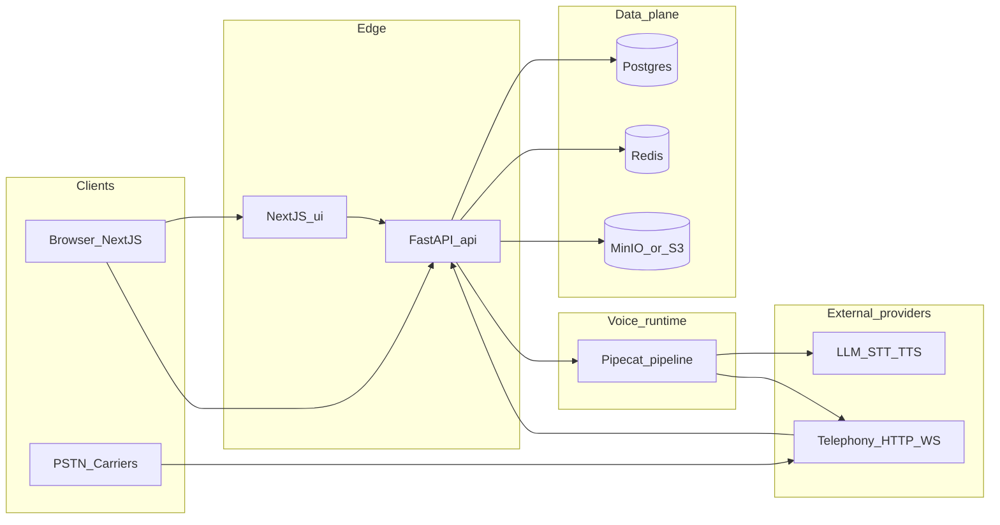
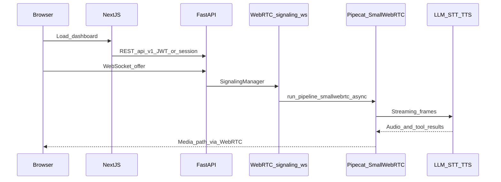

# READMELEARNME — Learn the platform end to end

This document teaches how the **Dograh**-style open voice AI platform in this repository is structured: how HTTP and WebSocket traffic flows, how **Pipecat** runs a call, how data is modeled in **PostgreSQL**, and where to extend behavior. It complements [READMEBUILDME.md](READMEBUILDME.md) (operations and fork hygiene).

**For GTM and marketplace positioning:** the same architecture supports **ready-to-bake** business voice—cloneable workflows per vertical, embeddable agents, and PSTN/WebRTC in one system. Read the **industry × use case catalog** and differentiation narrative in [READMEPLANNING.md](READMEPLANNING.md) §6; ship vertical packs via epic **MK-01** in [READMEPLANTOEXECUTE.md](READMEPLANTOEXECUTE.md).

**Current codebase** facts are grounded in file paths below. **Roadmap** notes are explicitly labeled.

---

## Table of contents

1. [Mental model in one diagram](#1-mental-model-in-one-diagram)
2. [Repositories and responsibilities](#2-repositories-and-responsibilities)
3. [HTTP API surface](#3-http-api-surface)
4. [Call lifecycles](#4-call-lifecycles)
5. [Pipecat and the voice pipeline](#5-pipecat-and-the-voice-pipeline)
6. [Domain model (database)](#6-domain-model-database)
7. [Authentication](#7-authentication)
8. [Background jobs and Redis](#8-background-jobs-and-redis)
9. [UI application](#9-ui-application)
10. [MCP server mount](#10-mcp-server-mount)
11. [Testing and evals](#11-testing-and-evals)
12. [Rebuild from scratch (ordered outline)](#12-rebuild-from-scratch-ordered-outline)
13. [Templates, verticals, and marketplace hooks](#13-templates-verticals-and-marketplace-hooks)

---

## 1. Mental model in one diagram

### 1.1 Deployment context

### 1.2 Single Web call (simplified)

---

## 2. Repositories and responsibilities

| Component | Path | Role |
|-----------|------|------|
| Backend | [api/](api/) | FastAPI app in [api/app.py](api/app.py); routes in [api/routes/](api/routes/); services in [api/services/](api/services/) |
| Frontend | [ui/](ui/) | Next.js App Router under [ui/src/app/](ui/src/app/) |
| Pipecat fork | [pipecat/](pipecat/) | Git submodule ([.gitmodules](.gitmodules)); installed editable per [scripts/setup_pipecat.sh](scripts/setup_pipecat.sh) |
| Migrations | [api/alembic/](api/alembic/) | Schema evolution |
| Docs site | [docs/](docs/) | Mintlify; published at [docs.dograh.com](https://docs.dograh.com) |

API version prefix: **`/api/v1`** ([api/app.py](api/app.py) `API_PREFIX`). OpenAPI JSON: `/api/v1/openapi.json`.

---

## 3. HTTP API surface

Routers are aggregated in [api/routes/main.py](api/routes/main.py). Detailed prefix table: [READMEBUILDME.md](READMEBUILDME.md#api-router-index-current-codebase).

Notable transports:

- **REST + JSON** — workflows, campaigns, tools, org settings, auth.
- **WebSocket `/api/v1/ws/...`** — browser WebRTC signaling ([api/routes/webrtc_signaling.py](api/routes/webrtc_signaling.py)).
- **WebSocket `/api/v1/telephony/ws/{workflow_id}/{user_id}/{workflow_run_id}`** — telephony media stream ([api/routes/telephony.py](api/routes/telephony.py)); providers build this URL (example: [api/services/telephony/providers/telnyx_provider.py](api/services/telephony/providers/telnyx_provider.py)).

Health check: `GET /api/v1/health` returns version, `deployment_mode`, `auth_provider`, resolved backend endpoint ([api/routes/main.py](api/routes/main.py)).

---

## 4. Call lifecycles

### 4.1 WebRTC “Web call”

1. User authenticates; UI creates or selects a **workflow run** via REST (workflow domain in [api/routes/workflow.py](api/routes/workflow.py)).
2. Client opens signaling WebSocket under **`/api/v1/ws`** ([api/routes/webrtc_signaling.py](api/routes/webrtc_signaling.py)).
3. Server constructs `SmallWebRTCConnection`, negotiates SDP, registers optional feedback sender, then starts **`run_pipeline_smallwebrtc`** in a background task ([api/services/pipecat/run_pipeline.py](api/services/pipecat/run_pipeline.py)).
4. Pipecat consumes microphone audio, runs STT/LLM/TTS (and tools), emits audio back on the transport.

TURN: time-limited credentials from **`/api/v1/turn/...`** using `TURN_SECRET` / host configuration ([api/routes/turn_credentials.py](api/routes/turn_credentials.py)).

### 4.2 PSTN inbound or outbound

1. **Outbound**: REST `POST /api/v1/telephony/initiate-call` (and related) creates or uses a `workflow_run_id`, then provider APIs point audio to the **telephony WebSocket** path above.
2. **Inbound**: provider webhooks (Twilio TwiML, Vonage NCCO, etc.) hit routes under `/api/v1/telephony/...` ([api/routes/telephony.py](api/routes/telephony.py)); stream connects to the same Pipecat entrypoints as other modes once established.
3. Provider-specific parsers and factory: [api/services/telephony/](api/services/telephony/).

### 4.3 Campaign calls

[api/services/campaign/campaign_call_dispatcher.py](api/services/campaign/campaign_call_dispatcher.py) creates a `WorkflowRunModel` with merged `initial_context` (campaign id, phone numbers, provider name, retry metadata), then telephony initiates the dial. Concurrency and circuit breaking use Redis and configuration from [api/constants.py](api/constants.py) defaults.

---

## 5. Pipecat and the voice pipeline

### 5.1 Submodule relationship

The application imports **`pipecat`** from the submodule tree, not only PyPI. That allows Dograh to carry patches and extra processors. Setup: [scripts/setup_pipecat.sh](scripts/setup_pipecat.sh).

### 5.2 Entry points

[api/services/pipecat/run_pipeline.py](api/services/pipecat/run_pipeline.py) exposes transport-specific runners, for example:

- `run_pipeline_smallwebrtc` — browser WebRTC
- `run_pipeline_vonage` — Vonage raw PCM WebSocket
- Twilio-oriented paths inside the same module family
- `run_pipeline_ari` — Asterisk ARI when enabled

They converge on **`_run_pipeline`**, which builds processors (STT, LLM context, TTS), registers tools, and runs until disconnect.

### 5.3 Workflow engine and tools

- **Graph / node transitions / LLM function “transition” tools**: [api/services/workflow/pipecat_engine.py](api/services/workflow/pipecat_engine.py).
- **Custom tools (HTTP APIs, messages)**: [api/services/workflow/pipecat_engine_custom_tools.py](api/services/workflow/pipecat_engine_custom_tools.py) calling [api/services/workflow/tools/custom_tool.py](api/services/workflow/tools/custom_tool.py) (`execute_http_tool` uses `httpx`).

### 5.4 Tracing

If `ENABLE_TRACING` and Langfuse env vars are set, exporters are prepared at startup ([api/app.py](api/app.py) lifespan calling [api/services/pipecat/tracing_config.py](api/services/pipecat/tracing_config.py)). Org-level credentials sync across workers via `WorkerSyncManager` ([api/services/worker_sync/](api/services/worker_sync/)).

**Roadmap:** unify run-level DB `logs` with trace IDs for a single “open run in Langfuse” UX.

---

## 6. Domain model (database)

Core tables are declared in [api/db/models.py](api/db/models.py). Access patterns use async SQLAlchemy and repository-style clients under [api/db/](api/db/).

### 6.1 Identity and tenancy

- **`UserModel`** — `provider_id`, optional `email` / `password_hash` for OSS auth, `selected_organization_id`.
- **`OrganizationModel`** — quotas, pricing fields, link to users via `organization_users` association table.
- **`APIKeyModel`** — org-scoped hashed keys for programmatic access.

### 6.2 Workflow versioning

- **`WorkflowModel`** — name, status, `organization_id`, legacy `workflow_definition` JSON, `workflow_configurations`, pointer **`released_definition_id`** to the live published version.
- **`WorkflowDefinitionModel`** — versioned **`workflow_json`**, `workflow_configurations`, `template_context_variables`, status (`draft` / `published` / `archived`).
- **`WorkflowRunModel`** — one executed conversation or call:
  - **`mode`**: telephony vs WebRTC vs provider-specific ([api/enums.py](api/enums.py) `WorkflowRunMode`).
  - **`initial_context` / `gathered_context`**: inputs and extracted variables.
  - **`usage_info` / `cost_info`**: billing-related aggregates.
  - **`logs`**: structured logging payload (JSON).
  - **`recording_url` / `transcript_url`**: artifacts in object storage.

### 6.3 Tools, campaigns, integrations

- **Tools** — stored definitions referenced by workflows; execution path in Pipecat custom tool manager.
- **Campaigns** — outbound batch configuration; links to `WorkflowRunModel` via `campaign_id`.
- **Integrations** — Nango connection metadata ([api/services/integrations/nango.py](api/services/integrations/nango.py)).

### 6.4 Knowledge base

Routes in [api/routes/knowledge_base.py](api/routes/knowledge_base.py); processing tasks in [api/tasks/knowledge_base_processing.py](api/tasks/knowledge_base_processing.py).

### 6.5 Templates (database hook)

**`WorkflowTemplates`** — `template_name`, `template_json` ([api/db/models.py](api/db/models.py)). The workflow API uses [api/db/workflow_template_client.py](api/db/workflow_template_client.py) (`WorkflowTemplateClient` imported in [api/routes/workflow.py](api/routes/workflow.py)) for template-backed flows (e.g. creating workflows from stored template JSON).

**Roadmap:** public marketplace indexing, categories, paid packs, and cross-vendor import — see [READMEBUILDME.md](READMEBUILDME.md#10-template-marketplace-roadmap).

---

## 7. Authentication

### 7.1 Configuration flags

[api/constants.py](api/constants.py):

- **`AUTH_PROVIDER`** — default `local` (OSS email/password JWT). Other values integrate with hosted auth modes when deployed.
- **`DEPLOYMENT_MODE`** — default `oss`; influences service key APIs ([api/routes/service_keys.py](api/routes/service_keys.py)).

### 7.2 OSS JWT

[api/routes/auth.py](api/routes/auth.py): signup creates user, organization, optional managed platform config, returns **`OSS_JWT_SECRET`**-signed JWT. Subsequent REST calls use `Authorization: Bearer ...` via dependencies in [api/services/auth/depends.py](api/services/auth/depends.py).

### 7.3 Stack Auth (hosted UI)

The UI depends on `@stackframe/stack` ([ui/package.json](ui/package.json)) and uses `NEXT_PUBLIC_STACK_PROJECT_ID` and related routes ([ui/src/app/impersonate/route.ts](ui/src/app/impersonate/route.ts)). Exact split between Stack and OSS paths depends on deployment env — treat hosted Dograh vs pure OSS as **different front-door configs**.

**Roadmap (FulliO):** single table of which routes require which identity provider; automated tests for both modes.

---

## 8. Background jobs and Redis

- **ARQ** worker pool: [api/tasks/arq.py](api/tasks/arq.py); Redis URL from `REDIS_URL`.
- **Tasks**: campaign maintenance ([api/tasks/campaign_tasks.py](api/tasks/campaign_tasks.py)), S3 uploads ([api/tasks/s3_upload.py](api/tasks/s3_upload.py)), integrations ([api/tasks/run_integrations.py](api/tasks/run_integrations.py)), knowledge base ([api/tasks/knowledge_base_processing.py](api/tasks/knowledge_base_processing.py)).
- **Cross-worker pub/sub**: [api/services/worker_sync/](api/services/worker_sync/) for shared state invalidation.

---

## 9. UI application

Structure per [ui/AGENTS.md](ui/AGENTS.md):

| Need | Location |
|------|----------|
| Pages | [ui/src/app/](ui/src/app/) |
| Feature components | [ui/src/components/](ui/src/components/) |
| Workflow graph | [ui/src/components/flow/](ui/src/components/flow/) |
| Generated API types/client | [ui/src/client/](ui/src/client/) — regenerate with `npm run generate-client` |
| Auth guard for data fetching | Pattern in [ui/AGENTS.md](ui/AGENTS.md): wait for `useAuth()` before firing effects |

State: **Zustand** ([ui/package.json](ui/package.json)). Styling: **Tailwind** + **shadcn/ui**.

API base URL resolution: [ui/src/lib/apiClient.ts](ui/src/lib/apiClient.ts) (`BACKEND_URL` server-side, `NEXT_PUBLIC_BACKEND_URL` in browser).

Workflow editor **implementation roadmap** (layout parity, palette, in-editor test rail): [READMEPLANTOEXECUTE.md](READMEPLANTOEXECUTE.md) epic **WE-01**.

**Three experience tiers** (beautified no-code, minimal-code recipes, full ADK): [READMEPLANNING.md](READMEPLANNING.md) §8; developer quick links: [READMEADK.md](READMEADK.md).

---

## 10. MCP server mount

[api/app.py](api/app.py) mounts an MCP HTTP app at **`/api/v1/mcp`**. Comment in code: agents authenticate with the same **`X-API-Key`** header as REST. Implementation: [api/mcp/](api/mcp/).

**Roadmap:** document tool catalog and example clients beside Mintlify external docs.

---

## 11. Testing and evals

- **Backend tests**: [api/tests/](api/tests/) (pytest; see [api/conftest.py](api/conftest.py)).
- **STT evals**: [evals/stt/](evals/stt/) — batch experiments and reference JSON results.
- **Visualizer**: [evals/visualizer/](evals/visualizer/) — separate small frontend for eval outputs.

These are optional for product runtime but useful when you change Pipecat or STT wiring.

---

## 12. Rebuild from scratch (ordered outline)

If you had to re-implement a comparable system, this order minimizes rework:

1. **Postgres schema** — users, orgs, workflows, versioned definitions, runs, tools, campaigns, API keys; enable pgvector if you need RAG embeddings.
2. **Object storage** — S3-compatible bucket for recordings and transcripts; signed URL policy.
3. **Redis** — queues, rate limits, optional pub/sub for workers.
4. **FastAPI skeleton** — `/health`, config module, CORS, structured logging.
5. **Auth** — JWT or session; org selection; API keys hashed at rest.
6. **Workflow CRUD** — persist graph JSON; validate graph; publish/version definitions.
7. **Pipecat integration** — one transport first (e.g. WebRTC); stub STT/LLM/TTS providers; prove end-to-end audio loop.
8. **Tool execution** — HTTP tool executor with timeouts, redaction, and idempotency keys.
9. **Telephony** — one provider (e.g. Twilio): inbound webhook + outbound REST + media WebSocket bridging into the same pipeline.
10. **Campaign scheduler** — ARQ (or Celery) workers; concurrency limits; retries.
11. **Next.js dashboard** — list workflows, editor, run history; generate TS client from OpenAPI.
12. **Observability** — Sentry, metrics, optional Langfuse; correlate `workflow_run_id` everywhere.

This repository already implements steps 1–12; the outline helps you **map unfamiliar code** to a known blueprint and estimate effort for FulliO-specific layers (compliance, marketplace, call forensics UI).

---

## 13. Templates, verticals, and marketplace hooks

**Why this section exists:** engineers selling **business voice** need to see where **templates**, **clones**, and **distribution** attach in the code—not only where audio runs.

| Capability | Code / data anchor | Marketplace note |
|------------|-------------------|------------------|
| Versioned graph + config | `WorkflowDefinitionModel`, `WorkflowModel` ([api/db/models.py](api/db/models.py)) | Each marketplace SKU is a **published definition** + metadata row. |
| Named templates table | `WorkflowTemplates` ([api/db/models.py](api/db/models.py)) | Seed rows per vertical; **Gap:** public browse + install API. |
| Clone / create from template | [api/routes/workflow.py](api/routes/workflow.py) (`WorkflowTemplateClient`) | **Partial** — extend for “install pack” UX. |
| Embed on customer sites | [api/routes/workflow_embed.py](api/routes/workflow_embed.py) | **Shipped** path for “try our agent” distribution. |
| Web / PSTN runs | [§4 Call lifecycles](#4-call-lifecycles) | Templates should declare **supported modes** in metadata (roadmap). |
| MCP for tools | [api/app.py](api/app.py) `/api/v1/mcp` | **Differentiator** for “agent + tools” marketplace stories. |
| Campaigns | [api/routes/campaign.py](api/routes/campaign.py) | Outbound vertical packs (e.g. reminders) reuse same brain. |

**Roadmap:** align template metadata with the **vertical catalog** in [READMEPLANNING.md](READMEPLANNING.md) §6; track build-out in [READMEPLANTOEXECUTE.md](READMEPLANTOEXECUTE.md) **MK-01**.

---

## Further reading

- [DOCS.md](DOCS.md) — map of all fork documentation files.
- [READMEBUILDME.md](READMEBUILDME.md) — env vars, Docker, fork/sync, extension boundaries.
- [READMEPLANNING.md](READMEPLANNING.md) — strategy, vertical catalog (§6), pillars, experience tiers (§8).
- [READMEEXPERIENCE.md](READMEEXPERIENCE.md) — no-code / builder / ADK journeys.
- [READMEADK.md](READMEADK.md) — OpenAPI, MCP, auth, generated client for IDE work.
- [READMEPLANTOEXECUTE.md](READMEPLANTOEXECUTE.md), [READMENEWRELEASES.md](READMENEWRELEASES.md) — execution IDs and shipped work.
- [AGENTS.md](AGENTS.md), [api/AGENTS.md](api/AGENTS.md), [ui/AGENTS.md](ui/AGENTS.md) — short contributor maps.
- [https://docs.dograh.com](https://docs.dograh.com) — user-facing deployment and feature documentation.
