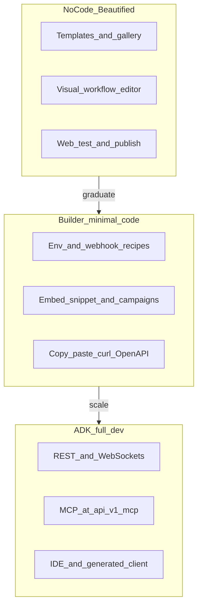

# READMEPLANNING — strategic product and architecture planning

This document is **roadmap and prioritization**, not a guarantee of delivery. When this file references the codebase, items are labeled **Shipped**, **Partial**, or **Gap** so we do not confuse aspiration with reality.

**Related docs**

- Operations, env, fork hygiene: [READMEBUILDME.md](READMEBUILDME.md)
- Architecture and lifecycles: [READMELEARNME.md](READMELEARNME.md)
- Contributor maps: [AGENTS.md](AGENTS.md), [api/AGENTS.md](api/AGENTS.md), [ui/AGENTS.md](ui/AGENTS.md)
- Agentic dev kit (OpenAPI, MCP, IDE): [READMEADK.md](READMEADK.md)
- Three paths (no-code / builder / ADK): [READMEEXPERIENCE.md](READMEEXPERIENCE.md)
- Documentation map (all root guides): [DOCS.md](DOCS.md)
- User-facing product docs: [https://docs.dograh.com](https://docs.dograh.com)

**From planning to execution (ongoing practice)**

- **Work packages and status:** [READMEPLANTOEXECUTE.md](READMEPLANTOEXECUTE.md) — turns themes below into epics (e.g. `WE-01-*`), acceptance criteria, and file-level pointers; update statuses there until shipped.
- **Shipped work log:** [READMENEWRELEASES.md](READMENEWRELEASES.md) — append when items close; links back to execution IDs.

When READMEPLANNING’s near/mid/long bullets become real work, add or extend the matching epic in READMEPLANTOEXECUTE so progress is traceable without rewriting this strategy file every week.

**Cadence:** do **not** promote every planning bullet into execution at once. Move **one slice** at a time into [READMEPLANTOEXECUTE.md](READMEPLANTOEXECUTE.md) (new or existing package ID), keep **WIP small** (see **Operating model** there), and pull **upstream** on dedicated branches per [READMEBUILDME.md](READMEBUILDME.md) §6.

**Audience:** FulliO (or fork) product and engineering leads setting priorities.

**How to read:** major sections end with **Near-term (0–3 mo)**, **Mid-term (3–12 mo)**, and **Long-term (12+ mo)** suggestions. Score competitive themes internally (e.g. 1–5) rather than treating this file as a static benchmark against moving competitors.

---

## Table of contents

1. [Competitive capability themes](#1-competitive-capability-themes)
2. [Pillar 1 — Customer-complete solution](#2-pillar-1--customer-complete-solution)
3. [Pillar 2 — Elite latency](#3-pillar-2--elite-latency)
4. [Pillar 3 — Cost and provider independence](#4-pillar-3--cost-and-provider-independence)
5. [Twenty strategic growth bets](#5-twenty-strategic-growth-bets)
6. [Marketplace and GTM — ready-to-bake business voice](#6-marketplace-and-gtm--ready-to-bake-business-voice)
7. [Risks, dependencies, sequencing](#7-risks-dependencies-sequencing)
8. [Three experience tiers — no-code, builder, agentic dev kit](#8-three-experience-tiers--no-code-builder-agentic-dev-kit)

---

## 1. Competitive capability themes

Mature conversational AI stacks (exemplars: **Vapi**-class voice APIs, **PolyAI**-style enterprise voice with vertical focus, **Cognigy**-class orchestration and governance) have converged on similar **theme rows**. Use this as a checklist your team scores periodically—not as copied marketing.

| Theme | What “great” looks like | Notes for this repo |
|-------|-------------------------|---------------------|
| **Authoring** | Visual flow, versioning, dev/stage/prod, templates, prompt variables, A/B or canary | **Partial:** workflow definitions and versioning exist ([api/db/models.py](api/db/models.py) `WorkflowDefinitionModel`, [api/routes/workflow.py](api/routes/workflow.py)). **Gap:** first-class env promotion, A/B at runtime. |
| **Runtime quality** | Barge-in, endpointing, fillers, multilingual, noise profiles, human handoff, warm transfer, voicemail handling | **Partial:** VAD and ambient config from workflow into Pipecat ([api/services/pipecat/run_pipeline.py](api/services/pipecat/run_pipeline.py)). **Gap:** productized “quality packs” per vertical. |
| **Omnichannel** | Voice + chat + SMS with one session/brain | **Gap:** mostly voice-centric today; expand deliberately. |
| **Integrations** | CRM, ticketing, calendars, DWH, signed webhooks, MCP | **Partial:** integrations route, Nango path ([api/services/integrations/nango.py](api/services/integrations/nango.py)). **Shipped:** MCP HTTP mount at `/api/v1/mcp` ([api/app.py](api/app.py)). |
| **Operations** | Per-call forensics, PII redaction, retention, RBAC, SSO, audit, quotas | **Partial:** org quotas, `WorkflowRunModel` JSON blobs ([api/db/models.py](api/db/models.py)). **Gap:** enterprise SSO, row-level security, redaction pipeline. |
| **GTM** | Marketplace, embeds, white-label, partner APIs | **Partial:** embed tokens under `/workflow` ([api/routes/workflow_embed.py](api/routes/workflow_embed.py)). **Gap:** marketplace distribution and payments. |

**Near-term:** pick 3–5 checklist rows to score; align roadmap to biggest revenue or retention lift.

**Mid-term:** publish an internal “parity vs differentiation” memo (what you will not copy, what you will lead on).

**Long-term:** two differentiated wedges (e.g. self-host + compliance, or latency + cost) documented in sales enablement.

---

## 2. Pillar 1 — Customer-complete solution

**Goal:** customers get **better outcomes** with **less expertise**—while power users retain **APIs and raw definitions** where they need them.

### Outcome-focused setup

- Guided flows by use case: sales qualification, tier-1 support, scheduling, order status. Each path ships **default graphs**, **recommended STT/TTS**, and **compliance nudges** (e.g. PCI: never train the model on PAN; use tokenized payment APIs only).
- Success metrics to instrument: **time-to-first-quality-call**, containment, repeat-contact resolution, escalation rate.

### Templates and verticals

- **Industry × modality matrix** (e.g. retail × voice FAQ, insurance × outbound campaign). Seed templates with copy, variables, and test scenarios. **Canonical catalog:** [§6 Marketplace and GTM](#6-marketplace-and-gtm--ready-to-bake-business-voice) (industry rows, buyer outcomes, integrations).
- **Storage anchor (current):** `WorkflowDefinitionModel`, `WorkflowTemplates` ([api/db/models.py](api/db/models.py)); template client usage in [api/routes/workflow.py](api/routes/workflow.py).
- **Gap:** import from other authoring tools (Claude projects, etc.), semver, changelog per template, and a **review pipeline** before publishing to marketplace. **Execution:** epic **MK-01** in [READMEPLANTOEXECUTE.md](READMEPLANTOEXECUTE.md).
- **Reality check (imports):** today’s **installable** units are **native** workflow graphs (`catalog/packaged-workflows/*.json`) plus `vertical-packs.json` metadata — not n8n/Make/Zapier/Claude-Skills bundles. Each external format implies a **dedicated adapter** (schema mapping, unsupported-node policy, credentials model). A “marketplace built from scraping MIT repos” is viable only as **curated** ports + legal review per asset, not lossless auto-import at scale. **Focused marketplace + import plan:** [READMEMARKETPLACEPLANNING.md](READMEMARKETPLACEPLANNING.md).

### Non-technical UX

- Progressive disclosure in the dashboard; **validate before publish** (graph, tools, credentials).
- LoopTalk-style testing: **Partial** — routes exist ([api/routes/looptalk.py](api/routes/looptalk.py), included from [api/routes/main.py](api/routes/main.py)); expand UX so every template ships with a default test persona.
- Safe defaults for VAD/STT in templates to reduce “robot felt slow / talked over me” tickets.

### Power users: dual-mode editing

- **Form / wizard** for tools, KB attachments, and workflow sections.
- **Raw tab** for JSON or YAML aligned with your OpenAPI-generated types ([ui/package.json](ui/package.json) `generate-client`) plus **schema validation** and **diff vs last published** definition.
- Implementation bias: keep one source of truth in the API; UI tabs are projections.

**Execution tracking:** package **WE-01-DUALMODE** in [READMEPLANTOEXECUTE.md](READMEPLANTOEXECUTE.md). **Experience tiers** (no-code vs builder vs full ADK): [§8](#8-three-experience-tiers--no-code-builder-agentic-dev-kit) and epic **DX-01**.

**Near-term:** template quality rubric + 5 vertical starter packs; publish/validate hardening in UI.

**Mid-term:** dual-mode editors for workflow JSON and tool definitions; golden test calls per template.

**Long-term:** partner-built template revenue share; certification program for third-party templates.

---

## 3. Pillar 2 — Elite latency

**Goal:** be **best in class** on latency where it is **technically meaningful**. Avoid misleading slogans: **sub-100 ms end-to-end voice** often collides with physics (codec frames, RTT, model inference). Credible commitments split into:

1. **Segment latency** — e.g. turn detection, intent router, cache hits, tool routing: target **under 100 ms** where feasible.
2. **Perceived conversational latency** — time from end-of-user-speech to first audible/agent motion: track **p50/p95** with explicit SLOs.
3. **Provider TTFB** — first LLM token / first TTS chunk: measure separately.

### Measurement

- Define pipeline stage timestamps (VAD end, STT final, LLM first token, TTS first byte, playout).
- **Partial:** Langfuse when `ENABLE_TRACING` ([api/constants.py](api/constants.py), [api/services/pipecat/tracing_config.py](api/services/pipecat/tracing_config.py)); extend toward **customer-visible** run timelines (see extension notes in [READMEBUILDME.md](READMEBUILDME.md)).

### Architecture levers

- Streaming STT/LLM/TTS end-to-end; avoid **serial** tool chains when a single batched tool or router model suffices.
- Connection reuse to providers; regional colocation of API + Redis + Postgres + TURN.
- **Smaller router model** for common branches; escalate only on low confidence.
- VAD and pipeline tuning from `workflow_configurations` ([api/services/pipecat/run_pipeline.py](api/services/pipecat/run_pipeline.py)).

### Infra

- Redis and DB proximity; hot-path query audit on run creation and webhooks.
- `FASTAPI_WORKERS` greater than 1: use **WorkerSyncManager** for shared config ([api/AGENTS.md](api/AGENTS.md)) so scaling workers does not regress latency via stale caches.
- WebRTC: ICE server selection, TURN only when needed ([api/routes/turn_credentials.py](api/routes/turn_credentials.py)).

**Near-term:** define SLOs and a dashboard; one “latency budget” doc per template.

**Mid-term:** router model + speculative TTS on high-probability branches; regional deployment playbook.

**Long-term:** edge inference for selected steps (see growth bets).

---

## 4. Pillar 3 — Cost and provider independence

**Goal:** reduce **$ / minute** and **vendor lock-in** without destroying quality.

### Tiered models

- Default path: **small/fast** model for majority of turns; **large** model for compliance-sensitive or low-confidence states.
- Explicit **escalation** nodes in the workflow graph (product pattern, not only a technical toggle).

### Self-hosted and custom-hosted inference

- Targets: **Ollama**, **vLLM**, **llama.cpp**, **TensorRT-LLM**, hosted OpenAI-compatible endpoints.
- **Integration approach:** OpenAI-compatible base URLs in org/user config where the stack already resolves LLM calls; deeper path: custom Pipecat processors in the **[pipecat/](pipecat/)** submodule ([.gitmodules](.gitmodules), [scripts/setup_pipecat.sh](scripts/setup_pipecat.sh)).
- **Gap:** first-class docs and QA matrix (GPU sizes, max concurrency, quality vs cloud).

### Caching and context economics

- Provider KV / prompt caches where available; rolling **session summary** instead of full transcript replay every turn.
- Tool result memoization for idempotent reads (with TTL and privacy review).

### Telephony spend

- Prefer **WebRTC/browser** and **app-embedded** voice when PSTN is not required (aligns with growth bet #1).
- SIP trunk optimization and carrier arbitrage for PSTN-heavy customers.

**Near-term:** document a “small model default” reference architecture; cost line items on runs ([api/db/models.py](api/db/models.py) `cost_info` / `usage_info`) surfaced in UI.

**Mid-term:** hosted inference profiles per org; automatic router based on load.

**Long-term:** multi-provider failover with quality gates (not just cheapest).

---

## 5. Twenty strategic growth bets

Each item is a **strategic bet**, not a commitment. Item **1** expands the product direction you called out: a **global directory**, **interest graph**, and **direct WebRTC/chat** to bypass PSTN when appropriate.

### 1. Global directory, interests, and direct WebRTC or chat (bypass PSTN)

Build a **verifiable directory** of organizations and professionals (and optionally individuals), with **interest tags** and **intent signals** (“open to sales calls about X”, “hiring for Y”, “support for product Z”). Discovery matches callers or browsers to the **right agent or human** without always paying PSTN tolls: **WebRTC** or **in-app chat** becomes the **default rail** when both parties are on-platform; PSTN remains **fallback** or **outbound bridge**.

**Mechanics (conceptual):** public profile pages, agent listings, “request connection” queues **verified by domain email** (or later OAuth / DUNS-style checks), claim flows for dormant prefilled records, rate limits and abuse prevention, GDPR lawful basis for directory data and marketing, and audit logs for who contacted whom.

**Why it matters:** lowers cost, improves latency, and creates a **network effect** moat separate from raw telephony minutes.

### 2. Trust and verification layer

Domain-based verification, optional KYC for high-trust categories, impersonation resistance, and visible trust badges on directory listings.

### 3. Skills and packages marketplace

Publish **versioned bundles**: prompts + workflow subgraph + tools + KB schemas; revenue share with partners; CI validation before listing.

### 4. Vertical compliance packs (sellable modules)

HIPAA-oriented logging defaults, PCI **SAQ-A-friendly** patterns (no card data in prompts), GDPR erasure workflows, and **deployment guides** per pack—not checkbox compliance alone.

### 5. Real-time human-agent copilot

Whisper-in-ear suggestions, auto-summary to ticket, next-best-action during **warm handoff** from bot to human.

### 6. Eval harness 2.0

Golden transcripts, regression on model or prompt change, **CI gates** that block deploy on quality drop; tie to [evals/](evals/) and run-level artifacts.

### 7. Multi-tenant data plane options

Beyond app-level `organization_id`: **per-tenant DB**, schema isolation, or cell-based routing for regulated customers.

### 8. Global low-latency mesh

Regional stacks with **local TURN**, **local inference** for router steps, and geo-routing of calls.

### 9. White-label mobile SDKs

iOS/Android SDKs for WebRTC voice against your signaling endpoints ([api/routes/webrtc_signaling.py](api/routes/webrtc_signaling.py)) with branded UI components.

### 10. Conversation memory governance

Configurable horizons (session-only vs 30-day memory), encrypted memory service, **user reset** and export/delete APIs.

### 11. Workflow composability

Reusable **subgraphs**, shared libraries, semver on imports so teams collaborate without merge chaos.

### 12. Billing transparency

Per-component attribution (STT/LLM/TTS/Telephony/tools) on each run; customer-facing invoice API; builds on `usage_info` / `cost_info` ([api/db/models.py](api/db/models.py)).

### 13. Noise and telephony resilience as a product

Packaged profiles for contact centers, drive-through, retail floor; measurable **WER / intent success** uplift.

### 14. Synthetic load and chaos testing

Synthetic callers for capacity tests, SLO burn alerts, and failover drills—especially before Black Friday-style peaks.

### 15. Policy engine for tools and egress

Org- and env-scoped allowlists for HTTP tool hosts, PII classifiers, and **break-glass** override with audit.

### 16. Human QA loop and annotation UI

Reviewers score runs, tag failures, feed a **fine-tuning or prompt** backlog; integrates with per-call forensics (roadmap in [READMEBUILDME.md](READMEBUILDME.md)).

### 17. Voice cloning and consent vault

Vaulted consent artifacts, per-voice license, watermarking or disclosure playback where legally required.

### 18. Embeddable concierge beyond the current widget

Higher-level SDK: theming, proactive engagement rules, A/B hooks, analytics callbacks—building on embed tokens ([api/routes/workflow_embed.py](api/routes/workflow_embed.py)).

### 19. Enterprise BI export

Near-real-time export to **Snowflake** / **BigQuery** with stable star schemas for runs, costs, and outcomes.

### 20. Standards and carrier-grade operations

SIPREC or equivalent recording interchange, exportable **CDRs**, mature **webhook signing** and replay protection, SLAs for enterprise contracts.

---

## 6. Marketplace and GTM — ready-to-bake business voice

**Positioning (FulliO / differentiated fork):** be the **Go-To** stack for teams that want **voice AI in production this week**, not a science project: **self-hostable** core, **vertical starter packs**, honest **Shipped / Partial / Gap** labels in this doc, and a **clear path** from [READMEPLANTOEXECUTE.md](READMEPLANTOEXECUTE.md) work items to [READMENEWRELEASES.md](READMENEWRELEASES.md) when features land. You stand out when buyers can **clone a template**, **connect keys**, **run Web or PSTN**, and **see cost and quality** without hiring a platform integrator.

### What “ready-to-bake” means for customers

Each **pack** ships: a **published workflow graph** (opinionated prompts + transitions), **recommended STT/TTS profile**, **variable schema** for CRM or order APIs, **one-click test persona** (LoopTalk direction — [api/routes/looptalk.py](api/routes/looptalk.py)), **embed snippet** where relevant ([api/routes/workflow_embed.py](api/routes/workflow_embed.py)), and a **one-page runbook** (who to call, what to measure Day 1). **Bake** = customize copy, credentials, and handoff numbers—not rebuild architecture.

### Industry verticals and top voice use cases (catalog)

Use this table for **marketplace SKUs**, **partner co-marketing**, and **internal epic naming** (see epic **MK-01** in [READMEPLANTOEXECUTE.md](READMEPLANTOEXECUTE.md)). Status column is **roadmap** unless you have already shipped the pack.

| Vertical | Top voice use cases (examples) | Buyer outcome | Typical integrations |
|----------|--------------------------------|---------------|------------------------|
| **Healthcare / clinics** | Patient intake, appointment confirm/remind, screening triage, post-visit follow-up | Fewer no-shows, consistent scripting, after-hours coverage | EHR scheduling APIs, secure messaging (design for HIPAA pack — bet #4) |
| **Insurance** | FNOL guidance, quote intent qual, policy FAQ, claims status | Contain tier-1 calls, route hot leads | CRM, claims core, document portals |
| **Financial services** | Card lost/stolen flow, balance and payment **non-PCI** FAQ, branch FAQ | Reduce fraud social engineering via scripted guardrails | Core banking APIs (tokenized only), ticketing |
| **Retail / e-commerce** | Order “where is my order”, return window, store hours, top SKU FAQ | Cut WISMO load, upsell with policy-safe prompts | OMS, Shopify-style APIs, KB |
| **Hospitality / travel** | Booking modify, cancellation policy, concierge FAQ | 24/7 voice without full staffing | PMS, CRS |
| **Telecom / utilities** | Outage FAQ, plan compare (non-binding), payment **redirect** not card capture | Deflect repeat questions | BSS/OSS, outage feeds |
| **SMB / franchises** | Multi-location FAQ, lead callback scheduling, “talk to location” router | One template × many locations | Sheets, CRM, calendar |
| **B2B SaaS** | Trial nurture, PQL voice qual, onboarding check-in | Pipeline velocity | HubSpot/Salesforce patterns via HTTP tools |
| **HR / staffing** | Application status, interview scheduling | Candidate experience | ATS |
| **Collections (regulated)** | Reminder and arrangement **non-threatening** scripts only where lawful | Compliance-first; legal sign-off per region | Dialer policies, recorded disclosures |

### Differentiation you can message without overclaiming

- **Open + fork-friendly:** no black box; [READMELEARNME.md](READMELEARNME.md) teaches the stack; [READMEBUILDME.md](READMEBUILDME.md) keeps upstream merges sane.
- **Voice-native + Pipecat:** real pipelines, not “LLM on a phone” duct tape ([READMELEARNME.md](READMELEARNME.md) §5).
- **MCP and tools in one product surface:** MCP mounted at `/api/v1/mcp` ([api/app.py](api/app.py)); HTTP tools for CRM and custom APIs.
- **Cost and latency story:** Pillars 2–3 are explicit about **honest SLOs** and **tiered models**—use that in enterprise sales instead of magic “100 ms everywhere” claims.
- **Execution traceability:** READMEPLANTOEXECUTE + READMENEWRELEASES so partners trust your release cadence.

**Near-term:** pick **three** vertical rows above; ship **read-only** templates + demo recordings; add marketplace copy to your public site.

**Mid-term:** partner **certified** packs; import from Claude / other authors (adapter bet in [READMEBUILDME.md](READMEBUILDME.md) §10).

**Long-term:** directory + WebRTC-first discovery (growth bet **#1**) as distribution for packs, not a replacement for quality templates.

---

## 7. Risks, dependencies, sequencing

- **Legal / trust:** a global directory and interest-based outreach touch **spam**, **TCPA/GDPR**, and **impersonation** risks. Ship verification and rate limits before scale.
- **Safety:** WebRTC and chat reduce PSTN cost but increase **abuse surface**; need account reputation and reporting.
- **Latency claims:** never market a number without **published benchmarks** and scenario labels (region, device, model).
- **Model economics:** aggressive small-model routing can **hurt conversion**; measure quality and revenue jointly.
- **Sequencing suggestion:** instrument runs and costs (feeds Pillar 2 and 3) before large marketplace or directory bets; otherwise you cannot prove value.

---

## 8. Three experience tiers — no-code, builder, agentic dev kit

**Positioning:** one platform, **three on-ramps**—so a solo founder never sees JSON until they want it, and a senior engineer never fights the UI for API access. Execution packages live under epic **DX-01** in [READMEPLANTOEXECUTE.md](READMEPLANTOEXECUTE.md).

### Tier 1 — Beautified no-code (operators and ICs)

**Who:** business owners, CS leads, ops—**no repo clone required** on your hosted offering; self-hosters use the same UI.

**What “masterful” means here:** calm visual hierarchy, **template-first** paths ([§6](#6-marketplace-and-gtm--ready-to-bake-business-voice)), guided publish checks, **Web call** try-before-buy, errors as plain language—not stack traces. Raw JSON **optional** behind “Advanced” (aligns with **WE-01-DUALMODE**).

**Current codebase:** dashboard + workflow editor + settings exist ([READMELEARNME.md](READMELEARNME.md) §9). **Gap:** dedicated onboarding, empty-state copy, and marketplace browse (**MK-01-BROWSE**).

### Tier 2 — Dev-ready entrepreneurs (minimal code)

**Who:** technical founders, agencies, “one script” integrators—comfortable with **env vars**, **webhooks**, and **curl**, not necessarily Pipecat internals.

**Deliver:** **recipe cards** (e.g. “Inbound Twilio + this workflow ID”), single-page **deploy checklists**, **embed** one-liner ([api/routes/workflow_embed.py](api/routes/workflow_embed.py)), and **OpenAPI** as the contract without forcing IDE clone ([api/app.py](api/app.py) `/api/v1/openapi.json`). Keep **blast radius small**: API keys scoped per org, rotate story documented in [READMEBUILDME.md](READMEBUILDME.md).

**Gap:** curated “recipes” doc and in-product links from UI to those recipes.

### Tier 3 — Agentic dev kit (full IDE + API)

**Who:** product engineers extending the fork, automation, CI, and **AI coding agents** (Cursor, Copilot) that need **deterministic surfaces**.

**Kit includes:**

- **REST** under `/api/v1` — full CRUD for workflows, runs, tools, campaigns ([READMELEARNME.md](READMELEARNME.md) §3).
- **WebSockets** — WebRTC signaling, telephony media ([READMELEARNME.md](READMELEARNME.md) §4).
- **MCP** — `POST` tools and resources at `/api/v1/mcp` ([READMELEARNME.md](READMELEARNME.md) §10) for agentic orchestration beside REST.
- **Generated client** — `npm run generate-client` in [ui/](ui/) from OpenAPI; same spec for **Python** generators if you add them to ADK.
- **Local dev** — split stack in [READMEBUILDME.md](READMEBUILDME.md) §4; **never** hand-edit `ui/src/client/`.

**Agentic story:** point an IDE agent at **this repo + OpenAPI + MCP** so it can propose workflow changes, tool defs, and integration code—**DX-01-ADK** in READMEPLANTOEXECUTE tracks docs and snippets, not a separate product binary.

**Near-term:** ship **DX-01-BUILDER** recipes + **DX-01-ADK** one-pager (OpenAPI + MCP + generate-client) in docs or repo.

**Mid-term:** polish **DX-01-NOCODE** with marketplace + WE-01 shell.

**Long-term:** optional **CLI** (`fullio` / `dograh`) wrapping common API flows for CI and power users.

### Detailed journeys (step-by-step)

Full **no-code**, **builder**, and **ADK** checklists with “masterful” quality bars: **[READMEEXPERIENCE.md](READMEEXPERIENCE.md)**. **Agentic kit** detail: **[READMEADK.md](READMEADK.md)**. Builder **recipes**: **[recipes/README.md](recipes/README.md)**. **Index of all fork docs:** **[DOCS.md](DOCS.md)**.

---

## Summary matrix (pillars vs bets)

| Pillar | Primary bets from the list above |
|--------|----------------------------------|
| Customer-complete | 3, 5, 6, 11, 16, 18 |
| Latency | 1, 8, 9, 14 |
| Cost / independence | 1, 7, 8, 10, 12, 15, 20 |
| Marketplace / GTM | §6 catalog, 1, 2, 3, 4, 18, 19 |
| Experience tiers (no-code / builder / ADK) | §8, DX-01 packages in [READMEPLANTOEXECUTE.md](READMEPLANTOEXECUTE.md) |

Revisit this file quarterly; archive superseded decisions in git history rather than endless append-only growth in one section.
