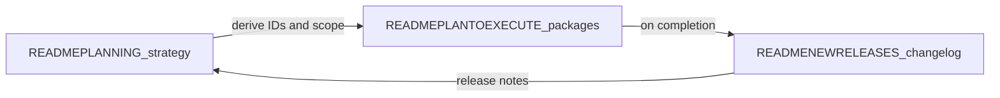

# READMEPLANTOEXECUTE — from strategy to shipped work

This file turns **[READMEPLANNING.md](READMEPLANNING.md)** into **traceable execution**: epics, work packages, acceptance criteria, primary code paths, and **status** you update until done. When a package ships, record it in **[READMENEWRELEASES.md](READMENEWRELEASES.md)** and optionally tick the cross-link in READMEPLANNING.

**Marketplace and “ready-to-bake” verticals:** the **Go-To** commercial story depends on shipping **catalog + install + proof** (see [READMEPLANNING.md](READMEPLANNING.md) §6). Track that work under epic **MK-01** below—not only the workflow editor (**WE-01**). Together they position a fork (e.g. **FulliO**) as **easy business voice**, not only infrastructure.

**Three experience tiers** (beautified no-code, minimal-code builders, full **agentic dev kit** with API + MCP + IDE): strategy in [READMEPLANNING.md](READMEPLANNING.md) §8; step-by-step journeys and **quality bar** in **[READMEEXPERIENCE.md](READMEEXPERIENCE.md)**; doc index in **[DOCS.md](DOCS.md)**; packages under epic **DX-01** below.

## Table of contents

- [Documentation workflow](#documentation-workflow-use-for-all-major-efforts)
- [Operating model](#operating-model--upstream-repo-tasks-and-keeping-scope-small) — upstream, tasks, WIP, checklist
- [Epic MK-01](#epic-mk-01--marketplace-ready-to-bake-vertical-packs)
- [Epic WE-01](#epic-we-01-workflow-editor-layout-and-feature-parity-reference-ui)
- [WE-01 Visual depth (design pillar)](#we-01-visual-depth-bento-glass-tactile-polish-design-pillar)
- [WE-01 Hyper-density SaaS UI extension (brief)](#we-01-hyper-density-saas-ui-extension-brief)
- [WE-01-HYPER-DENSITY — package](#we-01-hyper-density--high-density-shell-and-operator-chrome)
- [Epic DX-01](#epic-dx-01-three-tier-experience-nocode-builder-agentic-adk)
- [Epic index](#epic-index-add-rows-as-new-epics-appear)
- [Changelog of this file](#changelog-of-execution-doc-itself)

## Documentation workflow (use for all major efforts)

1. **Plan** — Add or refine themes in [READMEPLANNING.md](READMEPLANNING.md) (pillars, competitive rows, growth bets). Keep aspirations honest with **Shipped / Partial / Gap**.
2. **Execute** — In **this file**, add an **Epic** with stable **work item IDs** (e.g. `WE-01-…`). Each item: goal, acceptance criteria, key files, dependencies, status.
3. **Ship** — When merged to your release branch, append **[READMENEWRELEASES.md](READMENEWRELEASES.md)** with version/date, what changed, and which IDs closed.
4. **Retro** — Optionally adjust READMEPLANNING (scores, near-term bullets) so planning stays aligned with reality.

**Status values:** `NotStarted` | `InProgress` | `Blocked` | `Done` (when `Done`, mirror into READMENEWRELEASES).

---

## Operating model — upstream repo, tasks, and keeping scope small

This section **buttons up** how your fork stays merge-friendly with the **external repo you cloned** (e.g. `dograh-hq/dograh`) while using **this file** as the **source of feature work**—with **[READMEPLANNING.md](READMEPLANNING.md)** feeding new ideas **incrementally**, not as a dump.

### Source of truth (read this once)

| Layer | Role | What changes how often |
|-------|------|-------------------------|
| **[READMEPLANNING.md](READMEPLANNING.md)** | Strategy, pillars, vertical catalog, growth bets | Quarterly or when strategy shifts; **do not** turn every paragraph into a task overnight. |
| **READMEPLANTOEXECUTE.md (this file)** | **Actionable backlog**: epics, package IDs, acceptance criteria, status | **Weekly** (or per sprint): add packages, move one item to `InProgress`, close to `Done`. |
| **[READMENEWRELEASES.md](READMENEWRELEASES.md)** | Proof of what shipped | **Per release** when IDs close. |
| **[READMEBUILDME.md](READMEBUILDME.md) §6** | Git: remotes, merge vs rebase, submodule, conflict zones | When pulling upstream or bumping `pipecat`. |
| **External task system** (Linear, Jira, GitHub Issues/Projects, etc.) | Day-to-day assignees, dates, dependencies | **Mirror** the same IDs (`MK-01-CATALOG`, `WE-01-SHELL`, …) in titles or labels so nothing lives only in chat. |

**Rule:** New work **lands in READMEPLANNING** as narrative first; it **moves to READMEPLANTOEXECUTE** only when you are willing to staff it (add a package under an epic or create a new epic). If it is not in this file with an ID, it is **not** a committed feature—just intent.

### Bringing in the external repo (cadence with features)

Follow [READMEBUILDME.md](READMEBUILDME.md) **§6 Fork and upstream sync playbook** in spirit:

1. **Dedicated upstream integration** — merge `upstream/main` (or your vendor branch) on a **branch by itself** (e.g. `chore/merge-upstream-2026-04-17`). Run tests and a quick voice smoke (WebRTC + one PSTN path if you use it).
2. **Do not mix** a large upstream merge with a big **MK-01** / **WE-01** feature in the same PR unless unavoidable; you want a clean bisect if something breaks.
3. **`pipecat` submodule** — bump on its own commit; note the commit hash in READMENEWRELEASES when you ship it.
4. **Your fork-only code** stays in predictable paths ([READMEBUILDME.md](READMEBUILDME.md) §5) so rebases/merges touch fewer files.

### Project / task system (how it maps here)

- **Epic** = section **MK-01**, **WE-01**, **DX-01**, or a future `XX-NN` block in this file.
- **Task** = a **package** under an epic (`MK-01-CATALOG`, `WE-01-PALETTE`, …).
- In Jira/Linear/GitHub: one issue per package **or** one issue per epic with sub-tasks per package—**either way**, the **ID string** matches this doc.

### WIP limits — “not too much at once”

- Prefer **one** `InProgress` package per epic (e.g. only `WE-01-SHELL` **or** only `MK-01-CATALOG`, not five at once) unless you have multiple engineers and explicit ownership.
- When **READMEPLANNING** grows (new §6 rows, new bets), **do not** add ten packages the same day—pick **the next smallest shippable slice** (e.g. catalog schema + one vertical seed before `MK-01-BROWSE`).
- If scope creeps, **split** a package (`WE-01-TEST-A`, `WE-01-TEST-B`) rather than leaving one giant `InProgress` forever.

### Current focus (optional; edit each sprint)

| Active packages (`InProgress`) | Owner | Notes |
|--------------------------------|-------|-------|
| _(none — pick next package)_ | | **WE-01-GUIDANCE-GTM**, **WE-01-VOICE-PROFILES**, **WE-01-DATASTORE-INTEG** (runtime v1), GTM WE01 PNGs → **`Done`**. |

#### Rolling pass notes (keep short; update when you ship a slice)

| | |
|--|--|
| **This pass (shipped in repo now)** | **workflowImport client committed** (fixes `next build` module-not-found); build/type fixes (`WorkflowTable`, `CallReviewPanel`, `include_qm_summary`); **`seed_gtm_analytics_demo_call.py`** + **`gtm_capture_deck.sh`** auto-seed; Playwright GTM timeout + OSS cookie fallback. **Full OpenAPI client + call review SDK** — fixed **`QmScorecardGetResponse`** forward ref ([analytics.py](api/routes/analytics.py)); offline export via **`generate_ui_openapi_client.sh --full --offline`**; [analyticsCallReviewApi.ts](ui/src/lib/analyticsCallReviewApi.ts) uses generated SDK. **GTM script** — [gtm_capture_deck.sh](scripts/gtm_capture_deck.sh) auto sample call id + `ui/.env` bootstrap; Playwright [ossSession.ts](ui/e2e/ossSession.ts) cookie fallback when `/api/auth/session` fails. **Alembic merge** — `4462d25364f9` merges `b7c3e9d12f01` (analytics span RLS) + `f8a91c2d4e6b` (product_feedback); CI runs `alembic upgrade head` + analytics route integration tests ([api-pytest-usage-rollup.yml](.github/workflows/api-pytest-usage-rollup.yml)). **MK-01 post-call review route tests** — [test_analytics_call_review_routes.py](api/tests/test_analytics_call_review_routes.py): `POST …/ai-review` (heuristic + cache + `force_refresh`), `GET`/`POST …/follow-ups`, `POST …/apply-workflow-improvement` (+ `recommendation_index`); org/404 guards. **GTM PNGs** committed under [docs/images/](docs/images/) (overview, calls, QM schedule, workflow import, get-started, settings cache, editor checklist). **GTM + test hygiene** — fixed analytics **`call_engineering_links`** circular import ([langfuse_trace_id.py](api/services/analytics/langfuse_trace_id.py)); GTM captures for **scorecard rubric**, **call review**, **quality widget** ([gtm-deck-screenshots.spec.ts](ui/e2e/gtm-deck-screenshots.spec.ts)); Playwright call-detail **AI call review** smoke. **QM list + client CSV alignment** — `GET /analytics/calls?include_qm_summary=true` adds `cx_score`, `containment`, `qa_score`, `scorecard_pass_rate` per row; call list fetches with flag; client **Export CSV (page)** columns match server export ([exportAnalyticsCallsCsv.ts](ui/src/lib/exportAnalyticsCallsCsv.ts)). **Playwright:** call-list rubric smoke, Overview **CX & containment** widget, optional call-detail panels when **`E2E_GTM_SAMPLE_CALL_ID`** set ([analytics-overview.spec.ts](ui/e2e/analytics-overview.spec.ts)). **STACK_AUTH + WE-01 authoring slice** — `resolve_stack_team_permissions_url` + [test_stack_auth_team_permissions_url_unit.py](api/tests/test_stack_auth_team_permissions_url_unit.py); HTTP tool **`response_storage_mode`** (`live_only` \| `org_cache_when_enabled`) on [HttpApiConfig](api/routes/tool.py) + [HttpApiToolConfig.tsx](ui/src/app/tools/[toolUuid]/components/HttpApiToolConfig.tsx) / [page.tsx](ui/src/app/tools/[toolUuid]/page.tsx); [test_http_tool_response_storage_mode_unit.py](api/tests/test_http_tool_response_storage_mode_unit.py); [api-pytest-usage-rollup.yml](.github/workflows/api-pytest-usage-rollup.yml). **MK-01 analytics:** Overview **Revenue & booking** widget shows **vertical HTTP proof hints** when **Vertical slug** is set ([analyticsVerticalHttpHints.ts](ui/src/lib/analyticsVerticalHttpHints.ts)); matrix § widgets ↔ `response_mapping` ([VERTICAL_ANALYTICS_HTTP_MATRIX.md](catalog/VERTICAL_ANALYTICS_HTTP_MATRIX.md)). **`GET /analytics/insights`** **`calls_with_tool_evidence`** (+ legacy **`calls_with_logged_tools`**) + **`tool_name_mix`** (KPI row + top tools strip — [analytics_calls_client.py](api/db/analytics_calls_client.py), [AnalyticsDashboardClient.tsx](ui/src/app/analytics/AnalyticsDashboardClient.tsx)). **Overview → calls:** clickable **Top outcomes** / **Top tools** ([analyticsOverviewDeepLinks.ts](ui/src/lib/analyticsOverviewDeepLinks.ts)). **Scheduled QM CSV:** `GET`/`PUT /analytics/qm-export-schedule` + ARQ (`ENABLE_ANALYTICS_QM_EXPORT_CRON`) → object storage ([analytics_qm_export_tasks.py](api/tasks/analytics_qm_export_tasks.py)); call list UI ([AnalyticsCallsListContent.tsx](ui/src/app/analytics/calls/AnalyticsCallsListContent.tsx)); **`next_run_at_utc`** + **Next dispatch** preview ([analytics_qm_export_schedule.py](api/services/analytics/analytics_qm_export_schedule.py), [analyticsCallsApi.ts](ui/src/lib/analyticsCallsApi.ts)); **Playwright** OSS **`/analytics/calls`** redirect + authenticated calls page smoke ([analytics-overview.spec.ts](ui/e2e/analytics-overview.spec.ts)). **MK-01 Phase D (partial):** **`analytics_http_tool_spans`** — Pipecat persist; call **detail** + **list** `tool_names` + **`tool_name`** query filter + **`insights`** `calls_with_tool_evidence` / `tool_name_mix` ([analytics_calls_client.py](api/db/analytics_calls_client.py), [analytics_http_tool_span_client.py](api/db/analytics_http_tool_span_client.py), migration `e8f4a2c91b00`); **Postgres RLS** + `app.current_organization_id` ([analytics_http_tool_span_rls.py](api/db/analytics_http_tool_span_rls.py), migration `b7c3e9d12f01`); reviewer **[ANALYTICS_REDACTION_MATRIX.md](catalog/ANALYTICS_REDACTION_MATRIX.md)** (surfaces × redaction v1 × RBAC). **WE-01-DATASTORE-INTEG:** HTTP cache draft **`integration_overrides`** per connection + **`policy_audit`** `integration_overrides_count` + schema **v4** ([http_tool_cache_policy.py](api/services/workflow/tools/http_tool_cache_policy.py), [organization.py](api/routes/organization.py)); Settings **per-integration** table ([HttpIntegrationCachePolicySection.tsx](ui/src/components/HttpIntegrationCachePolicySection.tsx), [httpIntegrationCachePolicy.ts](ui/src/lib/httpIntegrationCachePolicy.ts)); **Docs (phase 3)** draft-era governance + audit on [http-tool-data-policy.mdx](docs/integrations/http-tool-data-policy.mdx). **MK-01-LIVE-TRACE:** per-call **`live_trace`** + **`quality_report`** on analytics detail + live Web test **Tools & LLM** rail. **MK-01-INSIGHTS-QUALITY:** org **`quality_summary`** + Overview **CX & containment** widget. **MK-01-QM-SCORECARD:** org rubric **`GET`/`PUT /analytics/qm-scorecard`**, QA **`criteria`** JSON, call-detail pass/fail grid, **smart QM export** sampling, Langfuse deep link, QM CSV columns (`cx_score`, `containment`, `qa_score`, `scorecard_pass_rate`), **Copy for QA node** prompt hint ([qm_scorecard.py](api/services/analytics/qm_scorecard.py), [CallScorecardPanel.tsx](ui/src/components/analytics/CallScorecardPanel.tsx)). |
| **Next pass (suggested)** | Staff next **roadmap motion** (retail upsell or B2B renewal) or pick next epic from [READMEPLANNING.md](READMEPLANNING.md) §6. |

### Strategic review (major bets)

Decide *which* of these to fund next; they are **candidates** from [READMEPLANNING.md](READMEPLANNING.md) and marketplace notes, not a committed roadmap by themselves. Update [READMEPLANNING.md](READMEPLANNING.md) scores when you pick 2–3 for the next quarter.

| Bet | User / market lift | Read first |
|-----|--------------------|------------|
| **Curated marketplace + vertical proof** (install, try, catalog quality) | Faster time-to-first valuable voice for buyers; GTM can point at real runbooks. | [READMEPLANNING.md](READMEPLANNING.md) §6, [READMEMARKETPLACEPLANNING.md](READMEMARKETPLACEPLANNING.md) → **MK-01** in this file. |
| **Reliable no-code + HTTP/tool authoring** (test parity, context variables, happy-path nudges) | Fewer bad runs; self-serve without reading every doc. | **WE-01-DUALMODE** / Tool API UX; [READMEEXPERIENCE.md](READMEEXPERIENCE.md). |
| **Three experience tiers** (no-code, builder, OpenAPI + MCP ADK) | Widen TAM: operators, integrators, and product engineers in one product story. | [READMEPLANNING.md](READMEPLANNING.md) §8, [READMEADK.md](READMEADK.md), **DX-01** here. |
| **Imports / adapters** (Make, n8n, Zapier, skills) *after* native catalog is strong | Switching cost from other stacks. | [READMEMARKETPLACEPLANNING.md](READMEMARKETPLACEPLANNING.md), **MK-01-IMPORT-OPTIONS**; only when adapters are **scoped**, not “implied by marketing”. |
| **Enterprise ops** (SSO, audit, PII) | Sticky revenue; requires dedicated security work. | [READMEPLANNING.md](READMEPLANNING.md) competitive row **Operations**. |

**Suggested next (meta):** In a 30–60 min review, pick **one** from marketplace, **one** from authoring/UX, and **one** from tiers or enterprise; log the decision in your issue tracker with these IDs and adjust **Active packages** above.

### Checklist before you add work from READMEPLANNING

- [ ] The idea is **already** in READMEPLANNING (or you added a short paragraph there first).
- [ ] You created or updated a **package** here with acceptance criteria—not just a bullet in planning.
- [ ] You are **not** duplicating the same work under two IDs.
- [ ] Upstream merge is **either** done **or** scheduled; you know if this work touches `pipecat/` or generated `ui/src/client/`.

---

## Epic MK-01 — Marketplace: ready-to-bake vertical packs

**Epic owner:** _TBD_  
**Strategy anchor:** [READMEPLANNING.md](READMEPLANNING.md) §6 (vertical catalog, differentiation) and [READMEBUILDME.md](READMEBUILDME.md) §0 / §10.  
**Goal:** buyers **discover**, **try**, and **install** opinionated voice workflows per industry with minimal engineering—supporting the **marketplace row** in READMEPLANNING’s competitive table (**Gap** today).

**Marketplace + import strategy (curated first):** [READMEMARKETPLACEPLANNING.md](READMEMARKETPLACEPLANNING.md) — n8n / Make / Zapier / Claude·Cursor·Codex skills positioning and sequencing.

### MK-01-RUBRIC — Template quality rubric (stub)

**Status:** `Done` (human worksheet + catalog JSON CI gate + **packaged voice graph skeleton** + **start→end reachability** + **prompt `{{tokens}}` ⊆ `default_template_variables`** + **runbook happy-path** sections + **install-from-catalog API happy-path** + **Playwright** catalog install → **Customize** → **Tidy up** + **Save** [catalog-marketplace.spec.ts](ui/e2e/catalog-marketplace.spec.ts))

**Purpose:** operationalize READMEPLANNING §2 near-term (“template quality rubric + starter packs”) before marketplace submissions scale.

**Draft criteria (v0):** (1) industry + primary use case are explicit; (2) default graph validates and has one documented happy-path test; (3) template variables are listed with safe sample values; (4) latency/cost band is honest vs declared providers; (5) compliance/data-handling tags match integrations used in the pack.

**Shipped in repo:** reviewer worksheet [catalog/TEMPLATE_QUALITY_RUBRIC.md](catalog/TEMPLATE_QUALITY_RUBRIC.md); pytest [test_vertical_packs_catalog.py](api/tests/test_vertical_packs_catalog.py) for `vertical-packs.json`, on-disk runbook / packaged refs, **JSON parse + minimal graph shape**, **voice skeleton invariants**, **directed happy-path spine**, and **rubric (3) prompt tokens**; **install-from-catalog API happy-path** [test_install_from_catalog_routes.py](api/tests/test_install_from_catalog_routes.py); [.github/pull_request_template.md](.github/pull_request_template.md); links from [catalog/README.md](catalog/README.md). **Prebuild / revenue:** [catalog/PREBUILD_VERTICAL_ROADMAP.md](catalog/PREBUILD_VERTICAL_ROADMAP.md) (booking + **`roadmap_motions`** per vertical + runbook **High-revenue motions (roadmap)** sections; **WE-01** HTTP tool expectations); rubric **row 9** (shipped vs roadmap claims). **Analytics:** [catalog/ANALYTICS_VERTICAL_ROADMAP.md](catalog/ANALYTICS_VERTICAL_ROADMAP.md) + [catalog/analytics-calls-api-draft.yaml](catalog/analytics-calls-api-draft.yaml) + [api/routes/analytics.py](api/routes/analytics.py) + **MK-01-ANALYTICS-VERTICAL** package (**`Done`**).

**Next pass:** **MK-01-RUBRIC** — **`Done`** booking-complex runbook happy paths + CI gate. **WE-01-DATASTORE-INTEG (optional):** cache-hit counters. **WE-01-VISUAL-DEPTH:** **`/overview`** / **`/reports`** rollout.

### MK-01-IMPORT-OPTIONS — External flows & agent skills (research package)

**Status:** `Done` (worksheet + **n8n**, **Make**, **Zapier**, **skills** import adapters shipped; Zapier **`nodes`** map normalization — [zapier-platform-nodes-map.json](catalog/fixtures/zapier-platform-nodes-map.json). UI: **MK-01-IMPORT-UI** below.)

**Goal:** evaluate **Make**, **n8n**, **Zapier**, and **agent skills** (Claude, Cursor, Codex) as **accelerators** or future adapters — without blocking curated-pack GTM.

**Acceptance criteria (to start work):**

- [x] **Spike owner + native JSON first target** — [IMPORT_ADAPTERS_SPIKE.md](catalog/IMPORT_ADAPTERS_SPIKE.md) owner row; default first target = packaged JSON hardening; playbook [import-packaged-workflow-json.md](catalog/import-packaged-workflow-json.md) (`POST /api/v1/workflow/create/definition` + [test_vertical_packs_catalog.py](api/tests/test_vertical_packs_catalog.py)).
- [x] **Spike doc (v0)** — [catalog/IMPORT_ADAPTERS_SPIKE.md](catalog/IMPORT_ADAPTERS_SPIKE.md): owner/first-target table, supported nodes / fields (when chosen), **failure modes**, security notes (credentials, PII).
- [x] **n8n adapter (v0 — structural + HTTP hints, Python)** — [n8n_workflow_adapter.py](api/utils/n8n_workflow_adapter.py); tests [test_n8n_workflow_adapter_unit.py](api/tests/test_n8n_workflow_adapter_unit.py); pairs with [validate-n8n-workflow-export.mjs](catalog/scripts/validate-n8n-workflow-export.mjs); READMEMARKETPLACEPLANNING §5 **Shipped experiments**.
- [x] **n8n → packaged draft (v1, HTTP-only nodes)** — `draft_packaged_workflow_from_n8n_http_only` emits **startCall → agentNode → endCall** + agent prompt listing HTTP hints; rejects mixed node types (`N8nUnsupportedNodesError`); [test_n8n_workflow_adapter_unit.py](api/tests/test_n8n_workflow_adapter_unit.py).
- [x] **n8n HTTP-only hint order (v1.1)** — `ordered_http_hints_from_http_only_workflow` orders hints via **topological sort** of n8n `connections.main` links between HTTP Request nodes (unique node names, acyclic); cycles, duplicate/missing names, or no HTTP→HTTP links fall back to workflow node-list order with warnings; fixture [n8n-two-http-linear.json](catalog/fixtures/n8n-two-http-linear.json).
- [x] **n8n packaged-draft API (v1)** — `POST /api/v1/workflow/import/n8n-packaged-draft` returns `workflow_definition` + `warnings` ([workflow.py](api/routes/workflow.py)); pytest [test_workflow_n8n_import_route.py](api/tests/test_workflow_n8n_import_route.py); [import-packaged-workflow-json.md](catalog/import-packaged-workflow-json.md).
- [x] **n8n skip non-HTTP (v1.2)** — default import **skips** non-HTTP nodes with warnings; **`strict_http_only: true`** preserves v1 reject behavior ([n8n_workflow_adapter.py](api/utils/n8n_workflow_adapter.py), [test_n8n_workflow_adapter_unit.py](api/tests/test_n8n_workflow_adapter_unit.py)).
- [x] **n8n import-and-create API** — `POST /api/v1/workflow/import/n8n-and-create` ([workflow.py](api/routes/workflow.py)); pytest [test_workflow_n8n_import_route.py](api/tests/test_workflow_n8n_import_route.py).
- [x] **Playwright catalog publish (conditional)** — after install → customize → save, clicks **Publish** when enabled else asserts validation errors ([catalog-marketplace.spec.ts](ui/e2e/catalog-marketplace.spec.ts)).
- [x] **n8n IF/Switch → subflows (v1.3)** — IF/Switch multi-output branches become **`subflows`** + main-agent **`enter_subflow`** edges; **`emit_branch_subflows`** (default true) on import APIs; fixture [n8n-if-two-branches-http.json](catalog/fixtures/n8n-if-two-branches-http.json); [test_n8n_workflow_adapter_unit.py](api/tests/test_n8n_workflow_adapter_unit.py).
- [x] **n8n Set/Code/Merge hints (v1.4)** — `transform_hints_from_workflow` + agent prompt section; fixture [n8n-set-code-http.json](catalog/fixtures/n8n-set-code-http.json); CLI **`--transform-hints`** on [validate-n8n-workflow-export.mjs](catalog/scripts/validate-n8n-workflow-export.mjs); [test_n8n_workflow_adapter_unit.py](api/tests/test_n8n_workflow_adapter_unit.py).
- [x] **Make / Zapier spike doc** — [import-adapter-make-zapier-spike.md](catalog/import-adapter-make-zapier-spike.md) (manual mapping, failure modes, proposed v0 subset).
- [x] **Make blueprint importer (v0)** — [make_scenario_adapter.py](api/utils/make_scenario_adapter.py); **`POST /import/make-packaged-draft`** + **`/import/make-and-create`**; Router → **subflows**; Set variable hints; fixtures [make-router-two-http.json](catalog/fixtures/make-router-two-http.json), [make-set-http.json](catalog/fixtures/make-set-http.json); [validate-make-blueprint.mjs](catalog/scripts/validate-make-blueprint.mjs); [test_make_scenario_adapter_unit.py](api/tests/test_make_scenario_adapter_unit.py).
- [x] **Agent skills spike doc** — [import-adapter-skills-spike.md](catalog/import-adapter-skills-spike.md) (manual SKILL.md → agent prompt / template variables).
- [x] **Zapier import-subset importer (v0)** — [zapier_zap_adapter.py](api/utils/zapier_zap_adapter.py); **`POST /import/zapier-packaged-draft`** + **`/import/zapier-and-create`**; Paths→subflows; fixtures [zapier-webhook-code-http.json](catalog/fixtures/zapier-webhook-code-http.json), [zapier-paths-two-http.json](catalog/fixtures/zapier-paths-two-http.json); [validate-zapier-export.mjs](catalog/scripts/validate-zapier-export.mjs).
- [x] **Skills packaged draft API** — [skill_packaged_adapter.py](api/utils/skill_packaged_adapter.py); **`POST /import/skill-packaged-draft`** + **`/import/skill-and-create`**; fixture [skill-booking-draft.sample.md](catalog/fixtures/skill-booking-draft.sample.md).
- [x] **Zapier platform `nodes` map (v0.1)** — `normalize_zapier_export` accepts top-level **`nodes`** or **`zap.nodes`**; fixture [zapier-platform-nodes-map.json](catalog/fixtures/zapier-platform-nodes-map.json); [test_zapier_zap_adapter_unit.py](api/tests/test_zapier_zap_adapter_unit.py).

### MK-01-IMPORT-UI — Import external flow (builder surface)

**Status:** `Done`

**Goal:** expose import adapters in the workflow list UI without requiring curl or OpenAPI codegen.

**Shipped:**

- [x] **Client helpers** — [workflowImportApi.ts](ui/src/lib/workflowImportApi.ts) + Vitest [workflowImportApi.test.ts](ui/src/lib/workflowImportApi.test.ts).
- [x] **Dialog** — [ImportExternalWorkflowDialog.tsx](ui/src/components/workflow/ImportExternalWorkflowDialog.tsx): vendor select (n8n / Make / Zapier / skill), JSON or SKILL.md paste/file, strict + branch toggles (non-skill).
- [x] **Entry points** — [ImportExternalWorkflowButton.tsx](ui/src/components/workflow/ImportExternalWorkflowButton.tsx) on [/workflow](ui/src/app/workflow/page.tsx); **Create Agent → Import external flow** ([CreateWorkflowButton.tsx](ui/src/components/workflow/CreateWorkflowButton.tsx)).
- [x] **Playwright** — [workflow-import.spec.ts](ui/e2e/workflow-import.spec.ts) (OSS, n8n minimal fixture); GTM capture **`gtm-mk01-workflow-import-dialog.png`** in [gtm-deck-screenshots.spec.ts](ui/e2e/gtm-deck-screenshots.spec.ts).
- [x] **Playwright (all vendors)** — n8n, Make, Zapier platform `nodes`, skill SKILL.md ([importExternalFlow.ts](ui/e2e/importExternalFlow.ts)).

### MK-01-IMPORT-CLIENT — OpenAPI SDK for import routes

**Status:** `Done`

**Goal:** typed SDK for `/workflow/import/*` without requiring a full running API to regenerate.

**Shipped:**

- [x] **Shared schemas** — [api/schemas/workflow_import.py](api/schemas/workflow_import.py) (imported by [workflow.py](api/routes/workflow.py)).
- [x] **Import-only OpenAPI** — [gen_workflow_import_openapi.py](scripts/gen_workflow_import_openapi.py) → [workflow-import.openapi.json](catalog/openapi/workflow-import.openapi.json) (8 paths).
- [x] **Generated client** — [ui/src/client/workflowImport](ui/src/client/workflowImport); `npm run generate-client:workflow-import`.
- [x] **`workflowImportApi`** — wraps generated `*AndCreate` SDK calls ([workflowImportApi.ts](ui/src/lib/workflowImportApi.ts)); auth on import client via [UserConfigContext.tsx](ui/src/context/UserConfigContext.tsx).
- [x] **CI drift gate** — [ui-playwright.yml](.github/workflows/ui-playwright.yml) regenerates spec + client and fails on uncommitted diff.

### MK-01-CATALOG — Template catalog schema and seed data

**Status:** `Done`

**Goal:** For each vertical row in READMEPLANNING §6, define a **template record**: slug, industry, use cases[], languages[], supported modes (`webrtc` | `pstn`), compliance tags, preview audio URL, cost/latency **estimate band**, `workflow_definition_id` or packaged JSON.

**Acceptance criteria:**

- [x] At least **three** vertical packs documented as JSON or DB seeds (healthcare, retail, B2B SaaS suggested first). **Canonical JSON:** [catalog/vertical-packs.json](catalog/vertical-packs.json); index [catalog/README.md](catalog/README.md).
- [x] Each pack links to a **runbook** (markdown) checked into repo or docs site. **Runbooks:** [runbooks/](runbooks/) (see [runbooks/README.md](runbooks/README.md)).

**Key files:** [catalog/vertical-packs.json](catalog/vertical-packs.json), [runbooks/](runbooks/), [api/db/models.py](api/db/models.py) `WorkflowTemplates` (future binding via `workflow_template` fields in JSON), [api/db/workflow_template_client.py](api/db/workflow_template_client.py), [api/routes/workflow.py](api/routes/workflow.py) `GET /templates`.

---

### MK-01-INSTALL — One-click “install into my org”

**Status:** `Done`

**Goal:** API + UI: user picks pack → clone workflow + variables + optional tools stub list → lands in editor with **read-only** graph until user clicks “Customize”.

**Acceptance criteria:**

- [x] No cross-org data leak; new workflow `organization_id` is caller’s org (`create_workflow` + `install-from-catalog` use `user.selected_organization_id` only).
- [x] Variables surface in dashboard for non-technical editing (`GET /workflow/fetch` includes `template_context_variables`; [WorkflowTable](ui/src/components/workflow/WorkflowTable.tsx) shows keys).

**Shipped paths:**

- `POST /api/v1/workflow/install-from-catalog` — installs from [catalog/vertical-packs.json](catalog/vertical-packs.json) + [catalog/packaged-workflows/](catalog/packaged-workflows/) JSON graphs; optional **`variant_id`** selects `workflow_variants` (`catalog_variant_id` stored on `mk01`); sets `workflow_configurations.mk01` with `installation_locked: true` until **Customize** clears it via `PUT /workflow/{id}` ([catalog_install.py](api/utils/catalog_install.py)). **API happy-path + org isolation:** [test_install_from_catalog_routes.py](api/tests/test_install_from_catalog_routes.py).
- `GET /api/v1/catalog/vertical-packs` — same catalog JSON for the UI.
- UI: [ui/src/app/workflow/catalog/page.tsx](ui/src/app/workflow/catalog/page.tsx); **Create Agent → Template catalog** in [CreateWorkflowButton](ui/src/components/workflow/CreateWorkflowButton.tsx).

**Key files:** [api/routes/workflow.py](api/routes/workflow.py), [api/routes/catalog.py](api/routes/catalog.py), [api/db/workflow_client.py](api/db/workflow_client.py) `create_workflow`, [ui/src/app/workflow/](ui/src/app/workflow/), [ui/src/app/workflow/[workflowId]/RenderWorkflow.tsx](ui/src/app/workflow/[workflowId]/RenderWorkflow.tsx) (install lock + Customize).

---

### MK-01-TRY — Try flow from catalog (Web + persona)

**Status:** `Done`

**Goal:** From template detail: launch **Web call** or **simulated user** without full publish (sandbox org or flagged run).

**Acceptance criteria:**

- [x] Costs labeled (LLM vs telephony); no surprise PSTN charges on “Try” — **Try (Web only)** on [MarketplaceCatalog](ui/src/components/catalog/MarketplaceCatalog.tsx) uses `smallwebrtc` only; dialog explains LLM/STT/TTS vs PSTN.
- [x] Reuse or extend [api/routes/looptalk.py](api/routes/looptalk.py) for **simulated user** / persona try — `POST /api/v1/looptalk/test-sessions/quick-persona` creates a session with **actor** = installed workflow and **adversary** = system `[System] LoopTalk simulated caller` from [catalog/packaged-workflows/looptalk-simulated-caller.json](catalog/packaged-workflows/looptalk-simulated-caller.json). UI: **Try (LoopTalk persona)** on catalog; **Simulation** rail in [WorkflowEditorRightRail.tsx](ui/src/app/workflow/[workflowId]/components/WorkflowEditorRightRail.tsx).

**Shipped paths:**

- Web: `install-from-catalog` → `POST .../workflow/{id}/runs` with `mode: smallwebrtc` → `/workflow/{id}/run/{runId}`.
- LoopTalk: `install-from-catalog` → `quick-persona` → `/looptalk/{sessionId}` (user starts the run on the LoopTalk page).

**Dependencies:** may overlap **WE-01-TEST**; coordinate so one backend path serves editor and marketplace.

---

### MK-01-BROWSE — Discover UI (industry / use case / filters)

**Status:** `Done`

**Goal:** Marketplace browse page (or section of dashboard) with filters aligned to READMEPLANNING §6 table.

**Acceptance criteria:**

- [x] Filter by industry, use case tag, language, compliance tag ([ui/src/lib/catalog/filterVerticalPacks.ts](ui/src/lib/catalog/filterVerticalPacks.ts), [MarketplaceCatalog](ui/src/components/catalog/MarketplaceCatalog.tsx)).
- [x] SEO-friendly public page **optional** — [ui/src/app/templates/](ui/src/app/templates/) (`/templates` with `metadata` in `layout.tsx`; server-side catalog fetch with `revalidate`).

**Key files:** [ui/src/components/catalog/MarketplaceCatalog.tsx](ui/src/components/catalog/MarketplaceCatalog.tsx), [ui/src/app/workflow/catalog/page.tsx](ui/src/app/workflow/catalog/page.tsx), [ui/src/app/templates/page.tsx](ui/src/app/templates/page.tsx).

---

### MK-01-PARTNER — Partner submit + review pipeline

**Status:** `Done`

**Goal:** Partners submit packs; internal or community **review** checklist before `published`; optional revenue share fields (roadmap).

**Acceptance criteria:**

- [x] Documented review criteria (safety, PII, telephony compliance copy) — [catalog/PARTNER_REVIEW.md](catalog/PARTNER_REVIEW.md).
- [x] Version semver on pack updates — each pack has **`pack_semver`** in [catalog/vertical-packs.json](catalog/vertical-packs.json); policy in [catalog/README.md](catalog/README.md) § Pack versioning (`catalog_version` vs `pack_semver`).

**Note:** Automated **submit** or revenue-share plumbing is out of scope for this package; PR-based submission is described in catalog README.

---

### MK-01-ANALYTICS-VERTICAL — Call insights & dashboards (plan + OpenAPI draft)

**Status:** `Done` (Phase **B** REST + **Phase** **C** list/detail + **default Overview** + **insights** route shipped; **server CSV export** shipped; **custom** dashboard **org** persistence shipped; **PII redaction v1** + **org redaction policy API** on detail + CSV; **RBAC v1** for **disabling** redaction shipped; **span table v1** (persist + detail + **list**/**insights** tool evidence) shipped; **Postgres RLS** on span table shipped (**FORCE** + session GUC; superuser bypass in typical dev). **GTM:** opt-in Playwright screenshot writer **`E2E_GTM_DECK_SCREENSHOTS=1`** → `docs/images/gtm-*.png`.)

**Goal:** Define how **vertical prebuilds** pair with **analytics**: filterable **calls list**, **call detail** (customer-defined outcomes, key metrics, AI/QA/QM views), **default + custom dashboards** (widget cards with insight functions), and **API / database** access patterns for enterprise — including **HTTP tool call/response** visibility aligned with [docs/voice-agent/tools/http-api.mdx](docs/voice-agent/tools/http-api.mdx).

**Acceptance criteria (documentation-first):**

- [x] **Scope doc** — [catalog/ANALYTICS_VERTICAL_ROADMAP.md](catalog/ANALYTICS_VERTICAL_ROADMAP.md): calls list/detail, outcomes, tool traces, dashboards, API/DB, phasing A–D.
- [x] **Cross-links** — [PREBUILD_VERTICAL_ROADMAP.md](catalog/PREBUILD_VERTICAL_ROADMAP.md) analytics section; [catalog/README.md](catalog/README.md); [DOCS.md](DOCS.md); this epic index row.
- [x] **OpenAPI draft (Phase A)** — [catalog/analytics-calls-api-draft.yaml](catalog/analytics-calls-api-draft.yaml): `GET /api/v1/analytics/insights` + `GET /api/v1/analytics/calls`, `GET /api/v1/analytics/calls/export`, `GET /api/v1/analytics/calls/{call_id}`, **HttpToolSpanSummary**; **DashboardWidgetDef** (roadmap; not all fields exposed in REST yet).
- [x] **REST MVP (Phase B)** — [api/routes/analytics.py](api/routes/analytics.py): org-scoped list + detail; **tool_spans** from `workflow_runs.logs` (`call_id` = `wr-{run.id}`); filters: `workflow_id`, `since`/`until`, `disposition`, `outcome_key`, `tool_name`, cursor pagination; **insights** roll-up: `get_analytics_insights` (totals, outcome mix, **`calls_with_tool_evidence`** + legacy **`calls_with_logged_tools`**, **`tool_name_mix`**; optional `workflow_id`, `catalog_slug`, `catalog_variant_id`).
- [x] **UI MVP (Phase C)** — shared [`/analytics` shell](ui/src/app/analytics/layout.tsx); default [`/analytics`](ui/src/app/analytics/page.tsx); [`/analytics/calls`](ui/src/app/analytics/calls/page.tsx), [`/analytics/calls/[callId]`](ui/src/app/analytics/calls/[callId]/page.tsx), [analyticsCallsApi.ts](ui/src/lib/analyticsCallsApi.ts) (regenerate OpenAPI client when API is up: `npm run generate-client`).
- [x] **Custom dashboard (MVP)** — [AnalyticsDashboardClient](ui/src/app/analytics/AnalyticsDashboardClient.tsx): default widget set, add/remove, reset, **org**-persisted layout via **`GET` / `PUT /api/v1/analytics/dashboard-layout`** + localStorage cache; [analyticsDashboardLayout](ui/src/lib/analyticsDashboardLayout.ts), [dashboard_layout_validate.py](api/services/analytics/dashboard_layout_validate.py); **Apply vertical preset** + **URL auto-preset** when `?catalog_slug=` matches a shipped pack and the board is still the generic default widget order.
- [x] **QM sampling export (client)** — [exportAnalyticsCallsCsv.ts](ui/src/lib/exportAnalyticsCallsCsv.ts): CSV for **currently loaded** call-list rows (use **Load more** before export to widen the set).
- [x] **QM export (server)** — `GET /api/v1/analytics/calls/export` ([api/routes/analytics.py](api/routes/analytics.py), [analytics_calls_client.py](api/db/analytics_calls_client.py), [analytics_calls_csv.py](api/services/analytics/analytics_calls_csv.py)); UI **Export CSV (server)** on [AnalyticsCallsListContent.tsx](ui/src/app/analytics/calls/AnalyticsCallsListContent.tsx); tests [test_analytics_calls_routes.py](api/tests/test_analytics_calls_routes.py), [test_analytics_calls_csv_unit.py](api/tests/test_analytics_calls_csv_unit.py).
- [x] **Org-persisted layouts** — `GET`/`PUT /api/v1/analytics/dashboard-layout` ([dashboard_layout_validate.py](api/services/analytics/dashboard_layout_validate.py)).
- [x] **PII redaction (v1)** — [analytics_redact.py](api/services/analytics/analytics_redact.py) on `get_analytics_call_detail` + [analytics_calls_csv.py](api/services/analytics/analytics_calls_csv.py); tests [test_analytics_redact_unit.py](api/tests/test_analytics_redact_unit.py).
- [x] **Enterprise redaction policy (v1)** — org `GET`/`PUT /api/v1/analytics/redaction-policy` (`detail_redaction_enabled`, default true); call detail + server CSV; Analytics Overview toggle [AnalyticsDashboardClient.tsx](ui/src/app/analytics/AnalyticsDashboardClient.tsx); tests [test_analytics_redaction_policy_routes.py](api/tests/test_analytics_redaction_policy_routes.py).
- [x] **Redaction disable RBAC (v1)** — [redaction_policy_rbac.py](api/services/analytics/redaction_policy_rbac.py): `may_disable_detail_redaction` on policy responses; block **API keys** from disabling; optional **superuser-only** or Stack **permission id** (`MK01_ANALYTICS_REDACTION_DISABLE_*`); [test_redaction_policy_rbac_unit.py](api/tests/test_redaction_policy_rbac_unit.py).
- [x] **Playwright smoke (OSS)** — [ui/e2e/analytics-overview.spec.ts](ui/e2e/analytics-overview.spec.ts): unauthenticated **`/analytics`** and **`/analytics/calls`** redirect to login; authenticated **calls list** shell + **Scheduled QM export** card + server export button (with **`E2E_EMAIL`** / **`E2E_PASSWORD`**); Overview flows unchanged; CI **`playwright-analytics-auth`**: strict RBAC **member** locked switch, then [ci_promote_oss_user_superuser.py](scripts/ci_promote_oss_user_superuser.py) + **`E2E_EXPECT_SUPERUSER_MAY_DISABLE`** interactive toggle; [ui-playwright.yml](.github/workflows/ui-playwright.yml).
- [x] **Playwright catalog smoke** — [ui/e2e/catalog-marketplace.spec.ts](ui/e2e/catalog-marketplace.spec.ts): OSS **`/workflow/catalog` → login**; authenticated **Template catalog** + vertical packs load (no catalog error banner).
- [x] **GTM deck PNGs (opt-in Playwright)** — [ui/e2e/gtm-deck-screenshots.spec.ts](ui/e2e/gtm-deck-screenshots.spec.ts): when **`E2E_GTM_DECK_SCREENSHOTS=1`**, writes **`docs/images/gtm-*.png`** at **1280×720** (optional **`E2E_GTM_SAMPLE_CALL_ID`** for call-detail).
- [x] **Redaction matrix (reviewer doc v1)** — [catalog/ANALYTICS_REDACTION_MATRIX.md](catalog/ANALYTICS_REDACTION_MATRIX.md): surfaces × org policy × RBAC × deferred Phase **D** topics (not legal advice).
- [x] **Overview → call list drill-down** — **Top outcomes** / **Top tools** link to `/analytics/calls` with `outcome_key` / `tool_name` plus catalog slug/variant and insights UTC date window ([analyticsOverviewDeepLinks.ts](ui/src/lib/analyticsOverviewDeepLinks.ts), [AnalyticsDashboardClient.tsx](ui/src/app/analytics/AnalyticsDashboardClient.tsx)).
- [x] **Scheduled QM exports** — org `GET`/`PUT /api/v1/analytics/qm-export-schedule` ([analytics.py](api/routes/analytics.py), [analytics_qm_export_schedule.py](api/services/analytics/analytics_qm_export_schedule.py)); ARQ hourly cron + `run_analytics_qm_export_for_org` uploads CSV to object storage ([analytics_qm_export_tasks.py](api/tasks/analytics_qm_export_tasks.py), `ENABLE_ANALYTICS_QM_EXPORT_CRON`); UI card on [AnalyticsCallsListContent.tsx](ui/src/app/analytics/calls/AnalyticsCallsListContent.tsx); responses include **`next_run_at_utc`** (next :47 slot in chosen UTC hour) + live **Next dispatch** preview in the UI.
- [x] **Span table (v1)** — `analytics_http_tool_spans` ([models.py](api/db/models.py) `AnalyticsHttpToolSpanModel`, Alembic `e8f4a2c91b00`); replace-on-complete from Pipecat logs ([event_handlers.py](api/services/pipecat/event_handlers.py)); `GET …/calls/{call_id}` prefers table when rows exist ([analytics_calls_client.py](api/db/analytics_calls_client.py), [analytics_http_tool_span_client.py](api/db/analytics_http_tool_span_client.py)).
- [x] **Span-backed list + insights** — **`tool_name`** filter OR-matches logs **or** span rows; call **list** `tool_names` batch-loads spans; **`insights`** `calls_with_tool_evidence` / `calls_with_logged_tools` / `tool_name_mix` union logs + spans ([analytics_calls_client.py](api/db/analytics_calls_client.py)); route test [test_analytics_calls_routes.py](api/tests/test_analytics_calls_routes.py) `test_analytics_calls_span_table_tool_name_list_and_insights`.
- [x] **DB RLS (`analytics_http_tool_spans`)** — Alembic `b7c3e9d12f01` (`FORCE ROW LEVEL SECURITY` + org policy on `app.current_organization_id`); application sets GUC per transaction ([analytics_http_tool_span_rls.py](api/db/analytics_http_tool_span_rls.py)); superuser/BYPASSRLS bypass (common locally); **non-superuser path** in CI via dedicated role + `SET ROLE` ([test_analytics_http_tool_span_rls_integration.py](api/tests/test_analytics_http_tool_span_rls_integration.py)).

**Key files:** [catalog/ANALYTICS_VERTICAL_ROADMAP.md](catalog/ANALYTICS_VERTICAL_ROADMAP.md), [catalog/ANALYTICS_REDACTION_MATRIX.md](catalog/ANALYTICS_REDACTION_MATRIX.md), [catalog/VERTICAL_ANALYTICS_HTTP_MATRIX.md](catalog/VERTICAL_ANALYTICS_HTTP_MATRIX.md), [catalog/recipes/booking-http-analytics-smoke.md](catalog/recipes/booking-http-analytics-smoke.md), [api/tests/test_booking_http_mapping_analytics_span.py](api/tests/test_booking_http_mapping_analytics_span.py), [api/tests/test_analytics_http_tool_span_rls_integration.py](api/tests/test_analytics_http_tool_span_rls_integration.py), [catalog/analytics-calls-api-draft.yaml](catalog/analytics-calls-api-draft.yaml), [api/routes/analytics.py](api/routes/analytics.py), [api/services/analytics/analytics_qm_export_schedule.py](api/services/analytics/analytics_qm_export_schedule.py), [api/tasks/analytics_qm_export_tasks.py](api/tasks/analytics_qm_export_tasks.py), [api/tasks/arq.py](api/tasks/arq.py), [api/services/analytics/redaction_policy_rbac.py](api/services/analytics/redaction_policy_rbac.py), [api/db/analytics_calls_client.py](api/db/analytics_calls_client.py), [api/db/analytics_http_tool_span_client.py](api/db/analytics_http_tool_span_client.py), [api/db/analytics_http_tool_span_rls.py](api/db/analytics_http_tool_span_rls.py), [api/services/analytics/call_intel.py](api/services/analytics/call_intel.py), [api/services/analytics/analytics_redact.py](api/services/analytics/analytics_redact.py), [ui/src/app/analytics/](ui/src/app/analytics/), [ui/src/lib/analyticsOverviewDeepLinks.ts](ui/src/lib/analyticsOverviewDeepLinks.ts), [ui/e2e/](ui/e2e/), [ui/playwright.config.ts](ui/playwright.config.ts), [catalog/PREBUILD_VERTICAL_ROADMAP.md](catalog/PREBUILD_VERTICAL_ROADMAP.md), [READMEPLANTOEXECUTE.md](READMEPLANTOEXECUTE.md) (this section).

**HTTP tool UX (WE-01-DUALMODE):** Grouped pickers, call-context app-default samples, and **auto-discovery** of `{{…}}` from URL / body / headers / templates / raw code into **Custom** + flow path lists ([httpToolVariablePickers.ts](ui/src/lib/httpToolVariablePickers.ts)); [http-api.mdx](docs/voice-agent/tools/http-api.mdx) for runtime resolution and **tool evidence** in analytics.

---

## Reference: competitor-style workflow editor (screenshot baseline)

**Goal:** Extend our workflow editor **layout and capabilities** toward the UX shown in the **April 2026 reference screenshot** (patient screening template): persistent **left palette** (nodes + components), **dense header** (metadata, cost/latency/token hints, Create vs Simulation, autosave, publish), **right rail** (Global settings + in-editor test agent: audio/LLM tests, manual chat, AI-simulated user), **canvas** tools, and **subflow / component** tabs in a footer bar.

**Current implementation (ground truth):**

| Area | Today | Primary paths |
|------|--------|----------------|
| Layout | **Three-column resizable shell** (palette \| canvas \| inspector rail); full-width canvas when viewing a **historical** version | [RenderWorkflow.tsx](ui/src/app/workflow/[workflowId]/RenderWorkflow.tsx), [WorkflowEditorShell.tsx](ui/src/app/workflow/[workflowId]/components/WorkflowEditorShell.tsx) |
| Header | Name, save, publish, run/phone, version history | [ui/src/app/workflow/[workflowId]/components/WorkflowEditorHeader.tsx](ui/src/app/workflow/[workflowId]/components/WorkflowEditorHeader.tsx) |
| Add nodes | **Docked palette** with **Nodes \| Components** tabs; click-to-add at viewport center; overlay variant still available | [AddNodePanel.tsx](ui/src/components/flow/AddNodePanel.tsx) |
| Settings | Full-page **settings** + **right rail** tabs **Inspector \| Global** (template variables + node summary); deep link `?section=` | [settings/page.tsx](ui/src/app/workflow/[workflowId]/settings/page.tsx), [WorkflowEditorRightRail.tsx](ui/src/app/workflow/[workflowId]/components/WorkflowEditorRightRail.tsx) |
| Test / simulate | **Web call** dialog; not the same as inline “Test Agent” + AI user simulator | [ui/src/app/workflow/[workflowId]/components/PhoneCallDialog.tsx](ui/src/app/workflow/[workflowId]/components/PhoneCallDialog.tsx) |
| Node types | `startCall`, `agentNode`, `endCall`, `globalNode`, `trigger`, `webhook`, `qa` | [ui/src/components/flow/types.ts](ui/src/components/flow/types.ts), [RenderWorkflow.tsx](ui/src/app/workflow/[workflowId]/RenderWorkflow.tsx) `nodeTypes` |
| Backend graph | Pipecat / workflow engine consumes persisted JSON | [api/services/workflow/pipecat_engine.py](api/services/workflow/pipecat_engine.py), [api/routes/workflow.py](api/routes/workflow.py) |

**READMEPLANNING alignment:** Pillar 1 (dual-mode editors, templates, non-technical UX), competitive row **Authoring**, growth bet **18** (embeddable concierge — share patterns with in-editor test).

---

## Epic WE-01 — Workflow editor: layout and feature parity (reference UI)

**Epic owner:** _TBD_  
**Target:** iterative releases; do not block shipping on full parity.

### WE-01 Visual depth (bento, glass, tactile polish design pillar)

**Creative brief (operator / “voice ops” dashboard aesthetic):** Ship a high-fidelity UI with **visual depth** and **tactile feedback** so the product feels premium, calm, and futuristic—not flat admin chrome. Direction:

- **Layout:** **Bento grid** for dense metrics (billing, credits, activity) with **generous negative space** between regions so each tile breathes.
- **Surfaces:** **Soft-edge glassmorphism**—frosted, translucent panels (`backdrop-filter` + layered fills) over subtle mesh / radial gradients; **anti-aliased** borders (`color-mix` on `border`) and **subtle inner highlights** (inset box-shadow) for lift.
- **Lighting:** **Dynamic lighting**—soft **glows** behind hero and active regions (low-opacity blurs, slow drift animation) without overwhelming data legibility.
- **Motion:** **Micro-interactions**—spring-like hover/active on metric tiles (CSS `cubic-bezier` + slight scale / translate), **animated** decorative icons where they aid orientation (respect **`prefers-reduced-motion`**).
- **Typography & color:** **High-contrast** headings and tabular numerals for usage; body copy stays **muted** for hierarchy; charts stay accessible (do not rely on glow alone for meaning).

**Fork alignment:** This pillar complements **WE-01-ORG-USAGE** (`/usage`), **MK-01-BROWSE** (catalog), and the **Simulation** rail—roll out incrementally so upstream merges stay safe.

---

### WE-01 Hyper-density SaaS UI extension (brief)

**Track as:** **WE-01-HYPER-DENSITY** (formal package [below](#we-01-hyper-density--high-density-shell-and-operator-chrome)); complements **WE-01-VISUAL-DEPTH** primitives.

#### Source prompt (design north star)

> Design a high-density SaaS UI and UX using a **Modern Professional Aesthetic**. Focus on a **Hyper-Refined Layout** featuring a **collapsible sidebar** with **Glassmorphism** effects and a **main stage** using a **Bento Box** grid. Include **“Eye Candy”** elements: **Dynamic Data Visualizations** with **glowing gradient line charts**, **Sparkline** micro-graphs, and **Status Indicators** with **breathing pulse** animations. Apply **Strict Information Hierarchy**: use **Inter** or **SF Pro** typography with varied weights, **Subtle Inner Shadows** on cards for a **“recessed”** look, and **1px Border Strokes** in semi-transparent grays. Ensure the UI feels **tactile** with **Segmented Controls**, **“Command + K”** search bars, and **Hover-Triggered Tooltips** that use **backdrop-blur** backgrounds for a **premium, high-utility** finish.

#### How we translate the prompt (without boiling the ocean)

| Pillar from prompt | Product interpretation | Guardrails |
|--------------------|-------------------------|------------|
| **Modern professional** | Restrained contrast, no neon overload; glass reads as **depth**, not distraction. | WCAG contrast on **body** and **controls**; never encode meaning **only** in glow. |
| **Hyper-refined layout** | Tight vertical rhythm in rails, **tabular** kbd hints, bento grids on catalog + `/usage`. | Keep **min tap targets** on mobile; don’t crush workflow canvas padding. |
| **Collapsible sidebar + glass** | **`ovo-sidebar-surface`** on desktop + mobile sheet ([sidebar.tsx](ui/src/components/ui/sidebar.tsx)); existing **icon** collapse ([AppSidebar.tsx](ui/src/components/layout/AppSidebar.tsx)). | **`prefers-reduced-motion`**: drop blur → solid **`--sidebar`**. |
| **Bento main stage** | **`ovo-bento-cell`** / **`ovo-glass-panel`** on marketplace + usage (already in **WE-01-VISUAL-DEPTH**). | Extend to **overview** / **reports** later, not all routes at once. |
| **Glowing gradient charts** | Recharts **`linearGradient`** on token **Line** in [WorkflowUsageTrendPanel.tsx](ui/src/app/workflow/[workflowId]/components/WorkflowUsageTrendPanel.tsx); optional feGaussianBlur on **SVG** sparklines only where cheap. | Sparklines on catalog are **decorative** (deterministic seed), not fake metrics—copy must not imply live traffic. |
| **Sparklines** | [Sparkline.tsx](ui/src/components/ui/sparkline.tsx) + `sparklineValuesFromSeed` for catalog; **real** `tokensSum` series on **`/usage`** Activity header ([usage/page.tsx](ui/src/app/usage/page.tsx)). | `decorative` + `role="presentation"` when not real data; real series gets **`aria-label`**. |
| **Breathing status** | **`ovo-status-breathe`** on healthy pills ([globals.css](ui/src/app/globals.css)). | Static dot when **reduced motion**. |
| **Inter / SF Pro hierarchy** | **Inter** loaded in [layout.tsx](ui/src/app/layout.tsx); **`SidebarInset`** uses **`--font-inter-ui`** stack ahead of Geist ([AppLayout.tsx](ui/src/components/layout/AppLayout.tsx)). | Geist remains global fallback; workflow editor typography unchanged outside inset if needed. |
| **Recessed cards + 1px hairlines** | **`ovo-bento-cell`** inset shadow + **`color-mix`** borders (**WE-01-VISUAL-DEPTH**). | Same tokens on new surfaces—avoid one-off hex. |
| **Segmented controls** | Radix **Tabs** + **`ovo-segmented-track`** pill density on **Week \| Day** and custom editor **Edit \| Simulation**. | Keyboard roving already from Radix. |
| **Command + K** | [AppCommandPalette](ui/src/components/layout/AppCommandPalette.tsx) + [appNavigationCommands.ts](ui/src/lib/appNavigationCommands.ts); header search button; skips fields while typing. | Dialog **focus** returns to page on close; **Escape** closes. |
| **Tooltips + backdrop-blur** | [tooltip.tsx](ui/src/components/ui/tooltip.tsx) popover-style chrome (arrow removed for clean glass). | Ensure text stays readable in **dark** mode. |

**Creative direction (one line):** ship **dense, calm, expensive-feeling** operator UI: glass where it aids **scanning**, motion only where it aids **state**, typography and borders doing most of the hierarchy.

| Theme | Intent | Implementation hints (map to code) |
|--------|--------|--------------------------------------|
| **Shell** | **Collapsible sidebar** + **main stage** as a **Bento** grid for dashboards and catalog-adjacent pages | [AppSidebar.tsx](ui/src/components/layout/AppSidebar.tsx) + [AppLayout.tsx](ui/src/components/layout/AppLayout.tsx); **`ovo-bento-cell`** / **`ovo-glass-panel`**; `xl:` catalog grid ([MarketplaceCatalog.tsx](ui/src/components/catalog/MarketplaceCatalog.tsx)). |
| **Glass** | **Glassmorphism** on sidebar and overlays—frosted, **1px** **semi-transparent** strokes, **subtle inner shadow** (“recessed” cards) | **`ovo-*`** + **`ovo-sidebar-surface`** in [globals.css](ui/src/app/globals.css); editor **Sheets**: **`ovo-editor-sheet`** (**WE-01-VISUAL-DEPTH**). |
| **Typography** | **Strict hierarchy** — **Inter** or **SF Pro** feel (clear weight steps, tabular numerals for usage) | **`--font-inter-ui`** on **`SidebarInset`**; **`tracking-tight`** on titles; **`ovo-command-kbd`** for **`tnum`**. |
| **Data viz** | **Dynamic** charts + **Sparkline** micro-graphs | [WorkflowUsageTrendPanel.tsx](ui/src/app/workflow/[workflowId]/components/WorkflowUsageTrendPanel.tsx) — token **Line** + stacked **Bar** **`linearGradient`** fills; [sparkline.tsx](ui/src/components/ui/sparkline.tsx). |
| **Status** | **Breathing pulse** | **`ovo-status-breathe`**: catalog registry dot ([MarketplaceCatalog.tsx](ui/src/components/catalog/MarketplaceCatalog.tsx)); **in-progress** workflow runs ([WorkflowRunsTable.tsx](ui/src/components/workflow-runs/WorkflowRunsTable.tsx)); **active** LoopTalk sessions + **connected** live audio ([TestSessionCard.tsx](ui/src/components/looptalk/TestSessionCard.tsx), [TestSessionDetails.tsx](ui/src/components/looptalk/TestSessionDetails.tsx), [LiveAudioPlayer.tsx](ui/src/components/looptalk/LiveAudioPlayer.tsx)). |
| **Tactile controls** | **Segmented**, **⌘K**, **tooltips** | **`ovo-segmented-track`** + pill triggers ([UsageTrendGranularityTabs.tsx](ui/src/components/usage/UsageTrendGranularityTabs.tsx), [WorkflowEditorHeader.tsx](ui/src/app/workflow/[workflowId]/components/WorkflowEditorHeader.tsx)); [AppCommandPalette](ui/src/components/layout/AppCommandPalette.tsx); [tooltip.tsx](ui/src/components/ui/tooltip.tsx). |
| **Polish** | High-utility finish | **`ovo-surface-popover`** on menus/selects/popovers, **AlertDialog** / **Dialog** / default **Sheet** (**slice 3**); optional **Lighthouse** blur budget (**WE-01-VISUAL-DEPTH**). |

---

### WE-01-HYPER-DENSITY — High-density shell and operator chrome

**Status:** `Done` (slices **1–3** shipped — palette, shell, segmented/charts slice 2, bar + modal + actions slice 3)

**Goal:** Execute the [extension brief](#we-01-hyper-density-saas-ui-extension-brief) in **small merges**: global navigation speed (**⌘K**), **glass** shell, **premium** hover hints, **micro** chart/status “eye candy” where honest.

**Acceptance criteria:**

- [x] **Command palette** — **⌘K** / **Ctrl+K** opens a searchable dialog of primary routes ([AppCommandPalette.tsx](ui/src/components/layout/AppCommandPalette.tsx), [appNavigationCommands.ts](ui/src/lib/appNavigationCommands.ts)); does not steal focus from normal text inputs unless palette already open; mounted under [AppLayout.tsx](ui/src/components/layout/AppLayout.tsx) inside **SidebarProvider**.
- [x] **Command bar affordance** — Authenticated shell header shows a **Search pages…** control (md+) with kbd hint where space allows.
- [x] **Sidebar glass** — Desktop + mobile sidebar surfaces use **`ovo-sidebar-surface`** ([sidebar.tsx](ui/src/components/ui/sidebar.tsx), [globals.css](ui/src/app/globals.css)) with reduced-motion fallback.
- [x] **Tooltip chrome** — Default **TooltipContent** uses translucent panel + **`backdrop-blur-md`** + hairline border ([tooltip.tsx](ui/src/components/ui/tooltip.tsx)).
- [x] **Inter stack on main stage** — [layout.tsx](ui/src/app/layout.tsx) exposes **`--font-inter-ui`**; [AppLayout.tsx](ui/src/components/layout/AppLayout.tsx) applies it to **`SidebarInset`** (Geist fallback).
- [x] **Catalog eye candy** — Pack cards show decorative **Sparkline** + **Active in registry** pulse ([MarketplaceCatalog.tsx](ui/src/components/catalog/MarketplaceCatalog.tsx), [sparkline.tsx](ui/src/components/ui/sparkline.tsx)).
- [x] **Segmented control density** — **`ovo-segmented-track`** + pill styling on **Edit \| Simulation** ([WorkflowEditorHeader.tsx](ui/src/app/workflow/[workflowId]/components/WorkflowEditorHeader.tsx)) and **Week \| Day** ([UsageTrendGranularityTabs.tsx](ui/src/components/usage/UsageTrendGranularityTabs.tsx)).
- [x] **Real sparklines / gradient lines** — **`/usage`** Activity header **Sparkline** from last **org** trend buckets’ `tokensSum` ([usage/page.tsx](ui/src/app/usage/page.tsx)); **Recharts** token **Line** uses **`linearGradient`** stroke ([WorkflowUsageTrendPanel.tsx](ui/src/app/workflow/[workflowId]/components/WorkflowUsageTrendPanel.tsx)).
- [x] **Popover / menu glass** — **`ovo-surface-popover`** on **DropdownMenu** / **SubContent**, **Popover**, **Select** viewport + trend chart tooltip ([dropdown-menu.tsx](ui/src/components/ui/dropdown-menu.tsx), [popover.tsx](ui/src/components/ui/popover.tsx), [select.tsx](ui/src/components/ui/select.tsx), [WorkflowUsageTrendPanel.tsx](ui/src/app/workflow/[workflowId]/components/WorkflowUsageTrendPanel.tsx), [globals.css](ui/src/app/globals.css)).
- [x] **Bar fill gradients** — Inbound / outbound stacked **Bar** series use vertical **`linearGradient`** defs (same chart component as token line).
- [x] **Modal / sheet chrome** — **`AlertDialogContent`**, **`DialogContent`**, and default **`SheetContent`** use **`ovo-surface-popover`**; narrow workflow editor sheets keep **`ovo-editor-sheet`** via passed **`className`** ([alert-dialog.tsx](ui/src/components/ui/alert-dialog.tsx), [dialog.tsx](ui/src/components/ui/dialog.tsx), [sheet.tsx](ui/src/components/ui/sheet.tsx), [WorkflowEditorShell.tsx](ui/src/app/workflow/[workflowId]/components/WorkflowEditorShell.tsx)).
- [x] **Command palette actions** — **Copy link to this page** (clipboard + toast) and **Reload app data** (`router.refresh()` + toast), filterable with nav routes ([appPaletteActions.ts](ui/src/lib/appPaletteActions.ts), [AppCommandPalette.tsx](ui/src/components/layout/AppCommandPalette.tsx)).
- [x] **Status breathe (runs + LoopTalk)** — **`ovo-status-breathe`** emerald dot on **In Progress** workflow runs ([WorkflowRunsTable.tsx](ui/src/components/workflow-runs/WorkflowRunsTable.tsx)); **active** LoopTalk session badges ([TestSessionCard.tsx](ui/src/components/looptalk/TestSessionCard.tsx), [TestSessionDetails.tsx](ui/src/components/looptalk/TestSessionDetails.tsx)); **connected** live audio stream indicator ([LiveAudioPlayer.tsx](ui/src/components/looptalk/LiveAudioPlayer.tsx)) — same reduced-motion rules as [globals.css](ui/src/app/globals.css) **`.ovo-status-breathe`**.

**Key files:** [AppCommandPalette.tsx](ui/src/components/layout/AppCommandPalette.tsx), [appNavigationCommands.ts](ui/src/lib/appNavigationCommands.ts), [appPaletteActions.ts](ui/src/lib/appPaletteActions.ts), [AppLayout.tsx](ui/src/components/layout/AppLayout.tsx), [layout.tsx](ui/src/app/layout.tsx), [sidebar.tsx](ui/src/components/ui/sidebar.tsx), [tooltip.tsx](ui/src/components/ui/tooltip.tsx), [sparkline.tsx](ui/src/components/ui/sparkline.tsx), [globals.css](ui/src/app/globals.css), [MarketplaceCatalog.tsx](ui/src/components/catalog/MarketplaceCatalog.tsx), [UsageTrendGranularityTabs.tsx](ui/src/components/usage/UsageTrendGranularityTabs.tsx), [WorkflowEditorHeader.tsx](ui/src/app/workflow/[workflowId]/components/WorkflowEditorHeader.tsx), [WorkflowUsageTrendPanel.tsx](ui/src/app/workflow/[workflowId]/components/WorkflowUsageTrendPanel.tsx), [usage/page.tsx](ui/src/app/usage/page.tsx), [alert-dialog.tsx](ui/src/components/ui/alert-dialog.tsx), [dialog.tsx](ui/src/components/ui/dialog.tsx), [sheet.tsx](ui/src/components/ui/sheet.tsx), [WorkflowEditorShell.tsx](ui/src/app/workflow/[workflowId]/components/WorkflowEditorShell.tsx), [WorkflowRunsTable.tsx](ui/src/components/workflow-runs/WorkflowRunsTable.tsx), [TestSessionCard.tsx](ui/src/components/looptalk/TestSessionCard.tsx), [TestSessionDetails.tsx](ui/src/components/looptalk/TestSessionDetails.tsx), [LiveAudioPlayer.tsx](ui/src/components/looptalk/LiveAudioPlayer.tsx).

---

### WE-01-VISUAL-DEPTH — Premium surfaces (pilot → rollout)

**Status:** `Done` (rollout: **`/usage`**, **`/overview`**, **`/reports`**, editor shell, catalog; **Lighthouse** **public** + **authenticated** snapshots logged in **READMENEWRELEASES**)

**Goal:** Codify reusable **glass / bento / hero** primitives in the UI bundle and apply them first where operators spend time on numbers (**Organization usage**).

**Acceptance criteria:**

- [x] **Global primitives** — Shared classes in [globals.css](ui/src/app/globals.css): **`ovo-usage-hero`** (layered gradients + border + depth shadow), **`ovo-glass-panel`** / **`ovo-bento-cell`** (frosted glass, inner highlight, hover lift with **`prefers-reduced-motion`** fallbacks), **`ovo-hero-glow`** + drift keyframes, **`ovo-icon-float`** for subtle SVG motion.
- [x] **`/usage` pilot** — [usage/page.tsx](ui/src/app/usage/page.tsx): hero band (eyebrow, **h1**, supporting copy, timezone in a glass card, ambient glows); **Current billing period** as a **bento** row (wide **tokens** tile + **call time** + **USD** tiles); **Activity** and **Dograh Model Credits** cards use **`ovo-glass-panel`** for parity with the hero.
- [x] **Editor shell** — **WorkflowEditorShell**: **`ovo-editor-rail`** on wide palette/rail columns; narrow **Sheet** drawers **`ovo-editor-sheet`**; FAB toggles **`ovo-glass-fab`**; palette/rail roots transparent so glass reads ([WorkflowEditorShell.tsx](ui/src/app/workflow/[workflowId]/components/WorkflowEditorShell.tsx), [AddNodePanel.tsx](ui/src/components/flow/AddNodePanel.tsx), [WorkflowEditorRightRail.tsx](ui/src/app/workflow/[workflowId]/components/WorkflowEditorRightRail.tsx)). Focus order unchanged (**WE-01-A11Y-QA**).
- [x] **Marketplace catalog** — **MarketplaceCatalog**: filters **`ovo-glass-panel`**; pack cards **`ovo-bento-cell`** + wider bento grid **`xl:grid-cols-3`** ([MarketplaceCatalog.tsx](ui/src/components/catalog/MarketplaceCatalog.tsx)).
- [x] **`/overview` + `/reports`** — Home hub and daily reports use **`ovo-usage-hero`**, **`ovo-glass-panel`** filter chrome, and **`ovo-bento-cell`** / glass chart cards ([overview/page.tsx](ui/src/app/overview/page.tsx), [reports/page.tsx](ui/src/app/reports/page.tsx), [MetricsCards.tsx](ui/src/app/reports/components/MetricsCards.tsx)).
- [x] **`/overview` + `/reports` Playwright** — OSS redirect + authenticated shell smoke ([operator-shell.spec.ts](ui/e2e/operator-shell.spec.ts)); CI via [ui-playwright.yml](.github/workflows/ui-playwright.yml).
- [x] **Optional — Lighthouse (operator shell `/overview` + `/reports`)** — **`npm run perf:lighthouse:auth:operator`** or one-shot **`npm run perf:lighthouse:auth:operator:full`** ([lighthouse-auth-operator-full.sh](ui/scripts/lighthouse-auth-operator-full.sh)); summarize with **`npm run perf:lighthouse:summary:latest-operator`**. Repo-root **`LIGHTHOUSE_OSS_PASSWORD='…' ./scripts/we01-lighthouse-auth-e2e.sh --operator`**. Log numbers in [READMENEWRELEASES.md](READMENEWRELEASES.md) Unreleased.
- [x] **Optional — motion tokens** — `@theme` **`--ease-ovo-spring`** / **`--ease-ovo-pop`** (Tailwind **`ease-ovo-spring`** / **`ease-ovo-pop`**); `:root` **`--ovo-ease-out-spring`**, **`--ovo-ease-pop`**, **`--ovo-duration-interaction`**, **`--ovo-duration-tap`**; **`ovo-glass-panel`** / **`ovo-bento-cell`** transitions use the shared curves; **`prefers-reduced-motion: reduce`** turns off glass/bento transitions; segmented pills on **Week \| Day** and **Edit \| Simulation** use **`ease-ovo-spring`**.
- [x] **Optional — Lighthouse (CLI, public)** — From **`ui/`**: **`npm run perf:lighthouse`** (desktop preset) and **`npm run perf:lighthouse:mobile`** (**`LIGHTHOUSE_FORM_FACTOR=mobile`**) run [scripts/lighthouse-we01-visual-depth.sh](ui/scripts/lighthouse-we01-visual-depth.sh) (**`npx lighthouse@11.7.1`**); default path **`/templates`**, override with space-separated **`LIGHTHOUSE_PATHS`** (each path is **curl**-waited). **`cpuSlowdownMultiplier`** default **4** (**`LIGHTHOUSE_CPU_SLOWDOWN`**). JSON + HTML under **`ui/.lighthouse/`** (gitignored; filenames `*.report.report.json`). **`BASE_URL`** defaults to **`http://127.0.0.1:3000`** — match the **host** shown when you start **`npm run dev`**; **`LIGHTHOUSE_WAIT_SECS`** default **90**. Summaries: **`npm run perf:lighthouse:summary`** (newest `*.report.report.json`), **`npm run perf:lighthouse:summary -- path1 path2`**, or after auth **`npm run perf:lighthouse:summary:latest-auth`**. See [lighthouse-summarize.mjs](ui/scripts/lighthouse-summarize.mjs).
- [x] **Optional — Lighthouse (CLI, cookie file)** — Copy [lighthouse-extra-headers.example.json](ui/lighthouse-extra-headers.example.json) → **`lighthouse-extra-headers.local.json`** (gitignored) with a **`Cookie`** from DevTools **or** generate it: **`npm run perf:lighthouse:oss-headers`** ([lighthouse-oss-session-headers.mjs](ui/scripts/lighthouse-oss-session-headers.mjs)) with **`LIGHTHOUSE_OSS_PASSWORD`** (≥8 chars), optional **`LIGHTHOUSE_UI_ORIGIN`**, **`LIGHTHOUSE_OSS_EMAIL`** — or **`LIGHTHOUSE_OSS_AUTO_SIGNUP=1`** without email to **`POST /api/v1/auth/signup`** once then log in (disposable **`lighthouse-e2e-*@example.com`**). Preflight **`GET /api/v1/health`** on **`LIGHTHOUSE_UI_ORIGIN`** (skip: **`LIGHTHOUSE_OSS_SKIP_HEALTH=1`**). One-shot: **`npm run perf:lighthouse:auth:full`** ([lighthouse-auth-full.sh](ui/scripts/lighthouse-auth-full.sh)) runs health preflight → **oss-headers** → **`npm run perf:lighthouse:auth`** → **`npm run perf:lighthouse:summary:latest-auth`** (skip preflight: **`LIGHTHOUSE_AUTH_FULL_SKIP_PREFLIGHT=1`**). **`npm run perf:lighthouse:auth`** alone runs **`/usage`** + **`/workflow/catalog`** with **`--extra-headers`** and **`LIGHTHOUSE_SKIP_WAIT=1`**. Override paths / file via **`LIGHTHOUSE_PATHS`**, **`LIGHTHOUSE_EXTRA_HEADERS_FILE`**.
- [x] **Optional — Lighthouse (public baseline logged)** — [READMENEWRELEASES.md](READMENEWRELEASES.md) Unreleased includes a **`/templates`** snapshot from **`npm run perf:lighthouse`** (public catalog surface, not login; Performance / Accessibility + lab metrics; **2026-04-25** update, local dev, **4× CPU**).
- [x] **Optional — Lighthouse (authenticated routes logged)** — After **`npm run perf:lighthouse:auth`** (cookie from DevTools **or** **`npm run perf:lighthouse:oss-headers`**) or repo-root **`LIGHTHOUSE_OSS_PASSWORD='…' ./scripts/we01-lighthouse-auth-e2e.sh`** on **`/usage`** and **`/workflow/catalog`**, add one-line notes to [READMENEWRELEASES.md](READMENEWRELEASES.md) Unreleased (e.g. **`npm run perf:lighthouse:summary:latest-auth`** output); check **[x]** when both routes have a recorded run; adjust [globals.css](ui/src/app/globals.css) blur radii only on measured regression.

**Key files:** [globals.css](ui/src/app/globals.css), [usage/page.tsx](ui/src/app/usage/page.tsx), [overview/page.tsx](ui/src/app/overview/page.tsx), [reports/page.tsx](ui/src/app/reports/page.tsx), [WorkflowEditorShell.tsx](ui/src/app/workflow/[workflowId]/components/WorkflowEditorShell.tsx), [MarketplaceCatalog.tsx](ui/src/components/catalog/MarketplaceCatalog.tsx), [AddNodePanel.tsx](ui/src/components/flow/AddNodePanel.tsx), [WorkflowEditorRightRail.tsx](ui/src/app/workflow/[workflowId]/components/WorkflowEditorRightRail.tsx), [UsageTrendGranularityTabs.tsx](ui/src/components/usage/UsageTrendGranularityTabs.tsx), [WorkflowEditorHeader.tsx](ui/src/app/workflow/[workflowId]/components/WorkflowEditorHeader.tsx), [middleware.ts](ui/src/middleware.ts), [LocalProviderWrapper.tsx](ui/src/lib/auth/providers/LocalProviderWrapper.tsx), [we01-lighthouse-auth-e2e.sh](scripts/we01-lighthouse-auth-e2e.sh), [lighthouse-we01-visual-depth.sh](ui/scripts/lighthouse-we01-visual-depth.sh), [lighthouse-oss-session-headers.mjs](ui/scripts/lighthouse-oss-session-headers.mjs), [lighthouse-auth-full.sh](ui/scripts/lighthouse-auth-full.sh), [lighthouse-auth-operator-full.sh](ui/scripts/lighthouse-auth-operator-full.sh), [lighthouse-summarize.mjs](ui/scripts/lighthouse-summarize.mjs), [lighthouse-extra-headers.example.json](ui/lighthouse-extra-headers.example.json), [package.json](ui/package.json) **`perf:lighthouse`**, **`perf:lighthouse:oss-headers`**, **`perf:lighthouse:auth:full`**, **`perf:lighthouse:auth:operator:full`**, **`perf:lighthouse:summary`**, **`perf:lighthouse:summary:latest-auth`**, **`perf:lighthouse:summary:latest-operator`**, **`perf:lighthouse:auth`**, **`perf:lighthouse:auth:operator`**.

---

### WE-01-SHELL — Three-column resizable shell

**Status:** `Done`

**Goal:** Persistent **left rail** (palette width ~240–280px), **center** React Flow canvas, **right rail** (inspector / test ~320–400px), all **resizable** with persisted widths (localStorage or user prefs API later).

**Acceptance criteria:**

- [x] Layout works at 1280px width without horizontal scroll on canvas controls (`min-h-0` / `min-w-0` on panels; flex percentage defaults).
- [x] Rails collapse to **icon buttons** on narrow breakpoints (`max-width: 1023px`) — full-width canvas plus **Sheet** drawers for palette (left) and inspector/simulation (right); see [WorkflowEditorShell.tsx](ui/src/app/workflow/[workflowId]/components/WorkflowEditorShell.tsx) (`WORKFLOW_EDITOR_NARROW_MAX_PX`). Documented in [READMENEWRELEASES.md](READMENEWRELEASES.md).
- [x] No regression: save, publish, version history, read-only historical version still reachable (historical view uses full-width canvas + read-only graph; editing uses shell).

**Key files:** [RenderWorkflow.tsx](ui/src/app/workflow/[workflowId]/RenderWorkflow.tsx), [WorkflowEditorShell.tsx](ui/src/app/workflow/[workflowId]/components/WorkflowEditorShell.tsx), [WorkflowEditorRightRail.tsx](ui/src/app/workflow/[workflowId]/components/WorkflowEditorRightRail.tsx), [AddNodePanel.tsx](ui/src/components/flow/AddNodePanel.tsx) (`variant="inline"`).

---

### WE-01-PALETTE — Docked node + component palette

**Status:** `Done`

**Goal:** Replace floating-only add flow with a **left dock** matching reference: tabs **Nodes | Components**; grouped draggable entries (colors/icons optional parity).

**Acceptance criteria:**

- [x] All **existing** node types reachable from palette without opening a separate modal, or modal only for “advanced add”.
- [x] Drag-to-canvas or click-to-add at viewport center — pick one pattern and document it (**click-to-add** at viewport center via `handleNodeSelect` in [useWorkflowState.ts](ui/src/app/workflow/[workflowId]/hooks/useWorkflowState.ts); drag-from-palette not implemented).
- [x] Keyboard: focus trap / Escape behavior documented (see **Keyboard / a11y** below).

**Keyboard / a11y (implemented behavior):**

- **Docked (inline) palette:** No modal focus trap — the palette is part of the page; **Escape** does **not** close it (use canvas / header as usual). Tab order includes the Radix **Tabs** list (arrow keys move between **Nodes** and **Components** per [Radix Tabs](https://www.radix-ui.com/primitives/docs/components/tabs#accessibility)).
- **Overlay palette:** **Escape** closes the panel (existing behavior). Tabs behave the same as docked.

**Key files:** [AddNodePanel.tsx](ui/src/components/flow/AddNodePanel.tsx), [useWorkflowState](ui/src/app/workflow/[workflowId]/hooks/useWorkflowState.ts) (or equivalent) for `handleNodeSelect`.

**Parity map (reference → current / new):**

| Reference node | Approach |
|----------------|----------|
| Conversation | Extend **Agent** node UX/copy; same `NodeType.AGENT_NODE` unless product renames. |
| Subagent | **New** node type or subgraph call — needs [api](api) graph validation + Pipecat support (likely **Blocked** until backend design). |
| Function | Overlap with **tools** on agent nodes + **Webhook**; clarify product: dedicated “inline function” node vs tool. |
| Call Transfer | Tool-based transfer today — optional dedicated node for discoverability. |
| Press Digit | **New** — DTMF / gather digit path; telephony + Pipecat. |
| Logic Split | Partially **edges with conditions** (`CustomEdge`); may need “split” visual node. |
| Agent Transfer | **New** or subgraph — backend routing. |
| In-Call SMS | **New** — provider + compliance. |
| Extract Variable | Partially **extraction** fields on `FlowNodeData` — surface as first-class palette entry. |
| Code | **New** — sandboxed expression step (high risk); phase later. |
| MCP | **New** — surface MCP tools / servers in graph ([api/app.py](api/app.py) MCP mount exists). |
| Ending | Maps to **End Call**. |
| Note | **New** — canvas-only annotation, not executed. |

---

### WE-01-HEADER — Header metadata and modes

**Status:** `Done` (partial: **dry-run** + **weekly and daily usage trends** in editor; **org dashboard** = **WE-01-ORG-USAGE**)

**Goal:** Richer header: **template source** label, optional **Agent/workflow IDs** (non-secret), **estimated cost / latency / token** band (from last N runs or dry-run), **Create | Simulation** tabs, **autosave** indicator, feedback entry point.

**Acceptance criteria:**

- [x] “From template **X**” when workflow came from catalog or DB template — **`workflow_configurations.mk01`**: `catalog_slug` + optional catalog fetch for display name; `source_template_id` shows “From template #N”. ([WorkflowEditorHeader.tsx](ui/src/app/workflow/[workflowId]/components/WorkflowEditorHeader.tsx), [headerMetadata.ts](ui/src/lib/workflow/headerMetadata.ts))
- [x] **Edit | Simulation** tabs switch right rail (simulation = cost-safe copy + WE-01-TEST placeholder; canvas unchanged). ([WorkflowEditorRightRail.tsx](ui/src/app/workflow/[workflowId]/components/WorkflowEditorRightRail.tsx))
- [x] No PII in header — only workflow **id**, catalog/template labels, catalog **cost/latency estimate band** text (no user content).
- [x] **Saved** affordance — “No unsaved changes” when graph is clean (not a claim of publish).
- [x] **Latest run usage** — header shows **Last run: …** (Dograh tokens · call length) when the most recent runs with `cost_info` exist, using existing `GET /workflow/{id}/runs` ([recentRunUsage.ts](ui/src/lib/workflow/recentRunUsage.ts), [RenderWorkflow.tsx](ui/src/app/workflow/[workflowId]/RenderWorkflow.tsx)).
- [x] **Multi-run token average** — when ≥2 recent runs include `dograh_token_usage`, header shows **Avg last N runs: X tokens** (N ≤ 10, same API response) ([computeRunUsageHints](ui/src/lib/workflow/recentRunUsage.ts)).
- [x] **Feedback entry point** — **Send feedback** in the header ⋮ menu opens the in-app dialog (**WE-01-FEEDBACK**); optional `NEXT_PUBLIC_FEEDBACK_URL` adds an external link inside the dialog; PostHog `feedback_link_clicked` / `feedback_in_app_submitted` ([feedbackUrl.ts](ui/src/lib/feedbackUrl.ts), [WorkflowFeedbackDialog.tsx](ui/src/app/workflow/[workflowId]/components/WorkflowFeedbackDialog.tsx)).
- [x] **Main graph draft (structure)** — metadata line summarizes the **main** flow’s node/edge/agent counts from the editor (uses `mainSnapshot` when the canvas is on a component tab) ([draftGraphStats.ts](ui/src/lib/workflow/draftGraphStats.ts)).
- [x] **Token/cost dry-run (no live call)** — `GET /api/v1/workflow/{workflow_id}/estimate-cost` uses saved draft (else released) graph + merged `workflow_configurations` and user model settings; returns estimated USD, Dograh tokens (×100), and assumptions ([cost_estimate_dry_run.py](api/services/workflow/cost_estimate_dry_run.py)); header shows **Est. dry-run** with tooltip ([workflowCostDryRun.ts](ui/src/lib/workflow/workflowCostDryRun.ts), [workflow.py](api/routes/workflow.py)).
- [x] **Usage trend (runs over time)** — primary rollups: `GET /api/v1/workflow/{workflow_id}/usage/weekly-rollup?weeks=…` (UTC **week** buckets) and **`GET .../usage/daily-rollup?days=…`** (UTC **day** buckets); **Simulation** rail **Week \| Day** toggle + **4–52** week / **7–90** day **Range** selectors (URL + sessionStorage); **Recharts** bars + token line; fallback: `GET .../runs` `limit=100` + client [aggregateRunsByWeek](ui/src/lib/workflow/workflowRunTrends.ts) / [aggregateRunsByDay](ui/src/lib/workflow/workflowRunTrends.ts) if rollup fails; header line **Trend (N wks \| days): …** via [formatUsageTrendHint](ui/src/lib/workflow/workflowRunTrends.ts) ([WorkflowUsageTrendPanel.tsx](ui/src/app/workflow/[workflowId]/components/WorkflowUsageTrendPanel.tsx), [RenderWorkflow.tsx](ui/src/app/workflow/[workflowId]/RenderWorkflow.tsx)).

**Still Gap (future):** scheduled reports; richer **PNG** automation beyond manual export.

**Key files:** [WorkflowEditorHeader.tsx](ui/src/app/workflow/[workflowId]/components/WorkflowEditorHeader.tsx), [RenderWorkflow.tsx](ui/src/app/workflow/[workflowId]/RenderWorkflow.tsx), [WorkflowEditorRightRail.tsx](ui/src/app/workflow/[workflowId]/components/WorkflowEditorRightRail.tsx), [recentRunUsage.ts](ui/src/lib/workflow/recentRunUsage.ts), [workflowRunTrends.ts](ui/src/lib/workflow/workflowRunTrends.ts), [workflowCostDryRun.ts](ui/src/lib/workflow/workflowCostDryRun.ts), [feedbackUrl.ts](ui/src/lib/feedbackUrl.ts), [draftGraphStats.ts](ui/src/lib/workflow/draftGraphStats.ts) (`formatMainDraftGraphStats`, `formatSubflowInventory`).

---

### WE-01-FEEDBACK — In-app product feedback

**Status:** `Done`

**Goal:** Operators can send **product feedback** from the workflow editor without leaving the app; messages are stored server-side with user, organization, and optional workflow context.

**Acceptance criteria:**

- [x] **API** — `POST /api/v1/feedback` (authenticated) accepts `message`, optional `workflow_id` (must belong to caller’s selected org), optional `source`; persists to `product_feedback` ([feedback.py](api/routes/feedback.py), [feedback_client.py](api/db/feedback_client.py)).
- [x] **Migration** — [`product_feedback`](api/alembic/versions/f8a91c2d4e6b_add_product_feedback_table.py) table.
- [x] **UI** — Header ⋮ **Send feedback** opens [WorkflowFeedbackDialog](ui/src/app/workflow/[workflowId]/components/WorkflowFeedbackDialog.tsx); client [productFeedbackSubmit.ts](ui/src/lib/productFeedbackSubmit.ts); optional **Open external form** link when `NEXT_PUBLIC_FEEDBACK_URL` is set ([ui/.env.example](ui/.env.example)).
- [x] **Tests** — [test_product_feedback.py](api/tests/test_product_feedback.py).

**Key files:** [feedback.py](api/routes/feedback.py), [models.py](api/db/models.py) `ProductFeedbackModel`, [main.py](api/routes/main.py) router include, [WorkflowFeedbackDialog.tsx](ui/src/app/workflow/[workflowId]/components/WorkflowFeedbackDialog.tsx), [WorkflowEditorHeader.tsx](ui/src/app/workflow/[workflowId]/components/WorkflowEditorHeader.tsx).

---

### WE-01-ORG-USAGE — Organization usage dashboard

**Status:** `Done` (sidebar **Usage** route; APIs in [organization_usage.py](api/routes/organization_usage.py); deep-links in [usageOrgDeepLink.ts](ui/src/lib/usageOrgDeepLink.ts))

**Goal:** One place to see **org-wide** usage: current billing period / quota, weekly run trend across **all** workflows, existing run history and filters — not only per-workflow header/rail hints.

**Acceptance criteria:**

- [x] **Billing period** — `/usage` shows **Current billing period** from `GET /api/v1/organizations/usage/current-period` (tokens, optional quota bar, duration, optional USD when present); clear handling when no org / API errors.
- [x] **Weekly trend (org)** — `GET /api/v1/organizations/usage/weekly-rollup?weeks=…` (server UTC **week** aggregates); user-selectable lookback **4–52** weeks; chart: **stacked** inbound vs outbound **run** bars + tokens **line** (Recharts); maps buckets via [weeklyRollupApiToUsageTrendBuckets](ui/src/lib/workflow/workflowRunTrends.ts); [WorkflowUsageTrendPanel](ui/src/app/workflow/[workflowId]/components/WorkflowUsageTrendPanel.tsx) supports **onWeekClick** (org dashboard).
- [x] **Daily trend (org)** — `GET /api/v1/organizations/usage/daily-rollup?days=…` or `since`/`until` (UTC **calendar-day** buckets, same inclusive range rules as weekly); **`/usage`** **Week \| Day** toggle; URL **`?trendGranularity=day`** + **`?trendDays=`** (7 \| 14 \| 30 \| 60 \| 90, default **30**); maps buckets via [dailyRollupApiToUsageTrendBuckets](ui/src/lib/workflow/workflowRunTrends.ts); bar click applies **one UTC day** to **Usage History** ([utcDayRangeFromYmd](ui/src/lib/usageOrgDeepLink.ts)).
- [x] **Daily trend (workflow, Simulation)** — `GET /api/v1/workflow/{workflow_id}/usage/daily-rollup` with the same **`days`** or fixed **`since` / `until`** query shape as weekly; **Simulation** rail **Week \| Day** toggle + **`usageTrendLookbackDays:{id}`** sessionStorage; client fallback [aggregateRunsByDay](ui/src/lib/workflow/workflowRunTrends.ts) when the rollup API fails; header **Trend** hint uses [formatUsageTrendHint](ui/src/lib/workflow/workflowRunTrends.ts) with day/week wording ([RenderWorkflow.tsx](ui/src/app/workflow/[workflowId]/RenderWorkflow.tsx)).
- [x] **Integration tests (rollup)** — [test_usage_daily_rollup_routes.py](api/tests/test_usage_daily_rollup_routes.py): no org → **400**; **`days` > 90** → **422**; incomplete **`since`/`until`** → **400**; fixed range **bucket** counts + **inbound**/**outbound**; workflow **404** when workflow not in org; per-workflow filter vs org-wide; **weekly** rollup parity (**400** / **404** / **422**, scoped workflow counts).
- [x] **Pytest DB ergonomics** — optional **`PYTEST_DATABASE_URL`** skips **`CREATE DATABASE`** when the role lacks **`CREATEDB`** ([conftest.py](api/conftest.py)); copy **[.env.test.example](api/.env.test.example)** → **`.env.test`** for **`DATABASE_URL`**, **`REDIS_URL`**, and optional **`PYTEST_DATABASE_URL`**.
- [x] **Discoverability** — workflow editor header ⋮ includes **Organization usage** → [`/usage`](ui/src/app/usage/page.tsx) ([WorkflowEditorHeader.tsx](ui/src/app/workflow/[workflowId]/components/WorkflowEditorHeader.tsx)).
- [x] **Deep-links** — `?week=YYYY-MM-DD` (**UTC Monday**) seeds the **Date range** filter (then canonicalizes to `filters=` JSON); **`?trendWeeks=`** (4 \| 8 \| 12 \| 26 \| 52) selects the **week** chart lookback (default **8**, omitted when default); **`?trendGranularity=day`** with **`?trendDays=`** (7 \| 14 \| 30 \| 60 \| 90, default **30** omitted) selects **daily** rollup when not using a custom range; optional **`?trendSince=`** / **`?trendUntil=`** (both **UTC YYYY-MM-DD**, inclusive) request a **fixed calendar range** for the chart (overrides rolling `trendWeeks` / `trendDays`; **`trendGranularity=day`** preserved when set so refresh stays on daily); pagination/filter URLs preserve the active chart mode; clicking a **bar** applies that UTC **week** or **day** to the table and scrolls to **Usage History**; **workflow editor Simulation** rail uses the same **`trendWeeks`** / **`trendSince`** / **`trendUntil`** / **`trendGranularity`** / **`trendDays`** query keys plus **`usageTrendLookback:{id}`**, **`usageTrendLookbackDays:{id}`**, and **`usageTrendRange:{id}`** sessionStorage for the per-workflow **weekly** or **daily** rollup chart, with **CSV** + **PNG** export (same [WorkflowUsageTrendPanel](ui/src/app/workflow/[workflowId]/components/WorkflowUsageTrendPanel.tsx) as `/usage`).
- [x] **Export** — **CSV** download of visible trend buckets on `/usage` and Simulation ([exportUsageTrendBucketsToCsv](ui/src/lib/workflow/workflowRunTrends.ts)); **PNG** snapshot of the chart ([exportUsageTrendChartToPng](ui/src/lib/workflow/usageTrendChartExport.ts)); filenames reflect **weekly** vs **daily** stem.
- [x] **Editor entry** — header **Trend (…)** line links to **`/usage?week=`** for the **current UTC week**; ⋮ menu **Org usage · this UTC week** (same); general **Organization usage** still opens `/usage` without a week ([WorkflowEditorHeader.tsx](ui/src/app/workflow/[workflowId]/components/WorkflowEditorHeader.tsx)).

**Key files:** [usage/page.tsx](ui/src/app/usage/page.tsx), [usageOrgDeepLink.ts](ui/src/lib/usageOrgDeepLink.ts), [organization_usage.py](api/routes/organization_usage.py), [workflow.py](api/routes/workflow.py) (`/workflow/{id}/usage/weekly-rollup`, `/workflow/{id}/usage/daily-rollup`), [usage_rollup.py](api/schemas/usage_rollup.py), [usage_rollup_range.py](api/utils/usage_rollup_range.py), [organization_usage_client.py](api/db/organization_usage_client.py) `get_weekly_usage_rollup`, `get_daily_usage_rollup`, [test_usage_daily_rollup_routes.py](api/tests/test_usage_daily_rollup_routes.py), [conftest.py](api/conftest.py), [.env.test.example](api/.env.test.example), [.github/workflows/api-pytest-usage-rollup.yml](.github/workflows/api-pytest-usage-rollup.yml), [RenderWorkflow.tsx](ui/src/app/workflow/[workflowId]/RenderWorkflow.tsx), [WorkflowEditorRightRail.tsx](ui/src/app/workflow/[workflowId]/components/WorkflowEditorRightRail.tsx), [WorkflowUsageTrendPanel.tsx](ui/src/app/workflow/[workflowId]/components/WorkflowUsageTrendPanel.tsx), [usageTrendChartExport.ts](ui/src/lib/workflow/usageTrendChartExport.ts), [workflowRunTrends.ts](ui/src/lib/workflow/workflowRunTrends.ts), [WorkflowEditorHeader.tsx](ui/src/app/workflow/[workflowId]/components/WorkflowEditorHeader.tsx), [AppSidebar.tsx](ui/src/components/layout/AppSidebar.tsx) (existing **Usage** nav).

---

### WE-01-RIGHT-INSPECTOR — Global settings + node inspector in rail

**Status:** `Done` (partial: template vars + node summary; full General/Models forms remain on settings route)

**Goal:** Move or **mirror** key flows from [settings/page.tsx](ui/src/app/workflow/[workflowId]/settings/page.tsx) into **Global Settings** tab on right rail; second tab or accordion for **selected node** properties (reduce double-click modal only workflow).

**Acceptance criteria:**

- [x] Changing global settings updates same store/API as today’s settings page — **Global** tab uses `saveTemplateContextVariables` from [useWorkflowState.ts](ui/src/app/workflow/[workflowId]/hooks/useWorkflowState.ts) (same as settings). **Inspector** tab shows a read-only summary of the **single** selected node (`nodes[].selected`).
- [x] Deep link `/workflow/:id/settings` still works — optional `?section=` (e.g. `variables`, `models`, `general`) scrolls to that section ([settings/page.tsx](ui/src/app/workflow/[workflowId]/settings/page.tsx)); links from [WorkflowEditorRightRail.tsx](ui/src/app/workflow/[workflowId]/components/WorkflowEditorRightRail.tsx)).
- [x] **Global tab shortcuts** — **Open in settings** row mirrors [settings `NAV_ITEMS`](ui/src/app/workflow/[workflowId]/settings/page.tsx) section `id`s: **General**, **Models**, **Dictionary**, **Voicemail**, **Variables** as chips; **Recordings**, **Deployment**, **Report** under **More** (`DropdownMenu`) to keep the rail compact; bottom CTA now opens **full workflow settings** (non-duplicate); **Inspector** tab keeps **Model overrides** link; **Simulation** rail keeps **Full workflow settings** → `general` ([WorkflowEditorRightRail.tsx](ui/src/app/workflow/[workflowId]/components/WorkflowEditorRightRail.tsx)).
- [x] **Template variable key/value editing (rail)** — [TemplateVariablesRailPanel.tsx](ui/src/app/workflow/[workflowId]/components/TemplateVariablesRailPanel.tsx) supports inline **Edit** per row (rename key + update value), **Save/Cancel** affordances, duplicate-key and empty-key guards, and inline error text; existing **Add / Remove / Save variables** path preserved (same `saveTemplateContextVariables` backend path).

**Key files:** [WorkflowEditorRightRail.tsx](ui/src/app/workflow/[workflowId]/components/WorkflowEditorRightRail.tsx), [TemplateVariablesRailPanel.tsx](ui/src/app/workflow/[workflowId]/components/TemplateVariablesRailPanel.tsx), [RenderWorkflow.tsx](ui/src/app/workflow/[workflowId]/RenderWorkflow.tsx), settings [page.tsx](ui/src/app/workflow/[workflowId]/settings/page.tsx).

---

### WE-01-TEST — In-editor Test Agent (manual + AI user)

**Status:** `Done` (partial: rich **LoopTalk** adversary packs / shared persona library vs editor `user_persona` hint below)

**Goal:** Right-rail **Test Agent**: **Test Audio**, **Test LLM**, **raw JSON** toggle, **manual** message thread, **AI-simulated user** with configurable persona (align with [READMEPLANNING](READMEPLANNING.md) LoopTalk / eval direction).

**Acceptance criteria:**

- [x] Manual text path does not place PSTN charges; cost label honest — **Simulation** rail + LoopTalk quick path document **no PSTN** for internal LoopTalk transport (see [WorkflowEditorRightRail.tsx](ui/src/app/workflow/[workflowId]/components/WorkflowEditorRightRail.tsx)).
- [x] Simulated user uses a defined API — `POST /api/v1/looptalk/test-sessions/quick-persona` ([api/routes/looptalk.py](api/routes/looptalk.py)); editor button creates session and opens `/looptalk/{id}`.
- [x] Raw view for debugging — **Simulation** rail **Raw debug (redacted)** collapsible shows in-memory workflow JSON (nodes/edges, template variables, `workflow_configurations`) via [redactForDebugJson.ts](ui/src/lib/workflow/redactForDebugJson.ts); not a substitute for network HAR (no live run request/response yet).
- [x] **Web test (browser)** in **Simulation** rail — **Start Web test** uses the same run as **Call → Web Call** (mic / STT / LLM / TTS; no PSTN); tooltips when save/validation block the run.
- [x] **Manual chat** thread in-rail — `POST /api/v1/workflow/{workflow_id}/simulation/text-turn` ([simulation_text_turn.py](api/services/workflow/simulation_text_turn.py)) + [SimulationManualChatPanel.tsx](ui/src/app/workflow/[workflowId]/components/SimulationManualChatPanel.tsx); uses draft graph’s first **Agent** after **Start**, user **LLM** settings, template variables; no PSTN.
- [x] **Optional simulated caller persona** — `user_persona` on the text-turn request + UI field (session-persisted per workflow); server prefixes each **user** turn ([simulation_user_persona.py](api/services/workflow/simulation_user_persona.py)).

**Key files:** [WorkflowEditorRightRail.tsx](ui/src/app/workflow/[workflowId]/components/WorkflowEditorRightRail.tsx), [RenderWorkflow.tsx](ui/src/app/workflow/[workflowId]/RenderWorkflow.tsx) (`simulationDebugSnapshot`), [redactForDebugJson.ts](ui/src/lib/workflow/redactForDebugJson.ts), [simulation_text_turn.py](api/services/workflow/simulation_text_turn.py), [simulationTextTurn.ts](ui/src/lib/workflow/simulationTextTurn.ts).

**Dependencies:** WE-01-SHELL; headless **text** path implemented for editor simulation (not full Pipecat voice pipeline).

---

### WE-01-SUBFLOWS — Main flow vs component tabs

**Status:** `Done` (editor + **Pipecat** voice: **enter_subflow** on main or component graph → run named subgraph → resume previous graph at edge target; nested entry uses sibling keys + stack resume)

**Goal:** Footer (or sub-header) tabs: **Main Flow**, **Component S1**, … backed by either multiple React Flow stores or subgraph IDs in `workflow_json`.

**Acceptance criteria:**

- [x] Published graph round-trips through API validation unchanged for single-flow workflows — existing workflows validate; optional `subflows` / `viewport` are explicit on [ReactFlowDTO](api/services/workflow/dto.py).
- [x] **Backend** accepts optional nested graph payload — `subflows: dict[str, Any] | None` on `ReactFlowDTO`; each **non-empty** subgraph is validated with the same graph rules as the primary flow ([WorkflowGraph](api/services/workflow/workflow.py) `subflow_graphs`).
- [x] **Pipecat voice** — [run_pipeline](api/services/pipecat/run_pipeline.py) builds `WorkflowGraph` from the run’s pinned JSON; [PipecatEngine](api/services/workflow/pipecat_engine.py) follows **main** `nodes`/`edges` unless a transition uses an outgoing edge with **`enter_subflow`** (runs that subgraph from its start, then continues at the edge’s **target** on the main graph after the subgraph’s end node).
- [x] **Edge trigger** — [EdgeDataDTO.enter_subflow](api/services/workflow/dto.py); validated on the root graph against loaded subgraph keys; **nested** component graphs may reference **sibling** subgraph names (same root `subflows` map); [test_workflow_subflows.py](api/tests/test_workflow_subflows.py).
- [x] **UI** — **Components** tab switches canvas scope, persists `subflows` + main `nodes`/`edges`/`viewport` on save, hydrates from API and version history ([workflowStore.ts](ui/src/app/workflow/[workflowId]/stores/workflowStore.ts), [useWorkflowState.ts](ui/src/app/workflow/[workflowId]/hooks/useWorkflowState.ts)).
- [x] **Edge UI (main + components)** — **Run subgraph first** on edge edit dialog ([CustomEdge.tsx](ui/src/components/flow/edges/CustomEdge.tsx)) when non-empty subgraph keys exist; on a component tab the dropdown **excludes the current scope** so you pick a sibling subgraph.
- [x] **Multiple component subgraphs** — scope bar lists **Component 1–3** (`component_1` … `component_3`); extend via [COMPONENT_SCOPE_ENTRIES](ui/src/app/workflow/[workflowId]/workflowScope.ts).
- [x] **Subgraph inventory in header** — non-empty `subflows` keys surfaced in metadata (**Subgraphs saved: …**); [formatSubflowInventory](ui/src/lib/workflow/draftGraphStats.ts).

**Key files:** [dto.py](api/services/workflow/dto.py) `ReactFlowDTO` / `EdgeDataDTO`, [workflow.py](api/services/workflow/workflow.py), [pipecat_engine.py](api/services/workflow/pipecat_engine.py), [run_pipeline.py](api/services/pipecat/run_pipeline.py), [test_workflow_subflows.py](api/tests/test_workflow_subflows.py), [test_dto.py](api/tests/test_dto.py), [WorkflowFlowScopeBar.tsx](ui/src/app/workflow/[workflowId]/components/WorkflowFlowScopeBar.tsx), [workflowScope.ts](ui/src/app/workflow/[workflowId]/workflowScope.ts) (`COMPONENT_SCOPE_ENTRIES`), [types.ts](ui/src/components/flow/types.ts) `WorkflowDefinition`, [CustomEdge.tsx](ui/src/components/flow/edges/CustomEdge.tsx), [RenderWorkflow.tsx](ui/src/app/workflow/[workflowId]/RenderWorkflow.tsx), [draftGraphStats.ts](ui/src/lib/workflow/draftGraphStats.ts).

---

### WE-01-DUALMODE — Form vs raw code tab (nodes + tools)

**Status:** `Done` (workflow canvas uses [UnsavedChangesContext](ui/src/context/UnsavedChangesContext.tsx) on `/workflow/[id]` — see [RenderWorkflow.tsx](ui/src/app/workflow/[workflowId]/RenderWorkflow.tsx))

**Goal:** Per READMEPLANNING Pillar 1: **Form** and **Raw** (JSON/YAML) tabs for node payload and tool wiring, with schema validation and diff vs last saved.

**Acceptance criteria:**

- [x] Invalid JSON blocks save with actionable errors — **Raw JSON** tab parses in-dialog; inline error + toast; **Save** disabled when parse fails ([NodeEditDialog.tsx](ui/src/components/flow/nodes/common/NodeEditDialog.tsx)).
- [x] Switching tabs does not drop unsaved changes — **Form → Raw** snapshots `getPendingData()`; **Raw → Form** applies valid JSON via `applyData`; discard confirmation uses form **or** raw text drift (`rawSnapshotRef`).
- [x] **Tool API test + response mapping** — HTTP tool editor has **Test API Call** (`POST /api/v1/tools/test-http-call`) with sample JSON payload, response preview, and **Auto-map from latest response** to `response_mapping` key/path pairs; saved in tool definition and applied during runtime tool execution ([HttpApiToolConfig.tsx](ui/src/app/tools/[toolUuid]/components/HttpApiToolConfig.tsx), [page.tsx](ui/src/app/tools/[toolUuid]/page.tsx), [tool.py](api/routes/tool.py), [custom_tool.py](api/services/workflow/tools/custom_tool.py)).
- [x] **Tool API mode tabs** — top-level mode switch in HTTP tool setup: **Simple**, **Advanced Form**, **Raw Code**. Raw starts from current form values, supports **Python** by default and optional **Bash/cURL**, and can be regenerated from form state (`raw_code`, `raw_language` in config).
- [x] **Tool API parameter/header/body guidance + context-variable templates** — params support `value_template`, headers support descriptive rows (`header_fields`) and template values, optional `body_template` JSON supports template placeholders, and UI includes hover tips + quick links to context-variable and HTTP tool docs for complete setup guidance.
- [x] **Tool API test call + context parity** — `POST /api/v1/tools/test-http-call` accepts optional **`call_context_vars`** so `{{...}}` resolution matches live calls; UI provides sample **call / conversation context JSON** (persisted locally), includes **test payload** on **Simple** tab, sends **`header_fields`** on test, and shows **unresolved template path** hints after a successful test.
- [x] **Tool API test payload seeding** — **Add missing parameter keys** merges each tool parameter name into test JSON when absent, using **`value_template`** when it is a JSON literal, a single `{{path}}` token, or a plain string; otherwise `""` ([seedTestPayloadJsonFromParameters](ui/src/lib/callContextSampleForm.ts), [HttpApiToolConfig.tsx](ui/src/app/tools/[toolUuid]/components/HttpApiToolConfig.tsx)).
- [x] **Tool API body template seeding** — Same control and merge rules for optional **body template** JSON ([seedBodyTemplateJsonFromParameters](ui/src/lib/callContextSampleForm.ts), [HttpApiToolConfig.tsx](ui/src/app/tools/[toolUuid]/components/HttpApiToolConfig.tsx)).
- [x] **Call context JSON tab parity** — **Add missing sample keys (JSON)** on the call-context **JSON** tab uses the same merge as the tool card ([CallContextSampleEditor.tsx](ui/src/app/tools/[toolUuid]/components/CallContextSampleEditor.tsx)).
- [x] **HTTP tool — integration cache notice** — Loads `GET /api/v1/organizations/http-integration-cache-policy` and shows org deferral + `implementation_status` when the API succeeds ([page.tsx](ui/src/app/tools/[toolUuid]/page.tsx), [HttpApiToolConfig.tsx](ui/src/app/tools/[toolUuid]/components/HttpApiToolConfig.tsx)).

**Key files:** [NodeEditDialog.tsx](ui/src/components/flow/nodes/common/NodeEditDialog.tsx) (`dualMode?: { getPendingData, applyData }`), [useNodeDialogDirty.ts](ui/src/components/flow/nodes/common/useNodeDialogDirty.ts); **nodes** — [AgentNode.tsx](ui/src/components/flow/nodes/AgentNode.tsx), [GlobalNode.tsx](ui/src/components/flow/nodes/GlobalNode.tsx), [StartCall.tsx](ui/src/components/flow/nodes/StartCall.tsx), [EndCall.tsx](ui/src/components/flow/nodes/EndCall.tsx), [TriggerNode.tsx](ui/src/components/flow/nodes/TriggerNode.tsx), [WebhookNode.tsx](ui/src/components/flow/nodes/WebhookNode.tsx), [QANode.tsx](ui/src/components/flow/nodes/QANode.tsx). **Tools** — [ui/src/app/tools/[toolUuid]/page.tsx](ui/src/app/tools/[toolUuid]/page.tsx) + [useToolFormRawTabs.tsx](ui/src/app/tools/[toolUuid]/hooks/useToolFormRawTabs.tsx). **Editor leave guard** — [UnsavedChangesProvider](ui/src/context/UnsavedChangesContext.tsx) in [workflow/[workflowId]/page.tsx](ui/src/app/workflow/[workflowId]/page.tsx) + `workflow-canvas` in [RenderWorkflow.tsx](ui/src/app/workflow/[workflowId]/RenderWorkflow.tsx).

### WE-01-DUALMODE-POLISH — HTTP tool happy-path nudges

**Status:** `Done`

**Goal:** guide operators through endpoint → test → mapping → save without reading long help copy first.

**Shipped:**

- [x] **Checklist strip** — [HttpToolHappyPathStrip.tsx](ui/src/app/tools/[toolUuid]/components/HttpToolHappyPathStrip.tsx) on HTTP tool card (endpoint, test call, response mapping, saved).
- [x] **Pure helpers + Vitest** — [httpToolHappyPath.ts](ui/src/lib/httpToolHappyPath.ts), [httpToolHappyPath.test.ts](ui/src/lib/httpToolHappyPath.test.ts).
- [x] **Analytics link** — after a successful test, link to **`/analytics/calls?tool_name=…`** ([analyticsOverviewDeepLinks.ts](ui/src/lib/analyticsOverviewDeepLinks.ts)).
- [x] **GTM capture** — **`gtm-we01-http-tool-happy-path.png`** via [gtm-deck-screenshots.spec.ts](ui/e2e/gtm-deck-screenshots.spec.ts); [seed_gtm_http_tool.py](scripts/seed_gtm_http_tool.py) + [gtm_capture_deck.sh](scripts/gtm_capture_deck.sh) auto-set **`E2E_GTM_HTTP_TOOL_UUID`**.

---

### WE-01-VOICE-PROFILES — Org voice delivery presets + per-workflow override

**Status:** `Done`

**Goal:** Tune how agents **sound** (authenticity, professional fillers, breath pauses, ElevenLabs stability/similarity) without editing prompts per agent. Built-in presets, org default, custom profiles (clone/edit/tags), workflow override, runtime TTS + LLM delivery block on live calls.

**Acceptance criteria:**

- [x] **Built-in presets** — `professional_clear`, `warm_conversational`, `authentic_natural` (org default), `broadcast_polished` ([presets.py](api/services/voice/presets.py)).
- [x] **Org API** — `GET/POST /api/v1/voice-profiles`, `GET/PUT/DELETE /{id}`, `POST /{id}/clone`, `PUT /org-default`; stored under **`VOICE_PROFILES`** org configuration ([voice_profiles.py](api/routes/voice_profiles.py)).
- [x] **Custom profiles** — create, clone built-in/custom, edit name/description/tags + speech settings, delete; built-ins read-only ([VoiceProfilesManager.tsx](ui/src/components/voice/VoiceProfilesManager.tsx)).
- [x] **Runtime** — `workflow_configurations.voice_profile_id` merges TTS overrides and appends **VOICE DELIVERY** instructions to node system prompts ([run_pipeline.py](api/services/pipecat/run_pipeline.py), [speech_delivery.py](api/services/voice/speech_delivery.py)).
- [x] **UI** — **`/voice-profiles`** manager; workflow **settings** card; **canvas quick-pick** (top-left) saves on change ([VoiceProfileCanvasQuickPick.tsx](ui/src/components/voice/VoiceProfileCanvasQuickPick.tsx)); header metadata **Voice: …** link ([WorkflowEditorHeader.tsx](ui/src/app/workflow/[workflowId]/components/WorkflowEditorHeader.tsx)).
- [x] **Tests** — unit [test_voice_profiles.py](api/tests/test_voice_profiles.py); route [test_voice_profiles_routes.py](api/tests/test_voice_profiles_routes.py); Playwright [voice-profiles.spec.ts](ui/e2e/voice-profiles.spec.ts).

**Key files:** [voice_profile.py](api/schemas/voice_profile.py), [voice_profiles.py](api/services/voice/voice_profiles.py), [service_factory.py](api/services/pipecat/service_factory.py) ElevenLabs `stability`/`similarity_boost`, [voiceProfiles.ts](ui/src/lib/voiceProfiles.ts), [useOrgVoiceProfiles.ts](ui/src/hooks/useOrgVoiceProfiles.ts).

---

### WE-01-DATASTORE-INTEG — Org datastore default vs integration-backed HTTP (stub)

**Status:** `Done` (org draft policy API + **per-integration** rows + **`/settings`** UI; HTTP tool **`response_storage_mode`**; **Redis runtime cache v1** when org + tool opt-in; metrics optional follow-up)  
**Strategy anchor:** [READMEPLANNING.md](READMEPLANNING.md) Pillar 1 (customer-complete) and **Integrations** row; [READMEPLANNING.md](READMEPLANNING.md) §6 marketplace + [READMEMARKETPLACEPLANNING.md](READMEMARKETPLACEPLANNING.md) for GTM sequencing.

**Goal:** Keep **HTTP API tools** as the primary **plug-in** for external systems (`{{…}}` + credentials today). Default workflow data paths use **org-local persistence** (Postgres / existing models). When a node or tool is **wired to an integration** and an **org admin** enables **read-through / cache** for that integration (and optionally per-integration retention), allow **storing or caching** normalized slices of tool or webhook responses for faster repeat lookups and offline-friendly UX—without silently replacing the org DB as source of truth unless explicitly modeled.

**Acceptance criteria:**

- [x] **Authoring** — Clear UI contract: “Use local store” vs “Also persist via integration X (admin: cache on/off, TTL)” on HTTP tool or adjacent workflow storage node; no ambiguous dual-writes. *(Slice: HTTP tool **`response_storage_mode`** — **Live API only** vs **Use organization HTTP cache policy when enabled** ([HttpApiToolConfig.tsx](ui/src/app/tools/[toolUuid]/components/HttpApiToolConfig.tsx), [tool.py](api/routes/tool.py)); execution stays live-only; **`org_cache_when_enabled`** logs at **debug** when cache is not implemented — [custom_tool.py](api/services/workflow/tools/custom_tool.py).)*
- [x] **Admin (draft persistence)** — Per-integration draft rows on org HTTP cache policy (`integration_overrides`: cache intent, optional TTL, **`pii_handling`** `allow_with_redaction` \| `block_cached_store`); **`policy_audit`** records **`integration_overrides_count`**; **PUT** `/organizations/http-integration-cache-policy` + **Platform Settings** table ([HttpIntegrationCachePolicySection.tsx](ui/src/components/HttpIntegrationCachePolicySection.tsx), [http_tool_cache_policy.py](api/services/workflow/tools/http_tool_cache_policy.py), **policy schema v4**). *(Runtime enforcement still **Runtime (full)**.)*
- [x] **Runtime (premature hook retracted)** — Removed unused `HTTP_TOOL_INTEGRATION_CACHE_ENABLED` / per-request warning; [`http_tool_cache_policy.py`](api/services/workflow/tools/http_tool_cache_policy.py) is a **doc-only extension anchor** until policy + persistence land ([http-tool-data-policy.mdx](docs/integrations/http-tool-data-policy.mdx)).
- [x] **Runtime (read stub)** — `GET /api/v1/organizations/http-integration-cache-policy` returns effective `cache_enabled: false`, deferral, `implementation_status`, **`policy_schema_version`**, merged **`stored_preferences`**, **`policy_audit`** tail from `organization_configurations` (**`HTTP_INTEGRATION_CACHE_POLICY`** key); **PUT** persists draft `cache_enabled_when_shipped` + `ttl_seconds` and appends audit when values change (runtime HTTP still live-only); PostHog **`http_integration_cache_policy_updated`** on **PUT** ([organization.py](api/routes/organization.py), [http_tool_cache_policy.py](api/services/workflow/tools/http_tool_cache_policy.py), [enums.py](api/enums.py)); [test_http_integration_cache_policy_route.py](api/tests/test_http_integration_cache_policy_route.py), [test_http_tool_cache_policy_unit.py](api/tests/test_http_tool_cache_policy_unit.py); HTTP tool **UI** via [httpIntegrationCachePolicy.ts](ui/src/lib/httpIntegrationCachePolicy.ts) ([HttpApiToolConfig.tsx](ui/src/app/tools/[toolUuid]/components/HttpApiToolConfig.tsx), [HttpIntegrationCachePolicySection.tsx](ui/src/components/HttpIntegrationCachePolicySection.tsx)).
- [x] **Runtime (authoring observability)** — `execute_http_tool` coerces `response_storage_mode`; when **`org_cache_when_enabled`**, logs at **debug** that integration cache is not implemented and the request is live-only ([custom_tool.py](api/services/workflow/tools/custom_tool.py), `coerce_response_storage_mode` in [http_tool_cache_policy.py](api/services/workflow/tools/http_tool_cache_policy.py)).
- [x] **Runtime (full)** — Redis read-through / write-through when org ``cache_enabled_when_shipped`` and tool ``org_cache_when_enabled`` ([http_tool_response_cache.py](api/services/workflow/tools/http_tool_response_cache.py), [custom_tool.py](api/services/workflow/tools/custom_tool.py)); ``cache_hit`` on results; PII field redaction before store; live fallback on Redis errors; ``GET`` policy ``cache_enabled`` + ``implementation_status: shipped_v1``.
- [x] **Runtime (metrics)** — **`GET /analytics/insights`** exposes **`http_tool_invocations`** + **`http_tool_cache_hits`** ([http_cache_insights.py](api/services/analytics/http_cache_insights.py)); Overview strip when invocations &gt; 0 ([AnalyticsDashboardClient.tsx](ui/src/app/analytics/AnalyticsDashboardClient.tsx)).
- [x] **Docs (phase 1)** — [http-api.mdx](docs/voice-agent/tools/http-api.mdx) **Storage model**: org-local tool definition, runtime call context vs **browser-only** test sample JSON, and explicit “roadmap / not shipped” integration cache (**WE-01-DATASTORE-INTEG**).
- [x] **Docs (phase 2 — policy hub)** — [http-tool-data-policy.mdx](docs/integrations/http-tool-data-policy.mdx) on integrations overview; [http-api.mdx](docs/voice-agent/tools/http-api.mdx) **Screenshots** table + policy link; org-wide draft editor on **`/settings`** ([settings/page.tsx](ui/src/app/settings/page.tsx)).
- [x] **Docs (design — org policy + persistence)** — [http-tool-org-datastore-design.mdx](docs/integrations/http-tool-org-datastore-design.mdx): proposed policy fields, storage boundaries, rollout gates; linked from policy doc + [integrations/overview.mdx](docs/integrations/overview.mdx).
- [x] **Planning — implementation deferral** — Design doc **Fork posture** records **no runtime cache before 2026-07-01** unless README + design are revised (fork planning signal).
- [x] **Docs (phase 3)** — **Draft-era** governance + audit copy on [http-tool-data-policy.mdx](docs/integrations/http-tool-data-policy.mdx) (data minimization, audit accountability, telemetry boundaries, separation from MK-01 analytics redaction); **future per-connector** subsection pending integration-scoped cache toggles. *(Deep connector matrices still track README **Admin** row when those toggles land.)*

**Key files (when staffed):** [custom_tool.py](api/services/workflow/tools/custom_tool.py), [http_tool_cache_policy.py](api/services/workflow/tools/http_tool_cache_policy.py), integration services under [api/services/integrations/](api/services/integrations/), workflow tool attach models, org settings routes, HTTP tool editor ([HttpApiToolConfig.tsx](ui/src/app/tools/[toolUuid]/components/HttpApiToolConfig.tsx)). **Shipped so far:** [http-api.mdx](docs/voice-agent/tools/http-api.mdx), [http-tool-data-policy.mdx](docs/integrations/http-tool-data-policy.mdx), [integrations/overview.mdx](docs/integrations/overview.mdx), [HttpApiToolConfig.tsx](ui/src/app/tools/[toolUuid]/components/HttpApiToolConfig.tsx), [httpIntegrationCachePolicy.ts](ui/src/lib/httpIntegrationCachePolicy.ts), [HttpIntegrationCachePolicySection.tsx](ui/src/components/HttpIntegrationCachePolicySection.tsx), [settings/page.tsx](ui/src/app/settings/page.tsx), [docs/images/](docs/images/) HTTP tool screenshot placeholders.

---

### WE-01-A11Y-QA — Accessibility and editor QA

**Status:** `Done` (ongoing: optional **full visual audit** vs external reference; **Lighthouse** under **WE-01-VISUAL-DEPTH** optional)

**Goal:** Focus order, ARIA for rails, contrast on dark theme parity with reference.

**Acceptance criteria:**

- [x] Core author path keyboard-only smoke test documented in [READMENEWRELEASES.md](READMENEWRELEASES.md) under **Workflow editor** (narrow shell icon buttons + sheets; palette tabs; header save path).
- [x] **Usage trend granularity** (**Week \| Day**) uses **Radix Tabs** (`tablist` / `tab` roles, arrow-key navigation between triggers, visible label + **`aria-labelledby`** on the tab list) on **Simulation** and **`/usage`** — [UsageTrendGranularityTabs.tsx](ui/src/components/usage/UsageTrendGranularityTabs.tsx), [WorkflowEditorRightRail.tsx](ui/src/app/workflow/[workflowId]/components/WorkflowEditorRightRail.tsx), [usage/page.tsx](ui/src/app/usage/page.tsx).
- [x] **Usage trend chart** exposes a short **`aria-label`** (week vs day) plus a long description via **`aria-describedby`**; empty/error states use **`role="status"`** — [WorkflowUsageTrendPanel.tsx](ui/src/app/workflow/[workflowId]/components/WorkflowUsageTrendPanel.tsx).
- [x] **UTC custom range** controls grouped with **`fieldset`/`legend`** on **Simulation** and **`/usage`** — [WorkflowEditorRightRail.tsx](ui/src/app/workflow/[workflowId]/components/WorkflowEditorRightRail.tsx), [usage/page.tsx](ui/src/app/usage/page.tsx).
- [x] **Editor header contrast (slice 1)** — Metadata, icons, validation popover copy, and ⋮ trigger on the fixed **`#1a1a1a`** bar use **`text-white/*`** alpha steps (stronger opacities for **10px** / **11px** copy) instead of **`text-gray-*`**; trend deep-link uses **teal** at readable contrast — [WorkflowEditorHeader.tsx](ui/src/app/workflow/[workflowId]/components/WorkflowEditorHeader.tsx).
- [x] **Version history drawer contrast (slice 2)** — Same **`#1a1a1a`** panel: **`text-white/*`** for secondary copy and icons; **Archived** badge **zinc** palette for readable neutrals on dark — [VersionHistoryPanel.tsx](ui/src/app/workflow/[workflowId]/components/VersionHistoryPanel.tsx).
- [x] **Dashboard / LoopTalk / canvas contrast (slice 3)** — Replace hardcoded **`gray-*`** with **`text-muted-foreground`**, **`bg-muted`**, **`bg-card`**, **`border-border`** where surfaces follow the app theme ([DailyUsageTable.tsx](ui/src/components/DailyUsageTable.tsx), [LoopTalkTestSessionsList.tsx](ui/src/components/looptalk/LoopTalkTestSessionsList.tsx), [ConversationsList.tsx](ui/src/components/looptalk/ConversationsList.tsx), [TestSessionCard.tsx](ui/src/components/looptalk/TestSessionCard.tsx), [TestSessionDetails.tsx](ui/src/components/looptalk/TestSessionDetails.tsx), [SimpleAudioPlayer.tsx](ui/src/components/looptalk/SimpleAudioPlayer.tsx), [LiveAudioPlayer.tsx](ui/src/components/looptalk/LiveAudioPlayer.tsx), [UploadWorkflowButton.tsx](ui/src/components/workflow/UploadWorkflowButton.tsx)); **Webhook** / **QA** disabled status dot uses **`muted-foreground`** ([WebhookNode.tsx](ui/src/components/flow/nodes/WebhookNode.tsx), [QANode.tsx](ui/src/components/flow/nodes/QANode.tsx)).
- [x] **Theme-token tail sweep** — [FilterBuilder.tsx](ui/src/components/filters/FilterBuilder.tsx), [TemplateCard.tsx](ui/src/components/workflow/TemplateCard.tsx), [WorkflowCard.tsx](ui/src/components/workflow/WorkflowCard.tsx), [SignInClient.tsx](ui/src/components/SignInClient.tsx): **`text-muted-foreground`** for last **`text-gray-*`** loaders/copy; **Gmail** integration search uses **`border-border`**, **`bg-background`**, **`ring-ring`** ([gmail/page.tsx](ui/src/app/integrations/[id]/gmail/page.tsx)); **AppLayout** optional sticky tabs bar uses **`border-white/15`** on **`#2a2e39`** ([AppLayout.tsx](ui/src/components/layout/AppLayout.tsx)). **Repo check:** no remaining **`text-gray-*` / `bg-gray-*` / `border-gray-*`** class patterns under **`ui/src/**/*.tsx`**.

**Key files:** [READMENEWRELEASES.md](READMENEWRELEASES.md) (**WE-01-A11Y-QA** bullets); [UsageTrendGranularityTabs.tsx](ui/src/components/usage/UsageTrendGranularityTabs.tsx); [WorkflowEditorRightRail.tsx](ui/src/app/workflow/[workflowId]/components/WorkflowEditorRightRail.tsx); [usage/page.tsx](ui/src/app/usage/page.tsx); [WorkflowUsageTrendPanel.tsx](ui/src/app/workflow/[workflowId]/components/WorkflowUsageTrendPanel.tsx); [WorkflowEditorHeader.tsx](ui/src/app/workflow/[workflowId]/components/WorkflowEditorHeader.tsx); [VersionHistoryPanel.tsx](ui/src/app/workflow/[workflowId]/components/VersionHistoryPanel.tsx); [DailyUsageTable.tsx](ui/src/components/DailyUsageTable.tsx); [LoopTalkTestSessionsList.tsx](ui/src/components/looptalk/LoopTalkTestSessionsList.tsx); [ConversationsList.tsx](ui/src/components/looptalk/ConversationsList.tsx); [TestSessionCard.tsx](ui/src/components/looptalk/TestSessionCard.tsx); [TestSessionDetails.tsx](ui/src/components/looptalk/TestSessionDetails.tsx); [SimpleAudioPlayer.tsx](ui/src/components/looptalk/SimpleAudioPlayer.tsx); [LiveAudioPlayer.tsx](ui/src/components/looptalk/LiveAudioPlayer.tsx); [UploadWorkflowButton.tsx](ui/src/components/workflow/UploadWorkflowButton.tsx); [WebhookNode.tsx](ui/src/components/flow/nodes/WebhookNode.tsx); [QANode.tsx](ui/src/components/flow/nodes/QANode.tsx); [FilterBuilder.tsx](ui/src/components/filters/FilterBuilder.tsx); [TemplateCard.tsx](ui/src/components/workflow/TemplateCard.tsx); [WorkflowCard.tsx](ui/src/components/workflow/WorkflowCard.tsx); [SignInClient.tsx](ui/src/components/SignInClient.tsx); [gmail/page.tsx](ui/src/app/integrations/[id]/gmail/page.tsx); [AppLayout.tsx](ui/src/components/layout/AppLayout.tsx).

---

## Epic DX-01 — Three-tier experience (no-code, builder, agentic ADK)

**Epic owner:** _TBD_  
**Strategy anchor:** [READMEPLANNING.md](READMEPLANNING.md) §8.  
**Goal:** Ship a **cohesive** story: **Tier 1** beautified no-code UI, **Tier 2** minimal-code recipes for entrepreneurs, **Tier 3** full **agentic dev kit** (OpenAPI, MCP, IDE, generated client)—without three separate products. Same backend; different **entry points** and **documentation depth**.

### DX-01-NOCODE — Beautified operator experience

**Status:** `Done`

**Goal:** Template-first dashboard, strong empty states, publish validation copy, accessibility; **hide complexity** until “Advanced” (coordinates with **WE-01** shell + dual-mode). Marketplace install path when **MK-01** lands.

**Acceptance criteria:**

- [x] New user can reach **Web test** from template or blank workflow without reading JSON — **Template catalog** install + **Create Voice Agent** success flow open a Web run; in the editor, **Simulation → Start Web test** matches **Call → Web Call** (see [WorkflowEditorRightRail.tsx](ui/src/app/workflow/[workflowId]/components/WorkflowEditorRightRail.tsx)); empty canvas links to the catalog ([RenderWorkflow.tsx](ui/src/app/workflow/[workflowId]/RenderWorkflow.tsx)).
- [x] Validation errors are **human-readable** on publish/save — header popover uses [friendlyValidation.ts](ui/src/lib/workflow/friendlyValidation.ts) titles + hints for common graph errors and **node display names** when available ([WorkflowEditorHeader.tsx](ui/src/app/workflow/[workflowId]/components/WorkflowEditorHeader.tsx)).
- [x] Documented **happy path** Loom-style script for GTM — [gtm/no-code-happy-path.md](gtm/no-code-happy-path.md).
- [x] [READMEEXPERIENCE.md](READMEEXPERIENCE.md) no-code journey updated for validation UX note.

**Delight (optional but on-brand):** empty states with one primary CTA; success toast copy that confirms “you can share embed / phone next” without jargon.

**Dependencies:** overlaps **WE-01-SHELL**, **MK-01-INSTALL**; prioritize shared design tokens / layout first.

---

### DX-01-BUILDER — Minimal-code entrepreneur path

**Status:** `Done`

**Goal:** **Recipes** not novels: Twilio/Vonage attach, webhook URLs, embed snippet, campaign CSV—each as a **single doc page** or in-app drawer with **copy buttons**. Link from dashboard “Connect” or “Recipes.”

**Acceptance criteria:**

- [x] At least **three** recipes (inbound PSTN, outbound campaign, embed widget) with env vars listed explicitly ([recipes/embed-widget.md](recipes/embed-widget.md), [recipes/inbound-pstn.md](recipes/inbound-pstn.md), [recipes/outbound-campaign.md](recipes/outbound-campaign.md)).
- [x] Each recipe lists **exact** API paths from [READMELEARNME.md](READMELEARNME.md) §3 (or OpenAPI tags) — see **API paths** / tables in each recipe.
- [x] Optional: Postman / OpenAPI import link — `{BACKEND}/api/v1/openapi.json` noted in recipes.
- [x] [READMEEXPERIENCE.md](READMEEXPERIENCE.md) builder journey links to each shipped recipe (§ Starter recipes).
- [x] [recipes/README.md](recipes/README.md) index lists every recipe file with one-line purpose.

**Key files:** [recipes/](recipes/) (markdown per recipe); Mintlify or public docs can mirror; deep links from [ui/src/app/](ui/src/app/) later.

**Note:** In-app dashboard “Connect” / “Recipes” drawer is still optional; repo docs satisfy the package.

---

### DX-01-ADK — Agentic dev kit (IDE + API + MCP)

**Status:** `Done`

**Goal:** First-class **developer** surface: OpenAPI URL prominent in [READMEBUILDME.md](READMEBUILDME.md) / dev setup; **MCP** documented with auth (`X-API-Key` per [api/app.py](api/app.py)); `npm run generate-client` in CI docs; **Cursor/IDE** rules file optional (`.cursor/rules` or link to [AGENTS.md](AGENTS.md)); local **split stack** one screen.

**Acceptance criteria:**

- [x] **[READMEADK.md](READMEADK.md)** kept accurate as the single entry point (base URL, `/api/v1/openapi.json`, `/api/v1/mcp`, WebSocket routes, auth headers).
- [x] Example: **MCP** tool call + **REST** workflow publish in **Python or curl**—minimal copy-paste ([READMEADK.md](READMEADK.md) § “Copy-paste — org API key”).
- [x] Statement on **generated client** regeneration after API change ([ui/AGENTS.md](ui/AGENTS.md)).
- [x] [READMEEXPERIENCE.md](READMEEXPERIENCE.md) ADK journey points to READMEADK + [READMELEARNME.md](READMELEARNME.md) §10.

**Key files:** [READMEADK.md](READMEADK.md) (maintain on each API surface change).

**Note:** Does **not** require new backend unless you add CLI; leverage existing [api/mcp/](api/mcp/) and OpenAPI.

---

## Epic index (add rows as new epics appear)

| ID | Title | READMEPLANNING anchor |
|----|--------|------------------------|
| MK-01 | Marketplace: ready-to-bake vertical packs | §6 Marketplace and GTM |
| MK-01-RUBRIC | Template quality rubric (**`Done`** — CI + runbook happy-path + Playwright catalog install flow) | §2 Pillar 1 near-term (template quality) |
| MK-01-IMPORT-OPTIONS | External flows / skills import adapters (**`Done`**) | [READMEMARKETPLACEPLANNING.md](READMEMARKETPLACEPLANNING.md) |
| MK-01-IMPORT-UI | Import external flow dialog + Playwright (**`Done`**) | [ImportExternalWorkflowDialog.tsx](ui/src/components/workflow/ImportExternalWorkflowDialog.tsx) |
| MK-01-IMPORT-CLIENT | Import-only OpenAPI SDK + CI drift gate (**`Done`**) | [workflow-import.openapi.json](catalog/openapi/workflow-import.openapi.json) |
| MK-01-ANALYTICS-VERTICAL | Call insights, dashboards, APIs (**`Done`** — REST MVP + OpenAPI draft; Playwright OSS/auth smoke + opt-in GTM PNG capture; under **MK-01**) | [ANALYTICS_VERTICAL_ROADMAP.md](catalog/ANALYTICS_VERTICAL_ROADMAP.md), [analytics-calls-api-draft.yaml](catalog/analytics-calls-api-draft.yaml), [api/routes/analytics.py](api/routes/analytics.py), [ui/e2e/](ui/e2e/) |
| WE-01 | Workflow editor parity (reference UI) | §2 Pillar 1, §1 Authoring row |
| WE-01-VISUAL-DEPTH | Bento / glass / tactile UI (under **WE-01**) | UX polish; org dashboard row |
| WE-01-HYPER-DENSITY | High-density SaaS extension (`Done` — slices 1–3) | [Brief](#we-01-hyper-density-saas-ui-extension-brief) · [Package](#we-01-hyper-density--high-density-shell-and-operator-chrome) |
| WE-01-DATASTORE-INTEG | Org datastore vs integration-backed HTTP cache (**`Done`** — Redis runtime v1, **`cache_hit`** in analytics spans; org draft **GET**/**PUT** + **`/settings`**; [storage model](docs/voice-agent/tools/http-api.mdx#storage-model), [policy](docs/integrations/http-tool-data-policy.mdx)) | Pillar 1; Integrations row |
| DX-01 | Three-tier experience (no-code, builder, ADK) | §8 Experience tiers |
| _TBD_ | (next epic) | … |

---

## Changelog of execution doc itself

| Date | Change |
|------|--------|
| 2026-05-23 | **WE-01 operator shell Lighthouse** — **`perf:lighthouse:auth:operator`**, **`auth:operator:full`**, **`summary:latest-operator`**; [we01-lighthouse-auth-e2e.sh](scripts/we01-lighthouse-auth-e2e.sh) **`--operator`** for **`/overview`** + **`/reports`**. |
| 2026-05-23 | **MK-01-PREBUILD (healthcare no-show reduction)** — **`confirm_remind`** variant + [healthcare-triage-confirm-remind-complex.json](catalog/packaged-workflows/healthcare-triage-confirm-remind-complex.json); runbook happy path; install API test. |
| 2026-05-23 | **MK-01-PREBUILD (roadmap motions)** — **`roadmap_motions`** on all packs ([vertical-packs.json](catalog/vertical-packs.json) **1.2.1**); runbook **High-revenue motions (roadmap)**; [PREBUILD_VERTICAL_ROADMAP.md](catalog/PREBUILD_VERTICAL_ROADMAP.md) per-vertical table; CI [test_each_pack_has_roadmap_motions](api/tests/test_vertical_packs_catalog.py). |
| 2026-05-23 | **GTM HTTP tool happy-path PNG (committed)** — [gtm-we01-http-tool-happy-path.png](docs/images/gtm-we01-http-tool-happy-path.png) captured via [gtm_capture_deck.sh](scripts/gtm_capture_deck.sh); deck PNGs refreshed. |
| 2026-05-23 | **GTM HTTP tool happy-path PNG** — [seed_gtm_http_tool.py](scripts/seed_gtm_http_tool.py) auto-seeds **`GTM book_slot demo`**; [gtm_capture_deck.sh](scripts/gtm_capture_deck.sh) sets **`E2E_GTM_HTTP_TOOL_UUID`** → **`gtm-we01-http-tool-happy-path.png`**. |
| 2026-05-23 | **WE-01 operator shell E2E** — Playwright [operator-shell.spec.ts](ui/e2e/operator-shell.spec.ts) for **`/overview`** + **`/reports`** (OSS redirect + authenticated shell). |
| 2026-05-23 | **WE-01-VISUAL-DEPTH (`/overview`, `/reports`)** — **`ovo-usage-hero`** + bento/glass on home hub and daily reports ([overview/page.tsx](ui/src/app/overview/page.tsx), [reports/page.tsx](ui/src/app/reports/page.tsx)). |
| 2026-05-23 | **WE-01-DATASTORE-INTEG (insights metrics)** — `http_tool_invocations` / `http_tool_cache_hits` on **`GET /analytics/insights`**; Analytics Overview cache strip; [http_cache_insights.py](api/services/analytics/http_cache_insights.py). |
| 2026-05-21 | **MK-01-RUBRIC (booking-complex runbooks)** — **Booking-complex happy-path test** sections in [healthcare-clinic-screening.md](runbooks/healthcare-clinic-screening.md), [retail-wismo-faq.md](runbooks/retail-wismo-faq.md), [b2b-saas-trial-nurture.md](runbooks/b2b-saas-trial-nurture.md); CI [test_runbooks_document_booking_complex_happy_path](api/tests/test_vertical_packs_catalog.py). |
| 2026-05-21 | **MK-01 booking stub** — [booking_scheduling_stub_server.py](scripts/booking_scheduling_stub_server.py) + Compose profile **`booking-stub`**; recipe [booking-scheduling-stub-local.md](catalog/recipes/booking-scheduling-stub-local.md). **Analytics** — **`cache_hit`** on HTTP tool spans ([call_intel.py](api/services/analytics/call_intel.py)). |
| 2026-05-20 | **WE-01-DATASTORE-INTEG (runtime v1)** — Redis HTTP tool response cache; [http_tool_response_cache.py](api/services/workflow/tools/http_tool_response_cache.py); policy ``shipped_v1`` + ``cache_enabled`` from org draft; [test_http_tool_response_cache_unit.py](api/tests/test_http_tool_response_cache_unit.py). **GTM** — [gtm-we01-voice-profiles-page.png](docs/images/gtm-we01-voice-profiles-page.png), [gtm-we01-workflow-voice-profile-quick-pick.png](docs/images/gtm-we01-workflow-voice-profile-quick-pick.png) via [gtm-deck-screenshots.spec.ts](ui/e2e/gtm-deck-screenshots.spec.ts). |
| 2026-05-20 | **WE-01-VOICE-PROFILES → Done** — Built-in + custom voice delivery presets; org API + runtime TTS/LLM wiring; **`/voice-profiles`**, canvas quick-pick, header metadata; Playwright [voice-profiles.spec.ts](ui/e2e/voice-profiles.spec.ts); [useOrgVoiceProfiles.ts](ui/src/hooks/useOrgVoiceProfiles.ts). |
| 2026-05-16 | **MK-01-IMPORT-CLIENT → Done** — [workflow_import.py](api/schemas/workflow_import.py), [workflow-import.openapi.json](catalog/openapi/workflow-import.openapi.json), [ui/src/client/workflowImport](ui/src/client/workflowImport); `workflowImportApi` uses generated SDK. |
| 2026-05-16 | **MK-01-IMPORT-CLIENT (E2E + interim client)** — Playwright all-vendor import; per-client auth interceptors ([apiClient.ts](ui/src/lib/apiClient.ts)). |
| 2026-05-16 | **MK-01-IMPORT-UI → Done** — [ImportExternalWorkflowDialog.tsx](ui/src/components/workflow/ImportExternalWorkflowDialog.tsx), [workflowImportApi.ts](ui/src/lib/workflowImportApi.ts); `/workflow` + **Create Agent** entry; Playwright [workflow-import.spec.ts](ui/e2e/workflow-import.spec.ts); Zapier **`nodes`** map test [zapier-platform-nodes-map.json](catalog/fixtures/zapier-platform-nodes-map.json). |
| 2026-05-18 | **MK-01-IMPORT-OPTIONS → Done (Zapier + skills API)** — [zapier_zap_adapter.py](api/utils/zapier_zap_adapter.py), [skill_packaged_adapter.py](api/utils/skill_packaged_adapter.py); import routes on [workflow.py](api/routes/workflow.py). |
| 2026-05-18 | **MK-01-IMPORT-OPTIONS (Make importer + skills spike)** — [make_scenario_adapter.py](api/utils/make_scenario_adapter.py), **`POST /import/make-packaged-draft`**; [import-adapter-skills-spike.md](catalog/import-adapter-skills-spike.md). |
| 2026-05-18 | **MK-01-IMPORT-OPTIONS (Set/Code/Merge hints + Make/Zapier spike)** — v1.4 transform hints in [n8n_workflow_adapter.py](api/utils/n8n_workflow_adapter.py); [import-adapter-make-zapier-spike.md](catalog/import-adapter-make-zapier-spike.md). |
| 2026-05-18 | **MK-01-IMPORT-OPTIONS (n8n v1.3 IF/Switch subflows)** — `analyze_n8n_branch_slices` + **`emit_branch_subflows`** on import APIs; fixture [n8n-if-two-branches-http.json](catalog/fixtures/n8n-if-two-branches-http.json). |
| 2026-05-18 | **MK-01-IMPORT-OPTIONS (n8n-and-create + Playwright publish)** — `POST /import/n8n-and-create`; catalog E2E **Publish** when graph validates ([catalog-marketplace.spec.ts](ui/e2e/catalog-marketplace.spec.ts)). |
| 2026-05-18 | **MK-01-IMPORT-OPTIONS (n8n v1.2 skip non-HTTP)** — `draft_packaged_workflow_from_n8n` lenient default on **`POST /import/n8n-packaged-draft`**; **`strict_http_only`** for v1 reject; [test_n8n_workflow_adapter_unit.py](api/tests/test_n8n_workflow_adapter_unit.py), [test_workflow_n8n_import_route.py](api/tests/test_workflow_n8n_import_route.py). |
| 2026-05-17 | **MK-01-RUBRIC → `Done`** — runbook **`## Happy-path test`** + CI `test_runbooks_document_happy_path_test`; Playwright **Customize** → **Tidy up layout** → **Save** ([catalog-marketplace.spec.ts](ui/e2e/catalog-marketplace.spec.ts)). **MK-01-IMPORT-OPTIONS** — **`POST /api/v1/workflow/import/n8n-packaged-draft`** + [test_workflow_n8n_import_route.py](api/tests/test_workflow_n8n_import_route.py). |
| 2026-05-16 | **MK-01-RUBRIC (Playwright Customize unlock)** — [catalog-marketplace.spec.ts](ui/e2e/catalog-marketplace.spec.ts): after catalog **Install**, **Customize** clears **Installed from catalog** banner (same OSS-auth CI path as install). |
| 2026-05-15 | **MK-01-ANALYTICS-VERTICAL → `Done`**; **MK-01-RUBRIC (Playwright catalog + install → editor)** — [catalog-marketplace.spec.ts](ui/e2e/catalog-marketplace.spec.ts): OSS **`/workflow/catalog` → login**; authenticated catalog shell; **Patient screening & triage** → **Install** → **`/workflow/{id}`** + **Installed from catalog** + **Customize** (install test skipped when **`E2E_EXPECT_STACK_AUTH=1`**); shared [loginForE2E.ts](ui/e2e/loginForE2E.ts); opt-in GTM **`E2E_GTM_DECK_SCREENSHOTS=1`** [gtm-deck-screenshots.spec.ts](ui/e2e/gtm-deck-screenshots.spec.ts) writes **`docs/images/gtm-*.png`** (optional **`E2E_GTM_SAMPLE_CALL_ID`**); [playwright.config.ts](ui/playwright.config.ts) / [ui/AGENTS.md](ui/AGENTS.md) / [docs/images/README.md](docs/images/README.md) / [http-api-analytics-redaction-gtm-demo.md](catalog/recipes/http-api-analytics-redaction-gtm-demo.md). |
| 2026-05-14 | **MK-01-INSTALL / MK-01-RUBRIC (install-from-catalog API pytest)** — [test_install_from_catalog_routes.py](api/tests/test_install_from_catalog_routes.py): default + **`booking_complex`** variant install, unknown slug/variant errors, cross-org **`GET /workflow/fetch/{id}`** 404; [api-pytest-usage-rollup.yml](.github/workflows/api-pytest-usage-rollup.yml). |
| 2026-05-14 | **MK-01-RUBRIC (graph reachability + template tokens)** — [test_vertical_packs_catalog.py](api/tests/test_vertical_packs_catalog.py): BFS **start→end** spine on packaged + variant JSON; every **`{{…}}`** in **startCall** / **agentNode** / **endCall** **prompt** strings appears as a key in **`default_template_variables`** (union across default + **`workflow_variants`** refs). |
| 2026-05-13 | **MK-01-RUBRIC (packaged graph voice skeleton CI)** — [test_vertical_packs_catalog.py](api/tests/test_vertical_packs_catalog.py) requires **startCall** / **agentNode** / **endCall** and valid edge endpoints for every `catalog/packaged-workflows/*.json`; [api-pytest-usage-rollup.yml](.github/workflows/api-pytest-usage-rollup.yml) runs that module + triggers on `catalog/vertical-packs.json` and `catalog/packaged-workflows/**`. |
| 2026-05-12 | **MK-01-ANALYTICS-VERTICAL (span RLS non-superuser CI probe)** — Session role **`analytics_http_tool_span_rls_ci`** (`NOBYPASSRLS`) + `SET ROLE` + `set_config` GUC; pytest [test_analytics_http_tool_span_rls_integration.py](api/tests/test_analytics_http_tool_span_rls_integration.py); workflow [api-pytest-usage-rollup.yml](.github/workflows/api-pytest-usage-rollup.yml). |
| 2026-05-12 | **MK-01-ANALYTICS-VERTICAL (GTM script `next_run_at_utc` probe)** — [gtm-http-api-analytics-redaction-demo.sh](scripts/gtm-http-api-analytics-redaction-demo.sh): after **`GET /analytics/qm-export-schedule`**, assert **`next_run_at_utc`** is present and matches **`enabled ∧ cron_enabled`** (non-null ISO `…Z` vs `null`). |
| 2026-05-08 | **MK-01-ANALYTICS-VERTICAL (QM export next-run)** — **`next_run_at_utc`** on `GET`/`PUT /api/v1/analytics/qm-export-schedule` ([analytics.py](api/routes/analytics.py)); **`next_analytics_qm_export_dispatch_utc`** + shared **`QM_EXPORT_CRON_DISPATCH_MINUTE_UTC`** ([analytics_qm_export_schedule.py](api/services/analytics/analytics_qm_export_schedule.py), [arq.py](api/tasks/arq.py)); calls list **Next dispatch** preview ([AnalyticsCallsListContent.tsx](ui/src/app/analytics/calls/AnalyticsCallsListContent.tsx), [analyticsCallsApi.ts](ui/src/lib/analyticsCallsApi.ts)); draft OpenAPI **0.3.9** ([catalog/analytics-calls-api-draft.yaml](catalog/analytics-calls-api-draft.yaml)); Vitest [analyticsCallsApi.qmExportPreview.test.ts](ui/src/lib/analyticsCallsApi.qmExportPreview.test.ts); pytest [test_analytics_qm_export_schedule_unit.py](api/tests/test_analytics_qm_export_schedule_unit.py). |
| 2026-04-18 | **WE-01-VISUAL-DEPTH** — design pillar + **`/usage`** pilot (globals **`ovo-*`**, bento billing, glass cards); package under epic **WE-01**. |
| 2026-04-18 | **WE-01-ORG-USAGE** — **pytest** [test_usage_daily_rollup_routes.py](api/tests/test_usage_daily_rollup_routes.py) + rollup **`HTTPException`** re-raise ([organization_usage.py](api/routes/organization_usage.py), [workflow.py](api/routes/workflow.py)). |
| 2026-04-18 | **WE-01-ORG-USAGE** — **Simulation** rail **daily** workflow chart + URL/session parity with **`/usage`**; [trim_rollup_bucket_window](api/utils/usage_rollup_range.py) + [test_usage_rollup_range.py](api/tests/test_usage_rollup_range.py). |
| 2026-04-18 | **WE-01-ORG-USAGE** — **`/usage`** org **daily** rollup API + UI (**Week \| Day**, **`trendGranularity` / `trendDays`**, day bar → UTC date filter); [getOrgDailyUsageRollupApiV1OrganizationsUsageDailyRollupGet](ui/src/client/sdk.gen.ts); **WE-01-HEADER** — **Edit \| Simulation** tab **`aria-label`**s ([WorkflowEditorHeader.tsx](ui/src/app/workflow/[workflowId]/components/WorkflowEditorHeader.tsx)). |
| 2026-04-18 | **WE-01-ORG-USAGE** — **Simulation** rail **CSV** + **PNG** for weekly trend ([WorkflowEditorRightRail.tsx](ui/src/app/workflow/[workflowId]/components/WorkflowEditorRightRail.tsx), [RenderWorkflow.tsx](ui/src/app/workflow/[workflowId]/RenderWorkflow.tsx)). |
| 2026-04-18 | **WE-01-ORG-USAGE** — **`/usage`** **PNG** chart download ([usageTrendChartExport.ts](ui/src/lib/workflow/usageTrendChartExport.ts), `html-to-image` in [ui/package.json](ui/package.json)). |
| 2026-04-18 | **WE-01-ORG-USAGE** — **Stacked** weekly run chart (**inbound** / **outbound** `call_type`) + **CSV** columns `runs_inbound`/`runs_outbound` ([organization_usage_client.py](api/db/organization_usage_client.py), [WorkflowUsageTrendPanel.tsx](ui/src/app/workflow/[workflowId]/components/WorkflowUsageTrendPanel.tsx), [workflowRunTrends.ts](ui/src/lib/workflow/workflowRunTrends.ts)). |
| 2026-04-18 | **WE-01-ORG-USAGE** — **Simulation** rail **same UTC range** as `/usage` (`trendSince`/`trendUntil`, `trendWeeks` URL + sessionStorage); [RenderWorkflow.tsx](ui/src/app/workflow/[workflowId]/RenderWorkflow.tsx), [WorkflowEditorRightRail.tsx](ui/src/app/workflow/[workflowId]/components/WorkflowEditorRightRail.tsx). |
| 2026-04-18 | **WE-01-ORG-USAGE** — **`?trendSince=`** / **`?trendUntil=`** (UTC inclusive) + **`GET .../weekly-rollup?since=&until=`** for org chart; `/usage` **Apply range** UI; [validateUtcInclusiveTrendRange](ui/src/lib/usageOrgDeepLink.ts); week preset clears custom params ([usage/page.tsx](ui/src/app/usage/page.tsx), [usage_rollup_range.py](api/utils/usage_rollup_range.py)). |
| 2026-04-21 | **WE-01-ORG-USAGE** — **`?trendWeeks=`** URL param + **CSV** export + chart loading skeleton + Simulation rail **sessionStorage** lookback ([usageOrgDeepLink.ts](ui/src/lib/usageOrgDeepLink.ts), [workflowRunTrends.ts](ui/src/lib/workflow/workflowRunTrends.ts)). |
| 2026-04-21 | **WE-01-ORG-USAGE** — **Recharts** dual-axis chart + **lookback** selector (4–52 wk) on `/usage` + Simulation rail ([WorkflowUsageTrendPanel.tsx](ui/src/app/workflow/[workflowId]/components/WorkflowUsageTrendPanel.tsx)). |
| 2026-04-21 | **WE-01-ORG-USAGE** — server **weekly rollups** (`/organizations/usage/weekly-rollup`, `/workflow/{id}/usage/weekly-rollup`); UI uses [weeklyRollupApiToUsageTrendBuckets](ui/src/lib/workflow/workflowRunTrends.ts); [usage_rollup.py](api/schemas/usage_rollup.py). |
| 2026-04-21 | **WE-01-ORG-USAGE** — editor header **Trend** link + ⋮ **Org usage · this UTC week**; [getUtcWeekMondayYmdFromDate](ui/src/lib/usageOrgDeepLink.ts). |
| 2026-04-21 | **WE-01-ORG-USAGE** — `/usage?week=` deep-link + clickable week bars → [usageOrgDeepLink.ts](ui/src/lib/usageOrgDeepLink.ts). |
| 2026-04-18 | **WE-01-ORG-USAGE** — `/usage` billing period + org weekly trend; editor ⋮ **Organization usage** ([usage/page.tsx](ui/src/app/usage/page.tsx), [WorkflowEditorHeader.tsx](ui/src/app/workflow/[workflowId]/components/WorkflowEditorHeader.tsx)). |
| 2026-04-18 | **WE-01-FEEDBACK** — `POST /api/v1/feedback` + `product_feedback` table; [WorkflowFeedbackDialog](ui/src/app/workflow/[workflowId]/components/WorkflowFeedbackDialog.tsx); [test_product_feedback.py](api/tests/test_product_feedback.py). |
| 2026-04-18 | **WE-01-SUBFLOWS (nested)** — sibling `enter_subflow` validation + stacked Pipecat resume; **Run subgraph first** on component canvases ([workflow.py](api/services/workflow/workflow.py), [pipecat_engine.py](api/services/workflow/pipecat_engine.py), [CustomEdge.tsx](ui/src/components/flow/edges/CustomEdge.tsx)); tests in [test_workflow_subflows.py](api/tests/test_workflow_subflows.py). |
| 2026-04-18 | **WE-01-HEADER** — **Usage trends:** weekly bars + header hint ([workflowRunTrends.ts](ui/src/lib/workflow/workflowRunTrends.ts), [WorkflowUsageTrendPanel.tsx](ui/src/app/workflow/[workflowId]/components/WorkflowUsageTrendPanel.tsx)). |
| 2026-04-18 | **WE-01-HEADER** — **`GET .../estimate-cost`** dry-run ([cost_estimate_dry_run.py](api/services/workflow/cost_estimate_dry_run.py)); header **Est. dry-run** ([workflowCostDryRun.ts](ui/src/lib/workflow/workflowCostDryRun.ts)). |
| 2026-04-18 | **WE-01-SUBFLOWS (branching)** — [EdgeDataDTO.enter_subflow](api/services/workflow/dto.py) + [PipecatEngine](api/services/workflow/pipecat_engine.py) subflow entry/resume; [CustomEdge](ui/src/components/flow/edges/CustomEdge.tsx) **Run subgraph first**. |
| 2026-04-18 | **WE-01-SUBFLOWS (runtime)** — [WorkflowGraph](api/services/workflow/workflow.py) validates non-empty `subflows`; [run_pipeline](api/services/pipecat/run_pipeline.py) logs subgraph names; [test_workflow_subflows.py](api/tests/test_workflow_subflows.py). |
| 2026-04-18 | **WE-01-SUBFLOWS** — **`component_3`** in [COMPONENT_SCOPE_ENTRIES](ui/src/app/workflow/[workflowId]/workflowScope.ts). |
| 2026-04-18 | **WE-01-SUBFLOWS** — header **Subgraphs saved** line ([formatSubflowInventory](ui/src/lib/workflow/draftGraphStats.ts)). |
| 2026-04-18 | **WE-01-HEADER** — **Main graph:** node/edge/agent summary ([draftGraphStats.ts](ui/src/lib/workflow/draftGraphStats.ts)). |
| 2026-04-18 | **WE-01-SUBFLOWS** — **Component 1** + **Component 2** scope tabs ([COMPONENT_SCOPE_ENTRIES](ui/src/app/workflow/[workflowId]/workflowScope.ts)). |
| 2026-04-18 | **DX-01-NOCODE** `Done`: friendly validation ([friendlyValidation.ts](ui/src/lib/workflow/friendlyValidation.ts)); Simulation **Start Web test** + empty-canvas catalog CTA; GTM script [gtm/no-code-happy-path.md](gtm/no-code-happy-path.md). |
| 2026-04-18 | **WE-01-HEADER** — **Avg last N runs** token hint ([computeRunUsageHints](ui/src/lib/workflow/recentRunUsage.ts)). |
| 2026-04-18 | **WE-01-HEADER** — optional **Send feedback** via `NEXT_PUBLIC_FEEDBACK_URL` ([feedbackUrl.ts](ui/src/lib/feedbackUrl.ts)). |
| 2026-04-18 | **WE-01-HEADER** — **Last run** tokens/duration from `GET .../runs` + [recentRunUsage.ts](ui/src/lib/workflow/recentRunUsage.ts). |
| 2026-04-18 | **WE-01-TEST** — manual chat **simulated caller persona** (`user_persona` API + [SimulationManualChatPanel](ui/src/app/workflow/[workflowId]/components/SimulationManualChatPanel.tsx)); [simulation_user_persona.py](api/services/workflow/simulation_user_persona.py). |
| 2026-04-18 | **WE-01-SUBFLOWS** — **ReactFlowDTO** `subflows` / `viewport` + editor **Main flow** \| **Components** scope, Zustand save/load ([workflowStore.ts](ui/src/app/workflow/[workflowId]/stores/workflowStore.ts), [useWorkflowState.ts](ui/src/app/workflow/[workflowId]/hooks/useWorkflowState.ts)); [types.ts](ui/src/components/flow/types.ts). |
| 2026-04-18 | **WE-01-DUALMODE** — Form \| Raw JSON (nodes + tools); `beforeunload`; `workflow-canvas` guard on `/workflow/[id]` ([RenderWorkflow.tsx](ui/src/app/workflow/[workflowId]/RenderWorkflow.tsx)). |
| 2026-04-18 | **WE-01-SHELL** — Narrow (`≤1023px`): icon buttons + **Sheet** drawers for palette and rail ([WorkflowEditorShell.tsx](ui/src/app/workflow/[workflowId]/components/WorkflowEditorShell.tsx)); [useMediaQuery](ui/src/hooks/useMediaQuery.ts). **WE-01-A11Y-QA** — keyboard smoke steps in [READMENEWRELEASES.md](READMENEWRELEASES.md). |
| 2026-04-18 | **WE-01-TEST** `Done` (partial persona): **`POST .../simulation/text-turn`** + [SimulationManualChatPanel](ui/src/app/workflow/[workflowId]/components/SimulationManualChatPanel.tsx); Simulation **Start Web test** + PostHog `source: simulation_rail`. |
| 2026-04-18 | **WE-01-RIGHT-INSPECTOR** closed (partial): rail tabs **Inspector \| Global**; template variables + selected-node summary; settings `?section=` deep links. |
| 2026-04-18 | **WE-01-TEST**: Simulation rail **Raw debug (redacted)** for in-memory workflow JSON ([redactForDebugJson.ts](ui/src/lib/workflow/redactForDebugJson.ts)). |
| 2026-04-18 | **MK-01-TRY** closed: Web try + **LoopTalk quick-persona** (`/looptalk/test-sessions/quick-persona`, system adversary pack). **WE-01-TEST** → **InProgress** (LoopTalk rail shipped; raw/manual chat still open). |
| 2026-04-18 | **MK-01-PARTNER** closed: PARTNER_REVIEW checklist; `pack_semver` + catalog_version bump. |
| 2026-04-21 | **DX-01-ADK** closed: READMEADK MCP+REST copy-paste; ui/AGENTS client policy; READMEEXPERIENCE ADK steps. |
| 2026-04-18 | **MK-01-BROWSE** closed: catalog filters (industry, use case search, language, compliance); public `/templates` + shared `MarketplaceCatalog`. |
| 2026-04-18 | **WE-01-HEADER** closed: template source + workflow ID + catalog cost band; Edit/Simulation rail; saved state chip. |
| 2026-04-20 | **DX-01-BUILDER** closed: env vars + §3 API path tables in three recipes; index updated. |
| 2026-04-18 | **MK-01-INSTALL** closed: `install-from-catalog` + packaged JSON; catalog GET; dashboard template vars; editor install lock + Customize. |
| 2026-04-19 | **MK-01-CATALOG** closed: `catalog/vertical-packs.json` + three `runbooks/`; README index. |
| 2026-04-18 | **WE-01-PALETTE** closed: Nodes \| Components tabs, click-to-add + keyboard notes; reference table updated. |
| 2026-04-18 | **WE-01-ORG-USAGE** — **`PYTEST_DATABASE_URL`** in [conftest.py](api/conftest.py) (skip **CREATE DATABASE**); [api/.env.test.example](api/.env.test.example). |
| 2026-04-18 | **WE-01-A11Y-QA** — usage chart **`aria-label`** / **`aria-describedby`**, **`role="status"`** empty/error; **`fieldset`/`legend`** for UTC trend range (Simulation + `/usage`). **MK-01-TRY** — try-dialog copy (no dials / no external numbers / Web vs LoopTalk). |
| 2026-04-18 | **WE-01-A11Y-QA** — **Week \| Day** Radix tabs for usage trend granularity (Simulation + `/usage`). **WE-01-ORG-USAGE** — **weekly** rollup integration tests in [test_usage_daily_rollup_routes.py](api/tests/test_usage_daily_rollup_routes.py). **MK-01** — catalog copy + public `/templates` subtitle parity. |
| 2026-04-17 | DX-01 stack: READMEEXPERIENCE (decision/FAQ/quality bar), READMEADK, recipes, ui/AGENTS; DOCS.md map; prior MK-01/WE-01/planning/ops. |
| 2026-04-23 | **WE-01-VISUAL-DEPTH** — editor rollout: **`ovo-editor-rail`**, **`ovo-editor-sheet`**, **`ovo-glass-fab`**; **MarketplaceCatalog** glass filter + **bento** cards; new **WE-01-HYPER-DENSITY** extension brief (high-density SaaS UI/UX). |
| 2026-04-24 | **WE-01-HYPER-DENSITY** slice 1 — **⌘K** palette + **`appNavigationCommands`**; **`ovo-sidebar-surface`**; tooltip **glass**; **Inter** on **SidebarInset**; **Sparkline** + **`ovo-status-breathe`** on catalog; README brief expanded with **source prompt** + pillar table + formal package acceptance. |
| 2026-04-25 | **WE-01-HYPER-DENSITY** slice 2 — **`ovo-segmented-track`**; **Recharts** token line **gradient**; **`ovo-surface-popover`** (dropdown / sub / popover / select / chart tooltip); **`/usage`** real **Sparkline** from org buckets; package **`Done`**. |
| 2026-04-23 | **WE-01-RIGHT-INSPECTOR** — Template variables rail: inline **Edit key/value** with duplicate/empty-key guards and Save/Cancel in [TemplateVariablesRailPanel.tsx](ui/src/app/workflow/[workflowId]/components/TemplateVariablesRailPanel.tsx). |
| 2026-04-23 | **WE-01-DUALMODE / Tool API UX** — HTTP tool top tabs **Simple / Advanced Form / Raw Code**; raw supports **Python** default + **Bash/cURL** and regenerate-from-form. |
| 2026-04-23 | **WE-01-DUALMODE / Tool API UX** — HTTP tool **Test API Call** + **Auto-map response mapping** UI; backend **`POST /api/v1/tools/test-http-call`** + runtime `response_mapping` support ([HttpApiToolConfig.tsx](ui/src/app/tools/[toolUuid]/components/HttpApiToolConfig.tsx), [page.tsx](ui/src/app/tools/[toolUuid]/page.tsx), [tool.py](api/routes/tool.py), [custom_tool.py](api/services/workflow/tools/custom_tool.py)). |
| 2026-04-23 | **WE-01-RIGHT-INSPECTOR** — **Global** adds **Variables** chip (`?section=variables`) and keeps **More** menu for **Recordings** / **Deployment** / **Report** (`DropdownMenu`) ([WorkflowEditorRightRail.tsx](ui/src/app/workflow/[workflowId]/components/WorkflowEditorRightRail.tsx)). |
| 2026-04-23 | **WE-01-RIGHT-INSPECTOR** — **Global** **Open in settings**: **Recordings**, **Deployment**, **Report** (`?section=recordings`, `deployment`, `report`); full **`NAV_ITEMS`** parity except **variables** (rail editor + bottom link). |
| 2026-04-23 | **WE-01-RIGHT-INSPECTOR** — **Global** **Open in settings**: **Dictionary** + **Voicemail** (`?section=dictionary`, `voicemail`) alongside **General** / **Models** ([WorkflowEditorRightRail.tsx](ui/src/app/workflow/[workflowId]/components/WorkflowEditorRightRail.tsx)). |
| 2026-04-30 | **STACK_AUTH + WE-01 (team-permissions URL + HTTP response_storage_mode)** — [stack_auth.py](api/services/auth/stack_auth.py) `resolve_stack_team_permissions_url`; [test_stack_auth_team_permissions_url_unit.py](api/tests/test_stack_auth_team_permissions_url_unit.py); [tool.py](api/routes/tool.py) **HttpApiConfig**; [HttpApiToolConfig.tsx](ui/src/app/tools/[toolUuid]/components/HttpApiToolConfig.tsx); [test_http_tool_response_storage_mode_unit.py](api/tests/test_http_tool_response_storage_mode_unit.py). |
| 2026-04-30 | **MK-01-ANALYTICS-VERTICAL (Playwright Stack auth)** — **`E2E_EXPECT_STACK_AUTH`**, **`E2E_STACK_REFRESH_TOKEN`** ([stackSession.ts](ui/e2e/stackSession.ts)), **`E2E_PLAYWRIGHT_STORAGE_STATE`** ([playwright.config.ts](ui/playwright.config.ts)); [analytics-overview.spec.ts](ui/e2e/analytics-overview.spec.ts); [ui/AGENTS.md](ui/AGENTS.md); [http-api-analytics-redaction-gtm-demo.md](catalog/recipes/http-api-analytics-redaction-gtm-demo.md). |
| 2026-04-30 | **WE-01-DATASTORE-INTEG (Platform Settings draft UI)** — [HttpIntegrationCachePolicySection.tsx](ui/src/components/HttpIntegrationCachePolicySection.tsx), [settings/page.tsx](ui/src/app/settings/page.tsx); [putHttpIntegrationCachePolicy](ui/src/lib/httpIntegrationCachePolicy.ts) **`HttpIntegrationCachePutResult`** + [httpIntegrationCachePolicy.test.ts](ui/src/lib/httpIntegrationCachePolicy.test.ts); [http-tool-data-policy.mdx](docs/integrations/http-tool-data-policy.mdx) policy API bullets. |
| 2026-04-30 | **MK-01-ANALYTICS-VERTICAL (Playwright superuser strict RBAC)** — Two-phase auth CI: [ci_promote_oss_user_superuser.py](scripts/ci_promote_oss_user_superuser.py); **`E2E_EXPECT_SUPERUSER_MAY_DISABLE`** ([analytics-overview.spec.ts](ui/e2e/analytics-overview.spec.ts)); [ui-playwright.yml](.github/workflows/ui-playwright.yml). |
| 2026-04-30 | **MK-01-ANALYTICS-VERTICAL (Playwright CI auth + strict RBAC)** — [ui-playwright.yml](.github/workflows/ui-playwright.yml): **`playwright-analytics-smoke`** + **`playwright-analytics-auth`** (Postgres/Redis, signup seed); **`MK01_ANALYTICS_LOCAL_E2E_STRICT_REDACTION_RBAC`** ([redaction_policy_rbac.py](api/services/analytics/redaction_policy_rbac.py)); [test_redaction_policy_rbac_unit.py](api/tests/test_redaction_policy_rbac_unit.py); [playwright.config.ts](ui/playwright.config.ts), [e2e/](ui/e2e/). |
| 2026-04-30 | **MK-01-ANALYTICS-VERTICAL (catalog CI + preset sync)** — **`analytics_hooks`** required per pack ([test_vertical_packs_catalog.py](api/tests/test_vertical_packs_catalog.py)); Vitest **vertical-packs slug ↔ Overview widget preset** ([analyticsDashboardLayout.test.ts](ui/src/lib/analyticsDashboardLayout.test.ts)). |
| 2026-05-01 | **WE-01-DATASTORE-INTEG (draft org policy GET/PUT)** — **`HTTP_INTEGRATION_CACHE_POLICY`** ([enums.py](api/enums.py)); [organization.py](api/routes/organization.py); [http_tool_cache_policy.py](api/services/workflow/tools/http_tool_cache_policy.py); [test_http_tool_cache_policy_unit.py](api/tests/test_http_tool_cache_policy_unit.py); [httpIntegrationCachePolicy.ts](ui/src/lib/httpIntegrationCachePolicy.ts); [http-tool-data-policy.mdx](docs/integrations/http-tool-data-policy.mdx). |
| 2026-05-05 | **MK-01-ANALYTICS-VERTICAL (span table Postgres RLS)** — `FORCE ROW LEVEL SECURITY` + org policy on `app.current_organization_id` ([b7c3e9d12f01_analytics_http_tool_spans_rls.py](api/alembic/versions/b7c3e9d12f01_analytics_http_tool_spans_rls.py)); per-transaction `set_config` from [analytics_http_tool_span_rls.py](api/db/analytics_http_tool_span_rls.py) in [analytics_http_tool_span_client.py](api/db/analytics_http_tool_span_client.py) + [analytics_calls_client.py](api/db/analytics_calls_client.py); [test_analytics_http_tool_span_rls_unit.py](api/tests/test_analytics_http_tool_span_rls_unit.py); [ANALYTICS_VERTICAL_ROADMAP.md](catalog/ANALYTICS_VERTICAL_ROADMAP.md). |
| 2026-05-05 | **MK-01-IMPORT-OPTIONS (n8n v1.1 connection hint order)** — `ordered_http_hints_from_http_only_workflow` + `draft_packaged_workflow_from_n8n_http_only` ([n8n_workflow_adapter.py](api/utils/n8n_workflow_adapter.py)); fixture [n8n-two-http-linear.json](catalog/fixtures/n8n-two-http-linear.json); [test_n8n_workflow_adapter_unit.py](api/tests/test_n8n_workflow_adapter_unit.py). |
| 2026-05-04 | **MK-01-ANALYTICS-VERTICAL (insights `calls_with_tool_evidence`)** — API + UI label/copy ([analytics.py](api/routes/analytics.py), [analytics_calls_client.py](api/db/analytics_calls_client.py), [AnalyticsDashboardClient.tsx](ui/src/app/analytics/AnalyticsDashboardClient.tsx), [analyticsCallsApi.ts](ui/src/lib/analyticsCallsApi.ts)); OpenAPI **0.3.8-draft** ([analytics-calls-api-draft.yaml](catalog/analytics-calls-api-draft.yaml)); [test_analytics_calls_routes.py](api/tests/test_analytics_calls_routes.py). |
| 2026-05-03 | **MK-01-IMPORT-OPTIONS (n8n Python)** — structural parse + HTTP hints + **`draft_packaged_workflow_from_n8n_http_only`** (`N8nUnsupportedNodesError`) ([n8n_workflow_adapter.py](api/utils/n8n_workflow_adapter.py), [test_n8n_workflow_adapter_unit.py](api/tests/test_n8n_workflow_adapter_unit.py)); [READMEMARKETPLACEPLANNING.md](READMEMARKETPLACEPLANNING.md) §5; [IMPORT_ADAPTERS_SPIKE.md](catalog/IMPORT_ADAPTERS_SPIKE.md), [import-packaged-workflow-json.md](catalog/import-packaged-workflow-json.md), [import-adapter-n8n-spike.md](catalog/import-adapter-n8n-spike.md); [api-pytest-usage-rollup.yml](.github/workflows/api-pytest-usage-rollup.yml). |
| 2026-05-02 | **MK-01-ANALYTICS-VERTICAL (span table + list/insights)** — `analytics_http_tool_spans` model + Alembic `e8f4a2c91b00`; Pipecat persist ([event_handlers.py](api/services/pipecat/event_handlers.py)); call **detail** prefers stored spans; **`tool_name`** filter + list **`tool_names`** + **`insights`** tool roll-ups union logs + spans ([analytics_calls_client.py](api/db/analytics_calls_client.py), [analytics_http_tool_span_client.py](api/db/analytics_http_tool_span_client.py)); [test_analytics_http_tool_spans_unit.py](api/tests/test_analytics_http_tool_spans_unit.py), [test_analytics_calls_routes.py](api/tests/test_analytics_calls_routes.py); [ANALYTICS_VERTICAL_ROADMAP.md](catalog/ANALYTICS_VERTICAL_ROADMAP.md). |
| 2026-05-02 | **MK-01 + WE-01 (GTM screenshot pack + probes)** — recipe checklist + API curls ([http-api-analytics-redaction-gtm-demo.md](catalog/recipes/http-api-analytics-redaction-gtm-demo.md)); **`GET /analytics/qm-export-schedule`** + **`GET /organizations/http-integration-cache-policy`** in [gtm-http-api-analytics-redaction-demo.sh](scripts/gtm-http-api-analytics-redaction-demo.sh); [docs/images/README.md](docs/images/README.md) **`gtm-mk01-*`** / **`gtm-we01-*`** filenames. |
| 2026-05-02 | **WE-01-DATASTORE-INTEG (cache policy read stub)** — `policy_schema_version` + [httpIntegrationCachePolicy.ts](ui/src/lib/httpIntegrationCachePolicy.ts); [http-tool-data-policy.mdx](docs/integrations/http-tool-data-policy.mdx). |
| 2026-05-01 | **WE-01-DATASTORE-INTEG (`response_storage_mode` debug acknowledgement)** — `coerce_response_storage_mode` ([http_tool_cache_policy.py](api/services/workflow/tools/http_tool_cache_policy.py)); [custom_tool.py](api/services/workflow/tools/custom_tool.py); [test_http_tool_cache_policy_unit.py](api/tests/test_http_tool_cache_policy_unit.py). **MK-01 runbooks** — **Proof in Analytics (MK-01)** in [runbooks/](runbooks/); [ANALYTICS_VERTICAL_ROADMAP.md](catalog/ANALYTICS_VERTICAL_ROADMAP.md) template checklist. |
| 2026-05-01 | **MK-01-ANALYTICS-VERTICAL (Overview auto-preset)** — `?catalog_slug=` + generic default board → vertical widget order ([analyticsDashboardLayout.ts](ui/src/lib/analyticsDashboardLayout.ts), [AnalyticsDashboardClient.tsx](ui/src/app/analytics/AnalyticsDashboardClient.tsx)); roadmap + GTM recipe updates. |
| 2026-04-30 | **WE-01-DUALMODE + MK-01 (GTM demo)** — [http-api-analytics-redaction-gtm-demo.md](catalog/recipes/http-api-analytics-redaction-gtm-demo.md); [gtm-http-api-analytics-redaction-demo.sh](scripts/gtm-http-api-analytics-redaction-demo.sh); [catalog/README.md](catalog/README.md). |
| 2026-04-29 | **MK-01-ANALYTICS-VERTICAL (redaction disable RBAC)** — [redaction_policy_rbac.py](api/services/analytics/redaction_policy_rbac.py), [stack_auth.py](api/services/auth/stack_auth.py) `list_team_permission_ids`; [analytics.py](api/routes/analytics.py) `may_disable_detail_redaction`; [AnalyticsDashboardClient.tsx](ui/src/app/analytics/AnalyticsDashboardClient.tsx); [test_redaction_policy_rbac_unit.py](api/tests/test_redaction_policy_rbac_unit.py); [analytics-calls-api-draft.yaml](catalog/analytics-calls-api-draft.yaml) **0.3.5-draft**; [api/.env.example](api/.env.example). |
| 2026-04-29 | **MK-01-ANALYTICS-VERTICAL (redaction policy UI)** — [AnalyticsDashboardClient.tsx](ui/src/app/analytics/AnalyticsDashboardClient.tsx) + [analyticsCallsApi.ts](ui/src/lib/analyticsCallsApi.ts) `fetch`/`put` **redaction-policy**. |
| 2026-04-29 | **MK-01-ANALYTICS-VERTICAL (org redaction policy API)** — `GET`/`PUT /api/v1/analytics/redaction-policy` ([analytics.py](api/routes/analytics.py), [enums.py](api/enums.py) `MK01_ANALYTICS_DETAIL_REDACTION_ENABLED`); [analytics_calls_client.py](api/db/analytics_calls_client.py), [analytics_calls_csv.py](api/services/analytics/analytics_calls_csv.py); [test_analytics_redaction_policy_routes.py](api/tests/test_analytics_redaction_policy_routes.py); [analytics-calls-api-draft.yaml](catalog/analytics-calls-api-draft.yaml) **0.3.4-draft**. |
| 2026-04-25 | **MK-01 (CI + vertical dashboard preset)** — [.github/workflows/api-pytest-usage-rollup.yml](.github/workflows/api-pytest-usage-rollup.yml) booking/redact/CSV units; [widgetPresetForCatalogSlug](ui/src/lib/analyticsDashboardLayout.ts) + [AnalyticsDashboardClient.tsx](ui/src/app/analytics/AnalyticsDashboardClient.tsx); [analyticsDashboardLayout.test.ts](ui/src/lib/analyticsDashboardLayout.test.ts); [ANALYTICS_VERTICAL_ROADMAP.md](catalog/ANALYTICS_VERTICAL_ROADMAP.md). |
| 2026-04-25 | **MK-01 (booking HTTP → analytics pytest + recipe)** — [test_booking_http_mapping_analytics_span.py](api/tests/test_booking_http_mapping_analytics_span.py); [booking-http-analytics-smoke.md](catalog/recipes/booking-http-analytics-smoke.md); [booking-scheduling-upstream-response.sample.json](catalog/fixtures/booking-scheduling-upstream-response.sample.json); [VERTICAL_ANALYTICS_HTTP_MATRIX.md](catalog/VERTICAL_ANALYTICS_HTTP_MATRIX.md); [catalog/README.md](catalog/README.md). |
| 2026-04-25 | **MK-01 / WE-01 (vertical analytics + HTTP variable UX)** — [VERTICAL_ANALYTICS_HTTP_MATRIX.md](catalog/VERTICAL_ANALYTICS_HTTP_MATRIX.md); [ANALYTICS_VERTICAL_ROADMAP.md](catalog/ANALYTICS_VERTICAL_ROADMAP.md) end-to-end table; [PREBUILD_VERTICAL_ROADMAP.md](catalog/PREBUILD_VERTICAL_ROADMAP.md) analytics; [catalog/README.md](catalog/README.md); [HttpApiToolConfig.tsx](ui/src/app/tools/[toolUuid]/components/HttpApiToolConfig.tsx) variable-source bullets + QM mapping. |
| 2026-04-25 | **MK-01-ANALYTICS-VERTICAL (PII redaction v1)** — [analytics_redact.py](api/services/analytics/analytics_redact.py) on [analytics_calls_client.py](api/db/analytics_calls_client.py) call detail + [analytics_calls_csv.py](api/services/analytics/analytics_calls_csv.py); pytest [test_analytics_redact_unit.py](api/tests/test_analytics_redact_unit.py); OpenAPI [analytics-calls-api-draft.yaml](catalog/analytics-calls-api-draft.yaml) **0.3.3-draft**; [ANALYTICS_VERTICAL_ROADMAP.md](catalog/ANALYTICS_VERTICAL_ROADMAP.md). |
| 2026-04-25 | **MK-01-ANALYTICS-VERTICAL (org dashboard layout)** — `GET` / `PUT /api/v1/analytics/dashboard-layout` ([analytics.py](api/routes/analytics.py), [dashboard_layout_validate.py](api/services/analytics/dashboard_layout_validate.py)); [AnalyticsDashboardClient](ui/src/app/analytics/AnalyticsDashboardClient.tsx), [analyticsCallsApi.ts](ui/src/lib/analyticsCallsApi.ts); pytest [test_analytics_dashboard_layout_routes.py](api/tests/test_analytics_dashboard_layout_routes.py), [test_dashboard_layout_validate_unit.py](api/tests/test_dashboard_layout_validate_unit.py); OpenAPI [analytics-calls-api-draft.yaml](catalog/analytics-calls-api-draft.yaml) **0.3.2-draft**; [ANALYTICS_VERTICAL_ROADMAP.md](catalog/ANALYTICS_VERTICAL_ROADMAP.md). |
| 2026-04-25 | **WE-01-RIGHT-INSPECTOR** — **Global** tab **Open in settings**: **General** + **Models** (`?section=` deep links) above template variables ([WorkflowEditorRightRail.tsx](ui/src/app/workflow/[workflowId]/components/WorkflowEditorRightRail.tsx)); acceptance row added. |
| 2026-04-25 | **WE-01-HYPER-DENSITY** — **`ovo-status-breathe`** on in-progress **workflow runs**, **active** LoopTalk session UI, **connected** LoopTalk live audio ([WorkflowRunsTable.tsx](ui/src/components/workflow-runs/WorkflowRunsTable.tsx), [TestSessionCard.tsx](ui/src/components/looptalk/TestSessionCard.tsx), [TestSessionDetails.tsx](ui/src/components/looptalk/TestSessionDetails.tsx), [LiveAudioPlayer.tsx](ui/src/components/looptalk/LiveAudioPlayer.tsx)); design brief **Status** row updated. |
| 2026-04-25 | **WE-01-DUALMODE / Tool API UX** — call context **Form \| JSON** sample editor ([CallContextSampleEditor.tsx](ui/src/app/tools/[toolUuid]/components/CallContextSampleEditor.tsx)); **MK-01-RUBRIC** stub + [catalog/README.md](catalog/README.md) cross-link. |
| 2026-04-25 | **MK-01-RUBRIC** — [TEMPLATE_QUALITY_RUBRIC.md](catalog/TEMPLATE_QUALITY_RUBRIC.md) worksheet + [test_vertical_packs_catalog.py](api/tests/test_vertical_packs_catalog.py); **WE-01** HTTP tool banner + custom-var copy ([HttpApiToolConfig.tsx](ui/src/app/tools/[toolUuid]/components/HttpApiToolConfig.tsx)). |
| 2026-04-25 | **MK-01-RUBRIC** — packaged-workflows **JSON graph** parse in CI; [.github/pull_request_template.md](.github/pull_request_template.md) catalog checklist. |
| 2026-04-25 | **MK-01** — [READMEMARKETPLACEPLANNING.md](READMEMARKETPLACEPLANNING.md) marketplace + import/skills plan; [DOCS.md](DOCS.md) index. **WE-01** — HTTP Simple tab copy for variable pickers ([HttpApiToolConfig.tsx](ui/src/app/tools/[toolUuid]/components/HttpApiToolConfig.tsx)). |
| 2026-04-25 | **WE-01-DUALMODE / Tool API UX** — HTTP **URL** `{{…}}` resolution at runtime ([custom_tool.py](api/services/workflow/tools/custom_tool.py)); templated URL UI validation ([url-input.tsx](ui/src/components/http/url-input.tsx)); Simple insert-mode strip + tests ([test_custom_tools.py](api/tests/test_custom_tools.py)). |
| 2026-04-25 | **WE-01-DUALMODE / Tool API UX** — HTTP **headers** / **header_fields** `{{…}}` resolved from **final_payload** ([custom_tool.py](api/services/workflow/tools/custom_tool.py)); UI tooltips + banner ([HttpApiToolConfig.tsx](ui/src/app/tools/[toolUuid]/components/HttpApiToolConfig.tsx)); [test_custom_tools.py](api/tests/test_custom_tools.py) header/body merge test. |
| 2026-04-25 | **WE-01-DUALMODE** — [http-api.mdx](docs/voice-agent/tools/http-api.mdx) **Template resolution order**; [page.tsx](ui/src/app/tools/[toolUuid]/page.tsx) test hints scan **url**; TemplatePreview copy ([HttpApiToolConfig.tsx](ui/src/app/tools/[toolUuid]/components/HttpApiToolConfig.tsx)). |
| 2026-04-25 | **WE-01-DUALMODE** — Call context **Form** “Preset path” merges **From your flow** keys from [variableSuggestions](ui/src/app/tools/[toolUuid]/page.tsx) ([contextVariableTemplates.ts](ui/src/constants/contextVariableTemplates.ts), [CallContextSampleEditor.tsx](ui/src/app/tools/[toolUuid]/components/CallContextSampleEditor.tsx)). |
| 2026-04-25 | **WE-01-DUALMODE / Tool API UX** — Vitest + [contextVariableTemplates.test.ts](ui/src/constants/contextVariableTemplates.test.ts); [HTTP_RESPONSE_PATH_PRESET_GROUPS](ui/src/constants/contextVariableTemplates.ts); **Simple** tab **Quick response mapping**; banner uses [HTTP_VARIABLE_GROUP_LABELS](ui/src/constants/contextVariableTemplates.ts) ([package.json](ui/package.json), [HttpApiToolConfig.tsx](ui/src/app/tools/[toolUuid]/components/HttpApiToolConfig.tsx), [http-api.mdx](docs/voice-agent/tools/http-api.mdx)). |
| 2026-04-25 | **WE-01-DUALMODE / Tool API UX** — **Add missing sample values** for test call context ([mergeCallContextJsonWithDefaults](ui/src/lib/callContextSampleForm.ts), [callContextSampleForm.test.ts](ui/src/lib/callContextSampleForm.test.ts)); [Strategic review (major bets)](READMEPLANTOEXECUTE.md#strategic-review-major-bets) in [READMEPLANTOEXECUTE.md](READMEPLANTOEXECUTE.md). |
| 2026-04-25 | **WE-01-DUALMODE** — [READMEBUILDME.md](READMEBUILDME.md) **After a fresh git pull**; [CallContextSampleEditor](ui/src/app/tools/[toolUuid]/components/CallContextSampleEditor.tsx) custom-variable discoverability. |
| 2026-04-25 | **DX-01 (dev experience)** — [bootstrap_fresh_dev.sh](scripts/bootstrap_fresh_dev.sh) + [READMEBUILDME.md](READMEBUILDME.md#one-command-local-bootstrap) / [AGENTS.md](AGENTS.md) / **After a fresh pull**; optional Pipecat via [setup_pipecat.sh](scripts/setup_pipecat.sh). |
| 2026-04-25 | **WE-01-DUALMODE** — HTTP variable pickers: sorted live group, ARIA labels, scrollable `SelectContent` ([page.tsx](ui/src/app/tools/[toolUuid]/page.tsx), [jsonTemplateTextarea.tsx](ui/src/app/tools/[toolUuid]/components/jsonTemplateTextarea.tsx), [key-value-editor](ui/src/components/http/key-value-editor.tsx), [parameter-editor](ui/src/components/http/parameter-editor.tsx), [CallContextSampleEditor](ui/src/app/tools/[toolUuid]/components/CallContextSampleEditor.tsx)). |
| 2026-04-25 | **WE-01-DUALMODE** — [UrlInput](ui/src/components/http/url-input.tsx) grouped variable insert on endpoint URL; **WE-01-DATASTORE-INTEG** stub in [READMEPLANTOEXECUTE.md](READMEPLANTOEXECUTE.md). |
| 2026-04-25 | **WE-01-DUALMODE** — [sortDistinctTemplates](ui/src/lib/httpToolVariablePickers.ts) for merged + custom + live `{{…}}` lists; help copy + Raw tab picker cross-tab hint ([page.tsx](ui/src/app/tools/[toolUuid]/page.tsx), [HttpApiToolConfig.tsx](ui/src/app/tools/[toolUuid]/components/HttpApiToolConfig.tsx)). |
| 2026-04-25 | **WE-01-DUALMODE** — Call-context **Form** **Add missing preset rows** + [collectPresetDotPaths](ui/src/lib/callContextSampleForm.ts) / [pathValueMapFromSampleJson](ui/src/lib/callContextSampleForm.ts) ([CallContextSampleEditor.tsx](ui/src/app/tools/[toolUuid]/components/CallContextSampleEditor.tsx), [callContextSampleForm.test.ts](ui/src/lib/callContextSampleForm.test.ts)). |
| 2026-04-25 | **WE-01-DUALMODE / Tool API UX** — **Searchable** grouped variable + **Preset path** pickers ([grouped-string-option-picker.tsx](ui/src/components/http/grouped-string-option-picker.tsx), [grouped-string-option-picker.test.ts](ui/src/components/http/grouped-string-option-picker.test.ts); [url-input](ui/src/components/http/url-input.tsx), [key-value-editor](ui/src/components/http/key-value-editor.tsx), [parameter-editor](ui/src/components/http/parameter-editor.tsx), [jsonTemplateTextarea](ui/src/app/tools/[toolUuid]/components/jsonTemplateTextarea.tsx), [CallContextSampleEditor](ui/src/app/tools/[toolUuid]/components/CallContextSampleEditor.tsx), [HttpApiToolConfig.tsx](ui/src/app/tools/[toolUuid]/components/HttpApiToolConfig.tsx), [http-api.mdx](docs/voice-agent/tools/http-api.mdx)). |
| 2026-04-26 | **WE-01-DATASTORE-INTEG** — **Storage model** + [HttpApiToolConfig](ui/src/app/tools/[toolUuid]/components/HttpApiToolConfig.tsx) doc link; initial runtime env stub (later **retracted**); [http-tool-data-policy.mdx](docs/integrations/http-tool-data-policy.mdx); [http-api.mdx](docs/voice-agent/tools/http-api.mdx) **Screenshots** table. **MK-01-IMPORT-OPTIONS** — [IMPORT_ADAPTERS_SPIKE.md](catalog/IMPORT_ADAPTERS_SPIKE.md) (**InProgress**). **READMEBUILDME** [Windows and WSL](READMEBUILDME.md#windows-and-wsl-local-dev); [bootstrap_fresh_dev.sh](scripts/bootstrap_fresh_dev.sh) `--help`. |
| 2026-04-26 | **WE-01-DUALMODE / Tool API UX** — Call-context Form **Preset path** → [mergePresetPathPick](ui/src/lib/callContextSampleForm.ts) (empty value + default sample); grouped picker **header `title`** tooltips ([GROUPED_PICKER_BUILTIN_HEADER_TOOLTIPS](ui/src/constants/contextVariableTemplates.ts), [grouped-string-option-picker.tsx](ui/src/components/http/grouped-string-option-picker.tsx)); [IMPORT_ADAPTERS_SPIKE.md](catalog/IMPORT_ADAPTERS_SPIKE.md) suggested first target. |
| 2026-04-26 | **WE-01-DATASTORE-INTEG** — Retracted `HTTP_TOOL_INTEGRATION_CACHE_ENABLED` env + warning; [http_tool_cache_policy.py](api/services/workflow/tools/http_tool_cache_policy.py) doc-only stub; [http-tool-data-policy.mdx](docs/integrations/http-tool-data-policy.mdx). **MK-01-IMPORT-OPTIONS** — [import-packaged-workflow-json.md](catalog/import-packaged-workflow-json.md), spike owner row. **Docs** — [docs/images/](docs/images/) `http-api-*.png` placeholders + [http-api.mdx](docs/voice-agent/tools/http-api.mdx) figures. |
| 2026-04-25 | **WE-01-VISUAL-DEPTH** — Authenticated **`/usage`** + **`/workflow/catalog`** Lighthouse lines in [READMENEWRELEASES.md](READMENEWRELEASES.md); [api/alembic/env.py](api/alembic/env.py) **`transaction_per_migration=True`**; local compose Postgres host **5433** ([docker-compose-local.yaml](docker-compose-local.yaml), [api/.env.example](api/.env.example)); [scripts/we01-lighthouse-auth-e2e.sh](scripts/we01-lighthouse-auth-e2e.sh) **`WE01_POSTGRES_PORT`**, **`.env`** before **wait_port**. |
| 2026-04-25 | **WE-01-VISUAL-DEPTH** — OSS public **`/templates`**: [LocalProviderWrapper](ui/src/lib/auth/providers/LocalProviderWrapper.tsx) + [middleware](ui/src/middleware.ts); catalog **Lighthouse** line in [READMENEWRELEASES.md](READMENEWRELEASES.md); **`npm run perf:lighthouse:summary`** / **`--latest-auth`**; [lighthouse-summarize.mjs](ui/scripts/lighthouse-summarize.mjs); **`npm run perf:lighthouse:oss-headers`** + **`LIGHTHOUSE_OSS_AUTO_SIGNUP`** ([lighthouse-oss-session-headers.mjs](ui/scripts/lighthouse-oss-session-headers.mjs)); **`npm run perf:lighthouse:auth:full`** ([lighthouse-auth-full.sh](ui/scripts/lighthouse-auth-full.sh)). |
| 2026-05-06 | **WE-01-VISUAL-DEPTH** — E2E [scripts/we01-lighthouse-auth-e2e.sh](scripts/we01-lighthouse-auth-e2e.sh): **Compose** v2/v1, **`--help`**, **`import api.app`** preflight, **Docker** [docker-compose-local.yaml](docker-compose-local.yaml) + **alembic** + **API :8000** + **Next** + **`auth:full`**; **`WE01_UI_PORT`**; [READMEBUILDME.md](READMEBUILDME.md) §4 step **6**. |
| 2026-05-05 | **WE-01-VISUAL-DEPTH** — **`/templates`** Lighthouse numbers in [READMENEWRELEASES.md](READMENEWRELEASES.md); [lighthouse-we01-visual-depth.sh](ui/scripts/lighthouse-we01-visual-depth.sh) fix **`set -u`** + **`--extra-headers`**. |
| 2026-05-04 | **WE-01-VISUAL-DEPTH** — **`--extra-headers`** cookie file, **`perf:lighthouse:auth`**, [lighthouse-extra-headers.example.json](ui/lighthouse-extra-headers.example.json), gitignore **local** headers. |
| 2026-05-03 | **WE-01-VISUAL-DEPTH** — Lighthouse script **`LIGHTHOUSE_PATHS`**, per-path **curl** wait; **`npm run perf:lighthouse:mobile`** ([package.json](ui/package.json)). |
| 2026-05-02 | **WE-01-VISUAL-DEPTH** (optional Lighthouse) — **`perf:lighthouse`** + [lighthouse-we01-visual-depth.sh](ui/scripts/lighthouse-we01-visual-depth.sh) for **`/templates`**; **`ui/.lighthouse/`** gitignore. |
| 2026-04-25 | **MK-01-ANALYTICS-VERTICAL (`catalog_variant_id` filters)** — insights + calls list + CSV export + call detail ([analytics.py](api/routes/analytics.py), [analytics_calls_client.py](api/db/analytics_calls_client.py), [analytics_calls_csv.py](api/services/analytics/analytics_calls_csv.py)); UI [analyticsCallsApi.ts](ui/src/lib/analyticsCallsApi.ts), call list + dashboard + [call detail](ui/src/app/analytics/calls/%5BcallId%5D/page.tsx); [analytics-calls-api-draft.yaml](catalog/analytics-calls-api-draft.yaml) **0.3.1-draft**; [exportAnalyticsCallsCsv.ts](ui/src/lib/exportAnalyticsCallsCsv.ts). |
| 2026-04-25 | **MK-01-INSTALL (catalog variant on install)** — `variant_id` on [InstallFromCatalogRequest](api/routes/workflow.py); [resolve_packaged_definition_ref](api/utils/catalog_install.py); `mk01.catalog_variant_id`; [MarketplaceCatalog.tsx](ui/src/components/catalog/MarketplaceCatalog.tsx) install dialog; [test_catalog_install.py](api/tests/test_catalog_install.py); [types.gen.ts](ui/src/client/types.gen.ts) `InstallFromCatalogRequest`; [import-packaged-workflow-json.md](catalog/import-packaged-workflow-json.md). |
| 2026-04-25 | **MK-01-RUBRIC / PREBUILD (simple vs complex variants)** — [vertical-packs.json](catalog/vertical-packs.json) **`workflow_variants`** + **`catalog_version` 4**; packaged [healthcare-triage-booking-complex.json](catalog/packaged-workflows/healthcare-triage-booking-complex.json), [retail-wismo-booking-complex.json](catalog/packaged-workflows/retail-wismo-booking-complex.json), [b2b-trial-booking-complex.json](catalog/packaged-workflows/b2b-trial-booking-complex.json); [PREBUILD_VERTICAL_ROADMAP.md](catalog/PREBUILD_VERTICAL_ROADMAP.md), runbooks, [TEMPLATE_QUALITY_RUBRIC.md](catalog/TEMPLATE_QUALITY_RUBRIC.md) row 10; [test_vertical_packs_catalog.py](api/tests/test_vertical_packs_catalog.py) `workflow_variants`; HTTP tool [COMMON_PACK_FLOW_TEMPLATE_STRINGS](ui/src/constants/contextVariableTemplates.ts) + marketplace [MarketplaceCatalog.tsx](ui/src/components/catalog/MarketplaceCatalog.tsx). |
| 2026-04-25 | **MK-01-ANALYTICS-VERTICAL (server CSV export)** — `GET /api/v1/analytics/calls/export` ([analytics.py](api/routes/analytics.py), [analytics_calls_client.py](api/db/analytics_calls_client.py), [analytics_calls_csv.py](api/services/analytics/analytics_calls_csv.py)); UI [analyticsCallsApi.ts](ui/src/lib/analyticsCallsApi.ts) + [AnalyticsCallsListContent.tsx](ui/src/app/analytics/calls/AnalyticsCallsListContent.tsx); OpenAPI [analytics-calls-api-draft.yaml](catalog/analytics-calls-api-draft.yaml); pytest [test_analytics_calls_routes.py](api/tests/test_analytics_calls_routes.py), [test_analytics_calls_csv_unit.py](api/tests/test_analytics_calls_csv_unit.py). |
| 2026-04-25 | **MK-01-ANALYTICS-VERTICAL (QM + catalog hooks)** — [exportAnalyticsCallsCsv.ts](ui/src/lib/exportAnalyticsCallsCsv.ts); call detail [page.tsx](ui/src/app/analytics/calls/%5BcallId%5D/page.tsx); [vertical-packs.json](catalog/vertical-packs.json) `analytics_hooks` + **catalog_version** 3; [PREBUILD_VERTICAL_ROADMAP.md](catalog/PREBUILD_VERTICAL_ROADMAP.md), [catalog/README.md](catalog/README.md). |
| 2026-04-25 | **MK-01-ANALYTICS-VERTICAL (custom dashboard + vertical filter)** — [AnalyticsDashboardClient](ui/src/app/analytics/AnalyticsDashboardClient.tsx); [analyticsDashboardLayout.ts](ui/src/lib/analyticsDashboardLayout.ts); `catalog_slug` on `GET /analytics/calls` ([api/db/analytics_calls_client.py](api/db/analytics_calls_client.py), [test_analytics_calls_routes.py](api/tests/test_analytics_calls_routes.py)); [AnalyticsCallsListContent](ui/src/app/analytics/calls/AnalyticsCallsListContent.tsx); [PREBUILD_VERTICAL_ROADMAP.md](catalog/PREBUILD_VERTICAL_ROADMAP.md), [ANALYTICS_VERTICAL_ROADMAP.md](catalog/ANALYTICS_VERTICAL_ROADMAP.md), [analytics-calls-api-draft.yaml](catalog/analytics-calls-api-draft.yaml). |
| 2026-04-25 | **WE-01-DUALMODE / HTTP tool** — `collectTemplatePathsFromStrings` + `pathsToTemplateTokens` ([httpToolVariablePickers.ts](ui/src/lib/httpToolVariablePickers.ts)); auto-list discovered `{{…}}` in **Custom** group + flat suggestions ([page.tsx](ui/src/app/tools/%5BtoolUuid%5D/page.tsx)); copy + fallback hint ([HttpApiToolConfig.tsx](ui/src/app/tools/%5BtoolUuid%5D/components/HttpApiToolConfig.tsx), [contextVariableTemplates.ts](ui/src/constants/contextVariableTemplates.ts)); [httpToolVariablePickers.test.ts](ui/src/lib/httpToolVariablePickers.test.ts). |
| 2026-04-25 | **MK-01-ANALYTICS-VERTICAL** — `GET /api/v1/analytics/insights` ([api/routes/analytics.py](api/routes/analytics.py), [analytics_calls_client.py](api/db/analytics_calls_client.py)); default **Overview** [`/analytics`](ui/src/app/analytics/page.tsx) + [layout + subnav](ui/src/app/analytics/layout.tsx); [analytics-calls-api-draft.yaml](catalog/analytics-calls-api-draft.yaml) **0.3.0-draft**; [test_analytics_calls_routes.py](api/tests/test_analytics_calls_routes.py) insights + range validation. |
| 2026-05-02 | **MK-01-ANALYTICS-VERTICAL (insights breadth)** — `GET /analytics/insights`: **`calls_with_logged_tools`**, **`tool_name_mix`** ([analytics_calls_client.py](api/db/analytics_calls_client.py), [analytics.py](api/routes/analytics.py)); Overview KPI row + top-tools strip ([AnalyticsDashboardClient.tsx](ui/src/app/analytics/AnalyticsDashboardClient.tsx), [analyticsCallsApi.ts](ui/src/lib/analyticsCallsApi.ts)); OpenAPI **0.3.6-draft** ([analytics-calls-api-draft.yaml](catalog/analytics-calls-api-draft.yaml)); [test_analytics_calls_routes.py](api/tests/test_analytics_calls_routes.py). |
| 2026-05-02 | **WE-01-DATASTORE-INTEG** — HTTP integration cache draft **policy_audit** tail (org JSON) + **`http_integration_cache_policy_updated`** PostHog on **PUT**; **`policy_schema_version` 3** + Settings audit list ([http_tool_cache_policy.py](api/services/workflow/tools/http_tool_cache_policy.py), [organization.py](api/routes/organization.py), [HttpIntegrationCachePolicySection.tsx](ui/src/components/HttpIntegrationCachePolicySection.tsx), [httpIntegrationCachePolicy.ts](ui/src/lib/httpIntegrationCachePolicy.ts)); [http-tool-data-policy.mdx](docs/integrations/http-tool-data-policy.mdx). |
| 2026-05-02 | **WE-01-DATASTORE-INTEG (docs phase 3)** — [http-tool-data-policy.mdx](docs/integrations/http-tool-data-policy.mdx) **Governance and audit (draft policy era)** + **Future per-connector compliance notes**; README acceptance **[x] Docs (phase 3)**. |
| 2026-05-02 | **MK-01-ANALYTICS-VERTICAL (Overview drill-down)** — **Top outcomes** / **Top tools** → `/analytics/calls` with filters + insights date window ([analyticsOverviewDeepLinks.ts](ui/src/lib/analyticsOverviewDeepLinks.ts), [analyticsOverviewDeepLinks.test.ts](ui/src/lib/analyticsOverviewDeepLinks.test.ts), [AnalyticsDashboardClient.tsx](ui/src/app/analytics/AnalyticsDashboardClient.tsx)). |
| 2026-05-03 | **MK-01-ANALYTICS-VERTICAL (Playwright — calls list)** — [analytics-overview.spec.ts](ui/e2e/analytics-overview.spec.ts): OSS redirect for **`/analytics/calls`**; authenticated **Call list** + **Scheduled QM export** + **Export CSV (server)**; shared `loginAnalyticsE2E` helper. |
| 2026-05-03 | **WE-01-DATASTORE-INTEG (Admin draft — per integration)** — `integration_overrides` on org HTTP cache policy + **`policy_audit`** `integration_overrides_count`; schema **v4** ([http_tool_cache_policy.py](api/services/workflow/tools/http_tool_cache_policy.py), [organization.py](api/routes/organization.py)); Settings UI table + **`GET /integration/`** ([HttpIntegrationCachePolicySection.tsx](ui/src/components/HttpIntegrationCachePolicySection.tsx), [httpIntegrationCachePolicy.ts](ui/src/lib/httpIntegrationCachePolicy.ts)); tests [test_http_tool_cache_policy_unit.py](api/tests/test_http_tool_cache_policy_unit.py), [test_http_integration_cache_policy_route.py](api/tests/test_http_integration_cache_policy_route.py). |
| 2026-05-02 | **MK-01-ANALYTICS-VERTICAL (scheduled QM CSV)** — `GET`/`PUT /analytics/qm-export-schedule`; ARQ cron + `ENABLE_ANALYTICS_QM_EXPORT_CRON` ([analytics_qm_export_tasks.py](api/tasks/analytics_qm_export_tasks.py)); tests [test_analytics_qm_export_schedule_unit.py](api/tests/test_analytics_qm_export_schedule_unit.py), [test_analytics_qm_export_routes.py](api/tests/test_analytics_qm_export_routes.py); OpenAPI **0.3.7-draft**; call list UI schedule card. |
| 2026-05-02 | **MK-01-ANALYTICS-VERTICAL (redaction matrix doc)** — [ANALYTICS_REDACTION_MATRIX.md](catalog/ANALYTICS_REDACTION_MATRIX.md); [PARTNER_REVIEW.md](catalog/PARTNER_REVIEW.md) pointer; [analytics_redact.py](api/services/analytics/analytics_redact.py) docstring; README Phase **D** checklist split (matrix **[x]**; span table v1 / RLS remainder). |
| 2026-05-02 | **MK-01-ANALYTICS-VERTICAL** — Overview **Revenue & booking** widget: per-slug HTTP proof hints when **Vertical slug** is set ([analyticsVerticalHttpHints.ts](ui/src/lib/analyticsVerticalHttpHints.ts), [analyticsVerticalHttpHints.test.ts](ui/src/lib/analyticsVerticalHttpHints.test.ts)); matrix **Overview widgets ↔ `response_mapping`** ([VERTICAL_ANALYTICS_HTTP_MATRIX.md](catalog/VERTICAL_ANALYTICS_HTTP_MATRIX.md)); [ANALYTICS_VERTICAL_ROADMAP.md](catalog/ANALYTICS_VERTICAL_ROADMAP.md) HTTP demo checklist row. |
| 2026-05-01 | **WE-01-A11Y-QA** (theme tail) — **FilterBuilder** / **TemplateCard** / **WorkflowCard** / **SignInClient**; **Gmail** search + **AppLayout** sticky tabs; **`ui/src/**/*.tsx`** free of **`gray-*`** Tailwind utilities. |
| 2026-04-30 | **WE-01-A11Y-QA** (contrast slice 3) — **DailyUsageTable** + **LoopTalk** + **UploadWorkflowButton** theme tokens; **Webhook** / **QA** disabled dots **`muted-foreground`**; **LiveAudioPlayer** neutral status dot. |
| 2026-04-29 | **WE-01-A11Y-QA** (contrast slice 2) — **VersionHistoryPanel** **`#1a1a1a`** drawer: **`text-white/*`** + **zinc** archived pill ([VersionHistoryPanel.tsx](ui/src/app/workflow/[workflowId]/components/VersionHistoryPanel.tsx)). |
| 2026-04-28 | **WE-01-A11Y-QA** (contrast slice 1) — **WorkflowEditorHeader** forced-dark chrome: **`text-white/*`** + **teal** trend link; validation popover aligned ([WorkflowEditorHeader.tsx](ui/src/app/workflow/[workflowId]/components/WorkflowEditorHeader.tsx)). |
| 2026-04-27 | **WE-01-VISUAL-DEPTH** (optional) — **Motion:** `@theme` / `:root` spring easing + duration tokens; **`ovo-glass-panel`** hover polish; **`ovo-bento-cell`** + reduced-motion; **UsageTrendGranularityTabs** + **WorkflowEditorHeader** segmented **`ease-ovo-spring`**. **Docs:** [READMENEWRELEASES.md](READMENEWRELEASES.md) keyboard steps **(6)–(7)** + Lighthouse QA bullet. |
| 2026-04-26 | **WE-01-HYPER-DENSITY** slice 3 — **Bar** fill **gradients**; **AlertDialog** / **Dialog** / **Sheet** **`ovo-surface-popover`**; palette **actions** ([appPaletteActions.ts](ui/src/lib/appPaletteActions.ts)); epic **`Done`** through slice 3. |
| 2026-04-25 | **WE-01-DATASTORE-INTEG** — [http-tool-org-datastore-design.mdx](docs/integrations/http-tool-org-datastore-design.mdx); [http-tool-data-policy.mdx](docs/integrations/http-tool-data-policy.mdx) summary (no cache env). **MK-01-IMPORT-OPTIONS** — [import-adapter-n8n-spike.md](catalog/import-adapter-n8n-spike.md) + [IMPORT_ADAPTERS_SPIKE.md](catalog/IMPORT_ADAPTERS_SPIKE.md) / [catalog/README.md](catalog/README.md). **WE-01-DUALMODE / Tool API** — HTTP variable groups always listed ([page.tsx](ui/src/app/tools/[toolUuid]/page.tsx), [grouped-string-option-picker.tsx](ui/src/components/http/grouped-string-option-picker.tsx)); call-context **Use app default** ([CallContextSampleEditor.tsx](ui/src/app/tools/[toolUuid]/components/CallContextSampleEditor.tsx)); [HttpApiToolConfig.tsx](ui/src/app/tools/[toolUuid]/components/HttpApiToolConfig.tsx) + [contextVariableTemplates.ts](ui/src/constants/contextVariableTemplates.ts) copy. |
| 2026-04-25 | **WE-01-DUALMODE / Tool API** — [seedTestPayloadJsonFromParameters](ui/src/lib/callContextSampleForm.ts); **Add missing parameter keys** for test payload JSON ([HttpApiToolConfig.tsx](ui/src/app/tools/[toolUuid]/components/HttpApiToolConfig.tsx), [page.tsx](ui/src/app/tools/[toolUuid]/page.tsx)). **MK-01-IMPORT-OPTIONS** — [validate-n8n-workflow-export.mjs](catalog/scripts/validate-n8n-workflow-export.mjs). **WE-01-DATASTORE-INTEG** — design doc **Fork posture** ([http-tool-org-datastore-design.mdx](docs/integrations/http-tool-org-datastore-design.mdx)). |
| 2026-04-25 | **WE-01-DUALMODE / Tool API** — [seedBodyTemplateJsonFromParameters](ui/src/lib/callContextSampleForm.ts); body template **Add missing parameter keys** ([HttpApiToolConfig.tsx](ui/src/app/tools/[toolUuid]/components/HttpApiToolConfig.tsx), [page.tsx](ui/src/app/tools/[toolUuid]/page.tsx)). **MK-01-IMPORT-OPTIONS** — n8n validator **`--http-hints`** ([validate-n8n-workflow-export.mjs](catalog/scripts/validate-n8n-workflow-export.mjs)). **WE-01-DATASTORE-INTEG** — **2026-07-01** runtime cache deferral in [http-tool-org-datastore-design.mdx](docs/integrations/http-tool-org-datastore-design.mdx) + README acceptance. |
| 2026-04-25 | **WE-01-DATASTORE-INTEG** — `GET /api/v1/organizations/http-integration-cache-policy` ([organization.py](api/routes/organization.py), [http_tool_cache_policy.py](api/services/workflow/tools/http_tool_cache_policy.py), [test_http_integration_cache_policy_route.py](api/tests/test_http_integration_cache_policy_route.py)); [api-pytest-usage-rollup.yml](.github/workflows/api-pytest-usage-rollup.yml). **MK-01-IMPORT-OPTIONS** — [n8n-minimal-http-request.json](catalog/fixtures/n8n-minimal-http-request.json), [catalog-n8n-validate.yml](.github/workflows/catalog-n8n-validate.yml). **GTM** — [gen_http_api_doc_pngs.py](scripts/gen_http_api_doc_pngs.py) + **1280×720** [http-api-*.png](docs/images/); docs ([http-api.mdx](docs/voice-agent/tools/http-api.mdx), [DOCS.md](DOCS.md), [http-tool-data-policy.mdx](docs/integrations/http-tool-data-policy.mdx)). |
| 2026-04-25 | **WE-01-DUALMODE / Tool API** — Call context **JSON** tab **Add missing sample keys (JSON)** ([CallContextSampleEditor.tsx](ui/src/app/tools/[toolUuid]/components/CallContextSampleEditor.tsx)); HTTP tool **integration cache** banner ([page.tsx](ui/src/app/tools/[toolUuid]/page.tsx), [HttpApiToolConfig.tsx](ui/src/app/tools/[toolUuid]/components/HttpApiToolConfig.tsx)). **MK-01** — [n8nFixtureValidate.test.ts](ui/src/lib/n8nFixtureValidate.test.ts); [ui-vitest.yml](.github/workflows/ui-vitest.yml) catalog paths. [http-api.mdx](docs/voice-agent/tools/http-api.mdx) storage bullet. |
| 2026-04-25 | **WE-01-DUALMODE / Tool API** — **Caret-safe** `{{…}}` insert ([templateSnippetInsert.ts](ui/src/components/http/templateSnippetInsert.ts), [url-input.tsx](ui/src/components/http/url-input.tsx), [jsonTemplateTextarea.tsx](ui/src/app/tools/[toolUuid]/components/jsonTemplateTextarea.tsx), [parameter-editor.tsx](ui/src/components/http/parameter-editor.tsx), [key-value-editor.tsx](ui/src/components/http/key-value-editor.tsx), [CallContextSampleEditor.tsx](ui/src/app/tools/[toolUuid]/components/CallContextSampleEditor.tsx)); **per-tool** custom variables ([page.tsx](ui/src/app/tools/[toolUuid]/page.tsx), [HttpApiToolConfig.tsx](ui/src/app/tools/[toolUuid]/components/HttpApiToolConfig.tsx)); [http-api.mdx](docs/voice-agent/tools/http-api.mdx); [templateSnippetInsert.test.ts](ui/src/components/http/templateSnippetInsert.test.ts). |
| 2026-04-25 | **WE-01-DUALMODE / Tool API** — **Raw Code** grouped variable insert ([HttpApiToolConfig.tsx](ui/src/app/tools/[toolUuid]/components/HttpApiToolConfig.tsx), [jsonTemplateTextarea.tsx](ui/src/app/tools/[toolUuid]/components/jsonTemplateTextarea.tsx) `spellCheck`). **Per-tool** test call-context JSON + editor tab ([page.tsx](ui/src/app/tools/[toolUuid]/page.tsx), [CallContextSampleEditor.tsx](ui/src/app/tools/[toolUuid]/components/CallContextSampleEditor.tsx)). [http-api.mdx](docs/voice-agent/tools/http-api.mdx). |
| 2026-04-25 | **WE-01-DUALMODE / Tool API** — Picker **hint lines** + filter-by-hint ([contextVariableTemplates.ts](ui/src/constants/contextVariableTemplates.ts), [grouped-string-option-picker.tsx](ui/src/components/http/grouped-string-option-picker.tsx), [grouped-string-option-picker.test.ts](ui/src/components/http/grouped-string-option-picker.test.ts)); **per-tool test payload** `tool-http-test-payload:{toolUuid}` ([page.tsx](ui/src/app/tools/[toolUuid]/page.tsx), [HttpApiToolConfig.tsx](ui/src/app/tools/[toolUuid]/components/HttpApiToolConfig.tsx)); [http-api.mdx](docs/voice-agent/tools/http-api.mdx). |
| 2026-04-25 | **WE-01-DUALMODE / Tool API** — **Fallback hints** for custom / live / flow-path picker rows + filter map ([contextVariableTemplates.ts](ui/src/constants/contextVariableTemplates.ts), [grouped-string-option-picker.tsx](ui/src/components/http/grouped-string-option-picker.tsx), [contextVariableTemplates.test.ts](ui/src/constants/contextVariableTemplates.test.ts)); [http-api.mdx](docs/voice-agent/tools/http-api.mdx); [HttpApiToolConfig.tsx](ui/src/app/tools/[toolUuid]/components/HttpApiToolConfig.tsx). |
| 2026-04-25 | **MK-01-RUBRIC / prebuild** — [PREBUILD_VERTICAL_ROADMAP.md](catalog/PREBUILD_VERTICAL_ROADMAP.md); [TEMPLATE_QUALITY_RUBRIC.md](catalog/TEMPLATE_QUALITY_RUBRIC.md) row **9**; [vertical-packs.json](catalog/vertical-packs.json) **1.0.1** + booking/revenue roadmap `use_cases`; [catalog/README.md](catalog/README.md); [runbooks/README.md](runbooks/README.md). |
| 2026-04-25 | **MK-01-ANALYTICS-VERTICAL** (stub) — [ANALYTICS_VERTICAL_ROADMAP.md](catalog/ANALYTICS_VERTICAL_ROADMAP.md); [PREBUILD_VERTICAL_ROADMAP.md](catalog/PREBUILD_VERTICAL_ROADMAP.md) analytics section; [READMEPLANTOEXECUTE.md](READMEPLANTOEXECUTE.md) package + epic index; [DOCS.md](DOCS.md). |
| 2026-04-25 | **MK-01-ANALYTICS-VERTICAL** — [analytics-calls-api-draft.yaml](catalog/analytics-calls-api-draft.yaml) OpenAPI draft; package **InProgress**; [ANALYTICS_VERTICAL_ROADMAP.md](catalog/ANALYTICS_VERTICAL_ROADMAP.md) Phase A; [catalog/README.md](catalog/README.md), [DOCS.md](DOCS.md). |
| 2026-04-25 | **MK-01-ANALYTICS-VERTICAL** Phase **B** — `GET /api/v1/analytics/calls` + detail ([api/routes/analytics.py](api/routes/analytics.py), [api/db/analytics_calls_client.py](api/db/analytics_calls_client.py), [call_intel.py](api/services/analytics/call_intel.py)); OpenAPI **0.2.0-draft**; [test_call_intel.py](api/tests/test_call_intel.py); [ANALYTICS_VERTICAL_ROADMAP.md](catalog/ANALYTICS_VERTICAL_ROADMAP.md) Phase B row. |
| 2026-04-25 | **MK-01-ANALYTICS-VERTICAL** Phase **C** (UI MVP) — [`/analytics/calls`](ui/src/app/analytics/calls/page.tsx), [`[callId]`](ui/src/app/analytics/calls/[callId]/page.tsx), [analyticsCallsApi.ts](ui/src/lib/analyticsCallsApi.ts); sidebar + command palette; [ANALYTICS_VERTICAL_ROADMAP.md](catalog/ANALYTICS_VERTICAL_ROADMAP.md) Phase C row. |
