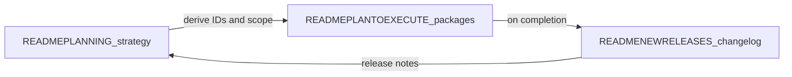

# READMEPLANTOEXECUTE — from strategy to shipped work

This file turns **[READMEPLANNING.md](READMEPLANNING.md)** into **traceable execution**: epics, work packages, acceptance criteria, primary code paths, and **status** you update until done. When a package ships, record it in **[READMENEWRELEASES.md](READMENEWRELEASES.md)** and optionally tick the cross-link in READMEPLANNING.

**Marketplace and “ready-to-bake” verticals:** the **Go-To** commercial story depends on shipping **catalog + install + proof** (see [READMEPLANNING.md](READMEPLANNING.md) §6). Track that work under epic **MK-01** below—not only the workflow editor (**WE-01**). Together they position a fork (e.g. **FulliO**) as **easy business voice**, not only infrastructure.

**Three experience tiers** (beautified no-code, minimal-code builders, full **agentic dev kit** with API + MCP + IDE): strategy in [READMEPLANNING.md](READMEPLANNING.md) §8; step-by-step journeys and **quality bar** in **[READMEEXPERIENCE.md](READMEEXPERIENCE.md)**; doc index in **[DOCS.md](DOCS.md)**; packages under epic **DX-01** below.

## Table of contents

- [Documentation workflow](#documentation-workflow-use-for-all-major-efforts)
- [Operating model](#operating-model--upstream-repo-tasks-and-keeping-scope-small) — upstream, tasks, WIP, checklist
- [Epic MK-01](#epic-mk-01--marketplace-ready-to-bake-vertical-packs)
- [Epic WE-01](#epic-we-01-workflow-editor-layout-and-feature-parity-reference-ui)
- [WE-01 Visual depth (design pillar)](#we-01-visual-depth-bento-glass-tactile-polish-design-pillar)
- [Epic DX-01](#epic-dx-01-three-tier-experience-nocode-builder-agentic-adk)
- [Epic index](#epic-index-add-rows-as-new-epics-appear)
- [Changelog of this file](#changelog-of-execution-doc-itself)

## Documentation workflow (use for all major efforts)

1. **Plan** — Add or refine themes in [READMEPLANNING.md](READMEPLANNING.md) (pillars, competitive rows, growth bets). Keep aspirations honest with **Shipped / Partial / Gap**.
2. **Execute** — In **this file**, add an **Epic** with stable **work item IDs** (e.g. `WE-01-…`). Each item: goal, acceptance criteria, key files, dependencies, status.
3. **Ship** — When merged to your release branch, append **[READMENEWRELEASES.md](READMENEWRELEASES.md)** with version/date, what changed, and which IDs closed.
4. **Retro** — Optionally adjust READMEPLANNING (scores, near-term bullets) so planning stays aligned with reality.

**Status values:** `NotStarted` | `InProgress` | `Blocked` | `Done` (when `Done`, mirror into READMENEWRELEASES).

---

## Operating model — upstream repo, tasks, and keeping scope small

This section **buttons up** how your fork stays merge-friendly with the **external repo you cloned** (e.g. `dograh-hq/dograh`) while using **this file** as the **source of feature work**—with **[READMEPLANNING.md](READMEPLANNING.md)** feeding new ideas **incrementally**, not as a dump.

### Source of truth (read this once)

| Layer | Role | What changes how often |
|-------|------|-------------------------|
| **[READMEPLANNING.md](READMEPLANNING.md)** | Strategy, pillars, vertical catalog, growth bets | Quarterly or when strategy shifts; **do not** turn every paragraph into a task overnight. |
| **READMEPLANTOEXECUTE.md (this file)** | **Actionable backlog**: epics, package IDs, acceptance criteria, status | **Weekly** (or per sprint): add packages, move one item to `InProgress`, close to `Done`. |
| **[READMENEWRELEASES.md](READMENEWRELEASES.md)** | Proof of what shipped | **Per release** when IDs close. |
| **[READMEBUILDME.md](READMEBUILDME.md) §6** | Git: remotes, merge vs rebase, submodule, conflict zones | When pulling upstream or bumping `pipecat`. |
| **External task system** (Linear, Jira, GitHub Issues/Projects, etc.) | Day-to-day assignees, dates, dependencies | **Mirror** the same IDs (`MK-01-CATALOG`, `WE-01-SHELL`, …) in titles or labels so nothing lives only in chat. |

**Rule:** New work **lands in READMEPLANNING** as narrative first; it **moves to READMEPLANTOEXECUTE** only when you are willing to staff it (add a package under an epic or create a new epic). If it is not in this file with an ID, it is **not** a committed feature—just intent.

### Bringing in the external repo (cadence with features)

Follow [READMEBUILDME.md](READMEBUILDME.md) **§6 Fork and upstream sync playbook** in spirit:

1. **Dedicated upstream integration** — merge `upstream/main` (or your vendor branch) on a **branch by itself** (e.g. `chore/merge-upstream-2026-04-17`). Run tests and a quick voice smoke (WebRTC + one PSTN path if you use it).
2. **Do not mix** a large upstream merge with a big **MK-01** / **WE-01** feature in the same PR unless unavoidable; you want a clean bisect if something breaks.
3. **`pipecat` submodule** — bump on its own commit; note the commit hash in READMENEWRELEASES when you ship it.
4. **Your fork-only code** stays in predictable paths ([READMEBUILDME.md](READMEBUILDME.md) §5) so rebases/merges touch fewer files.

### Project / task system (how it maps here)

- **Epic** = section **MK-01**, **WE-01**, **DX-01**, or a future `XX-NN` block in this file.
- **Task** = a **package** under an epic (`MK-01-CATALOG`, `WE-01-PALETTE`, …).
- In Jira/Linear/GitHub: one issue per package **or** one issue per epic with sub-tasks per package—**either way**, the **ID string** matches this doc.

### WIP limits — “not too much at once”

- Prefer **one** `InProgress` package per epic (e.g. only `WE-01-SHELL` **or** only `MK-01-CATALOG`, not five at once) unless you have multiple engineers and explicit ownership.
- When **READMEPLANNING** grows (new §6 rows, new bets), **do not** add ten packages the same day—pick **the next smallest shippable slice** (e.g. catalog schema + one vertical seed before `MK-01-BROWSE`).
- If scope creeps, **split** a package (`WE-01-TEST-A`, `WE-01-TEST-B`) rather than leaving one giant `InProgress` forever.

### Current focus (optional; edit each sprint)

| Active packages (`InProgress`) | Owner | Notes |
|--------------------------------|-------|-------|
| **WE-01-VISUAL-DEPTH** | | **`InProgress`** — design pillar + **`/usage`** pilot ([globals.css](ui/src/app/globals.css), [usage/page.tsx](ui/src/app/usage/page.tsx)). *Suggested next:* **WorkflowEditorShell** / catalog **MarketplaceCatalog** glass pass; **Lighthouse** blur cost check; manual **READMENEWRELEASES** step **(5)**. |

#### Rolling pass notes (keep short; update when you ship a slice)

| | |
|--|--|
| **This pass (shipped in repo now)** | **WE-01-VISUAL-DEPTH** (pilot) — Design pillar doc + package **WE-01-VISUAL-DEPTH** under epic **WE-01**; [globals.css](ui/src/app/globals.css) primitives (**`ovo-usage-hero`**, **`ovo-glass-panel`**, **`ovo-bento-cell`**, glow + float motion with **`prefers-reduced-motion`**); **`/usage`** hero + billing **bento** + glass **Activity** / **MPS** cards ([usage/page.tsx](ui/src/app/usage/page.tsx)). |
| **Next pass (suggested)** | **WE-01-VISUAL-DEPTH** — Apply **`ovo-*`** tokens to **WorkflowEditorShell** narrow sheets + **MarketplaceCatalog** cards; tune blur on low-end devices (**Lighthouse**). **CI:** confirm [api-pytest-usage-rollup.yml](.github/workflows/api-pytest-usage-rollup.yml) green. **Manual:** **READMENEWRELEASES** keyboard step **(5)**. |

### Checklist before you add work from READMEPLANNING

- [ ] The idea is **already** in READMEPLANNING (or you added a short paragraph there first).
- [ ] You created or updated a **package** here with acceptance criteria—not just a bullet in planning.
- [ ] You are **not** duplicating the same work under two IDs.
- [ ] Upstream merge is **either** done **or** scheduled; you know if this work touches `pipecat/` or generated `ui/src/client/`.

---

## Epic MK-01 — Marketplace: ready-to-bake vertical packs

**Epic owner:** _TBD_  
**Strategy anchor:** [READMEPLANNING.md](READMEPLANNING.md) §6 (vertical catalog, differentiation) and [READMEBUILDME.md](READMEBUILDME.md) §0 / §10.  
**Goal:** buyers **discover**, **try**, and **install** opinionated voice workflows per industry with minimal engineering—supporting the **marketplace row** in READMEPLANNING’s competitive table (**Gap** today).

### MK-01-CATALOG — Template catalog schema and seed data

**Status:** `Done`

**Goal:** For each vertical row in READMEPLANNING §6, define a **template record**: slug, industry, use cases[], languages[], supported modes (`webrtc` | `pstn`), compliance tags, preview audio URL, cost/latency **estimate band**, `workflow_definition_id` or packaged JSON.

**Acceptance criteria:**

- [x] At least **three** vertical packs documented as JSON or DB seeds (healthcare, retail, B2B SaaS suggested first). **Canonical JSON:** [catalog/vertical-packs.json](catalog/vertical-packs.json); index [catalog/README.md](catalog/README.md).
- [x] Each pack links to a **runbook** (markdown) checked into repo or docs site. **Runbooks:** [runbooks/](runbooks/) (see [runbooks/README.md](runbooks/README.md)).

**Key files:** [catalog/vertical-packs.json](catalog/vertical-packs.json), [runbooks/](runbooks/), [api/db/models.py](api/db/models.py) `WorkflowTemplates` (future binding via `workflow_template` fields in JSON), [api/db/workflow_template_client.py](api/db/workflow_template_client.py), [api/routes/workflow.py](api/routes/workflow.py) `GET /templates`.

---

### MK-01-INSTALL — One-click “install into my org”

**Status:** `Done`

**Goal:** API + UI: user picks pack → clone workflow + variables + optional tools stub list → lands in editor with **read-only** graph until user clicks “Customize”.

**Acceptance criteria:**

- [x] No cross-org data leak; new workflow `organization_id` is caller’s org (`create_workflow` + `install-from-catalog` use `user.selected_organization_id` only).
- [x] Variables surface in dashboard for non-technical editing (`GET /workflow/fetch` includes `template_context_variables`; [WorkflowTable](ui/src/components/workflow/WorkflowTable.tsx) shows keys).

**Shipped paths:**

- `POST /api/v1/workflow/install-from-catalog` — installs from [catalog/vertical-packs.json](catalog/vertical-packs.json) + [catalog/packaged-workflows/](catalog/packaged-workflows/) JSON graphs; sets `workflow_configurations.mk01` with `installation_locked: true` until **Customize** clears it via `PUT /workflow/{id}`.
- `GET /api/v1/catalog/vertical-packs` — same catalog JSON for the UI.
- UI: [ui/src/app/workflow/catalog/page.tsx](ui/src/app/workflow/catalog/page.tsx); **Create Agent → Template catalog** in [CreateWorkflowButton](ui/src/components/workflow/CreateWorkflowButton.tsx).

**Key files:** [api/routes/workflow.py](api/routes/workflow.py), [api/routes/catalog.py](api/routes/catalog.py), [api/db/workflow_client.py](api/db/workflow_client.py) `create_workflow`, [ui/src/app/workflow/](ui/src/app/workflow/), [ui/src/app/workflow/[workflowId]/RenderWorkflow.tsx](ui/src/app/workflow/[workflowId]/RenderWorkflow.tsx) (install lock + Customize).

---

### MK-01-TRY — Try flow from catalog (Web + persona)

**Status:** `Done`

**Goal:** From template detail: launch **Web call** or **simulated user** without full publish (sandbox org or flagged run).

**Acceptance criteria:**

- [x] Costs labeled (LLM vs telephony); no surprise PSTN charges on “Try” — **Try (Web only)** on [MarketplaceCatalog](ui/src/components/catalog/MarketplaceCatalog.tsx) uses `smallwebrtc` only; dialog explains LLM/STT/TTS vs PSTN.
- [x] Reuse or extend [api/routes/looptalk.py](api/routes/looptalk.py) for **simulated user** / persona try — `POST /api/v1/looptalk/test-sessions/quick-persona` creates a session with **actor** = installed workflow and **adversary** = system `[System] LoopTalk simulated caller` from [catalog/packaged-workflows/looptalk-simulated-caller.json](catalog/packaged-workflows/looptalk-simulated-caller.json). UI: **Try (LoopTalk persona)** on catalog; **Simulation** rail in [WorkflowEditorRightRail.tsx](ui/src/app/workflow/[workflowId]/components/WorkflowEditorRightRail.tsx).

**Shipped paths:**

- Web: `install-from-catalog` → `POST .../workflow/{id}/runs` with `mode: smallwebrtc` → `/workflow/{id}/run/{runId}`.
- LoopTalk: `install-from-catalog` → `quick-persona` → `/looptalk/{sessionId}` (user starts the run on the LoopTalk page).

**Dependencies:** may overlap **WE-01-TEST**; coordinate so one backend path serves editor and marketplace.

---

### MK-01-BROWSE — Discover UI (industry / use case / filters)

**Status:** `Done`

**Goal:** Marketplace browse page (or section of dashboard) with filters aligned to READMEPLANNING §6 table.

**Acceptance criteria:**

- [x] Filter by industry, use case tag, language, compliance tag ([ui/src/lib/catalog/filterVerticalPacks.ts](ui/src/lib/catalog/filterVerticalPacks.ts), [MarketplaceCatalog](ui/src/components/catalog/MarketplaceCatalog.tsx)).
- [x] SEO-friendly public page **optional** — [ui/src/app/templates/](ui/src/app/templates/) (`/templates` with `metadata` in `layout.tsx`; server-side catalog fetch with `revalidate`).

**Key files:** [ui/src/components/catalog/MarketplaceCatalog.tsx](ui/src/components/catalog/MarketplaceCatalog.tsx), [ui/src/app/workflow/catalog/page.tsx](ui/src/app/workflow/catalog/page.tsx), [ui/src/app/templates/page.tsx](ui/src/app/templates/page.tsx).

---

### MK-01-PARTNER — Partner submit + review pipeline

**Status:** `Done`

**Goal:** Partners submit packs; internal or community **review** checklist before `published`; optional revenue share fields (roadmap).

**Acceptance criteria:**

- [x] Documented review criteria (safety, PII, telephony compliance copy) — [catalog/PARTNER_REVIEW.md](catalog/PARTNER_REVIEW.md).
- [x] Version semver on pack updates — each pack has **`pack_semver`** in [catalog/vertical-packs.json](catalog/vertical-packs.json); policy in [catalog/README.md](catalog/README.md) § Pack versioning (`catalog_version` vs `pack_semver`).

**Note:** Automated **submit** or revenue-share plumbing is out of scope for this package; PR-based submission is described in catalog README.

---

## Reference: competitor-style workflow editor (screenshot baseline)

**Goal:** Extend our workflow editor **layout and capabilities** toward the UX shown in the **April 2026 reference screenshot** (patient screening template): persistent **left palette** (nodes + components), **dense header** (metadata, cost/latency/token hints, Create vs Simulation, autosave, publish), **right rail** (Global settings + in-editor test agent: audio/LLM tests, manual chat, AI-simulated user), **canvas** tools, and **subflow / component** tabs in a footer bar.

**Current implementation (ground truth):**

| Area | Today | Primary paths |
|------|--------|----------------|
| Layout | **Three-column resizable shell** (palette \| canvas \| inspector rail); full-width canvas when viewing a **historical** version | [RenderWorkflow.tsx](ui/src/app/workflow/[workflowId]/RenderWorkflow.tsx), [WorkflowEditorShell.tsx](ui/src/app/workflow/[workflowId]/components/WorkflowEditorShell.tsx) |
| Header | Name, save, publish, run/phone, version history | [ui/src/app/workflow/[workflowId]/components/WorkflowEditorHeader.tsx](ui/src/app/workflow/[workflowId]/components/WorkflowEditorHeader.tsx) |
| Add nodes | **Docked palette** with **Nodes \| Components** tabs; click-to-add at viewport center; overlay variant still available | [AddNodePanel.tsx](ui/src/components/flow/AddNodePanel.tsx) |
| Settings | Full-page **settings** + **right rail** tabs **Inspector \| Global** (template variables + node summary); deep link `?section=` | [settings/page.tsx](ui/src/app/workflow/[workflowId]/settings/page.tsx), [WorkflowEditorRightRail.tsx](ui/src/app/workflow/[workflowId]/components/WorkflowEditorRightRail.tsx) |
| Test / simulate | **Web call** dialog; not the same as inline “Test Agent” + AI user simulator | [ui/src/app/workflow/[workflowId]/components/PhoneCallDialog.tsx](ui/src/app/workflow/[workflowId]/components/PhoneCallDialog.tsx) |
| Node types | `startCall`, `agentNode`, `endCall`, `globalNode`, `trigger`, `webhook`, `qa` | [ui/src/components/flow/types.ts](ui/src/components/flow/types.ts), [RenderWorkflow.tsx](ui/src/app/workflow/[workflowId]/RenderWorkflow.tsx) `nodeTypes` |
| Backend graph | Pipecat / workflow engine consumes persisted JSON | [api/services/workflow/pipecat_engine.py](api/services/workflow/pipecat_engine.py), [api/routes/workflow.py](api/routes/workflow.py) |

**READMEPLANNING alignment:** Pillar 1 (dual-mode editors, templates, non-technical UX), competitive row **Authoring**, growth bet **18** (embeddable concierge — share patterns with in-editor test).

---

## Epic WE-01 — Workflow editor: layout and feature parity (reference UI)

**Epic owner:** _TBD_  
**Target:** iterative releases; do not block shipping on full parity.

### WE-01 Visual depth (bento, glass, tactile polish design pillar)

**Creative brief (operator / “voice ops” dashboard aesthetic):** Ship a high-fidelity UI with **visual depth** and **tactile feedback** so the product feels premium, calm, and futuristic—not flat admin chrome. Direction:

- **Layout:** **Bento grid** for dense metrics (billing, credits, activity) with **generous negative space** between regions so each tile breathes.
- **Surfaces:** **Soft-edge glassmorphism**—frosted, translucent panels (`backdrop-filter` + layered fills) over subtle mesh / radial gradients; **anti-aliased** borders (`color-mix` on `border`) and **subtle inner highlights** (inset box-shadow) for lift.
- **Lighting:** **Dynamic lighting**—soft **glows** behind hero and active regions (low-opacity blurs, slow drift animation) without overwhelming data legibility.
- **Motion:** **Micro-interactions**—spring-like hover/active on metric tiles (CSS `cubic-bezier` + slight scale / translate), **animated** decorative icons where they aid orientation (respect **`prefers-reduced-motion`**).
- **Typography & color:** **High-contrast** headings and tabular numerals for usage; body copy stays **muted** for hierarchy; charts stay accessible (do not rely on glow alone for meaning).

**Fork alignment:** This pillar complements **WE-01-ORG-USAGE** (`/usage`), **MK-01-BROWSE** (catalog), and the **Simulation** rail—roll out incrementally so upstream merges stay safe.

---

### WE-01-VISUAL-DEPTH — Premium surfaces (pilot → rollout)

**Status:** `InProgress` (pilot shipped on **`/usage`**; next slices: editor chrome, catalog)

**Goal:** Codify reusable **glass / bento / hero** primitives in the UI bundle and apply them first where operators spend time on numbers (**Organization usage**).

**Acceptance criteria:**

- [x] **Global primitives** — Shared classes in [globals.css](ui/src/app/globals.css): **`ovo-usage-hero`** (layered gradients + border + depth shadow), **`ovo-glass-panel`** / **`ovo-bento-cell`** (frosted glass, inner highlight, hover lift with **`prefers-reduced-motion`** fallbacks), **`ovo-hero-glow`** + drift keyframes, **`ovo-icon-float`** for subtle SVG motion.
- [x] **`/usage` pilot** — [usage/page.tsx](ui/src/app/usage/page.tsx): hero band (eyebrow, **h1**, supporting copy, timezone in a glass card, ambient glows); **Current billing period** as a **bento** row (wide **tokens** tile + **call time** + **USD** tiles); **Activity** and **Dograh Model Credits** cards use **`ovo-glass-panel`** for parity with the hero.
- [ ] **Editor shell** — **WorkflowEditorShell** / header: restrained glass on narrow **Sheet** drawers + palette; no regression to focus order (**WE-01-A11Y-QA**).
- [ ] **Marketplace catalog** — **MarketplaceCatalog** card grid: bento rhythm + glass cards aligned with `/usage` tokens.
- [ ] **Optional:** spring presets in Tailwind theme; Lighthouse performance budget check (blur cost on low-end devices).

**Key files:** [globals.css](ui/src/app/globals.css), [usage/page.tsx](ui/src/app/usage/page.tsx); future — [WorkflowEditorShell.tsx](ui/src/app/workflow/[workflowId]/components/WorkflowEditorShell.tsx), [MarketplaceCatalog.tsx](ui/src/components/catalog/MarketplaceCatalog.tsx).

---

### WE-01-SHELL — Three-column resizable shell

**Status:** `Done`

**Goal:** Persistent **left rail** (palette width ~240–280px), **center** React Flow canvas, **right rail** (inspector / test ~320–400px), all **resizable** with persisted widths (localStorage or user prefs API later).

**Acceptance criteria:**

- [x] Layout works at 1280px width without horizontal scroll on canvas controls (`min-h-0` / `min-w-0` on panels; flex percentage defaults).
- [x] Rails collapse to **icon buttons** on narrow breakpoints (`max-width: 1023px`) — full-width canvas plus **Sheet** drawers for palette (left) and inspector/simulation (right); see [WorkflowEditorShell.tsx](ui/src/app/workflow/[workflowId]/components/WorkflowEditorShell.tsx) (`WORKFLOW_EDITOR_NARROW_MAX_PX`). Documented in [READMENEWRELEASES.md](READMENEWRELEASES.md).
- [x] No regression: save, publish, version history, read-only historical version still reachable (historical view uses full-width canvas + read-only graph; editing uses shell).

**Key files:** [RenderWorkflow.tsx](ui/src/app/workflow/[workflowId]/RenderWorkflow.tsx), [WorkflowEditorShell.tsx](ui/src/app/workflow/[workflowId]/components/WorkflowEditorShell.tsx), [WorkflowEditorRightRail.tsx](ui/src/app/workflow/[workflowId]/components/WorkflowEditorRightRail.tsx), [AddNodePanel.tsx](ui/src/components/flow/AddNodePanel.tsx) (`variant="inline"`).

---

### WE-01-PALETTE — Docked node + component palette

**Status:** `Done`

**Goal:** Replace floating-only add flow with a **left dock** matching reference: tabs **Nodes | Components**; grouped draggable entries (colors/icons optional parity).

**Acceptance criteria:**

- [x] All **existing** node types reachable from palette without opening a separate modal, or modal only for “advanced add”.
- [x] Drag-to-canvas or click-to-add at viewport center — pick one pattern and document it (**click-to-add** at viewport center via `handleNodeSelect` in [useWorkflowState.ts](ui/src/app/workflow/[workflowId]/hooks/useWorkflowState.ts); drag-from-palette not implemented).
- [x] Keyboard: focus trap / Escape behavior documented (see **Keyboard / a11y** below).

**Keyboard / a11y (implemented behavior):**

- **Docked (inline) palette:** No modal focus trap — the palette is part of the page; **Escape** does **not** close it (use canvas / header as usual). Tab order includes the Radix **Tabs** list (arrow keys move between **Nodes** and **Components** per [Radix Tabs](https://www.radix-ui.com/primitives/docs/components/tabs#accessibility)).
- **Overlay palette:** **Escape** closes the panel (existing behavior). Tabs behave the same as docked.

**Key files:** [AddNodePanel.tsx](ui/src/components/flow/AddNodePanel.tsx), [useWorkflowState](ui/src/app/workflow/[workflowId]/hooks/useWorkflowState.ts) (or equivalent) for `handleNodeSelect`.

**Parity map (reference → current / new):**

| Reference node | Approach |
|----------------|----------|
| Conversation | Extend **Agent** node UX/copy; same `NodeType.AGENT_NODE` unless product renames. |
| Subagent | **New** node type or subgraph call — needs [api](api) graph validation + Pipecat support (likely **Blocked** until backend design). |
| Function | Overlap with **tools** on agent nodes + **Webhook**; clarify product: dedicated “inline function” node vs tool. |
| Call Transfer | Tool-based transfer today — optional dedicated node for discoverability. |
| Press Digit | **New** — DTMF / gather digit path; telephony + Pipecat. |
| Logic Split | Partially **edges with conditions** (`CustomEdge`); may need “split” visual node. |
| Agent Transfer | **New** or subgraph — backend routing. |
| In-Call SMS | **New** — provider + compliance. |
| Extract Variable | Partially **extraction** fields on `FlowNodeData` — surface as first-class palette entry. |
| Code | **New** — sandboxed expression step (high risk); phase later. |
| MCP | **New** — surface MCP tools / servers in graph ([api/app.py](api/app.py) MCP mount exists). |
| Ending | Maps to **End Call**. |
| Note | **New** — canvas-only annotation, not executed. |

---

### WE-01-HEADER — Header metadata and modes

**Status:** `Done` (partial: **dry-run** + **weekly and daily usage trends** in editor; **org dashboard** = **WE-01-ORG-USAGE**)

**Goal:** Richer header: **template source** label, optional **Agent/workflow IDs** (non-secret), **estimated cost / latency / token** band (from last N runs or dry-run), **Create | Simulation** tabs, **autosave** indicator, feedback entry point.

**Acceptance criteria:**

- [x] “From template **X**” when workflow came from catalog or DB template — **`workflow_configurations.mk01`**: `catalog_slug` + optional catalog fetch for display name; `source_template_id` shows “From template #N”. ([WorkflowEditorHeader.tsx](ui/src/app/workflow/[workflowId]/components/WorkflowEditorHeader.tsx), [headerMetadata.ts](ui/src/lib/workflow/headerMetadata.ts))
- [x] **Edit | Simulation** tabs switch right rail (simulation = cost-safe copy + WE-01-TEST placeholder; canvas unchanged). ([WorkflowEditorRightRail.tsx](ui/src/app/workflow/[workflowId]/components/WorkflowEditorRightRail.tsx))
- [x] No PII in header — only workflow **id**, catalog/template labels, catalog **cost/latency estimate band** text (no user content).
- [x] **Saved** affordance — “No unsaved changes” when graph is clean (not a claim of publish).
- [x] **Latest run usage** — header shows **Last run: …** (Dograh tokens · call length) when the most recent runs with `cost_info` exist, using existing `GET /workflow/{id}/runs` ([recentRunUsage.ts](ui/src/lib/workflow/recentRunUsage.ts), [RenderWorkflow.tsx](ui/src/app/workflow/[workflowId]/RenderWorkflow.tsx)).
- [x] **Multi-run token average** — when ≥2 recent runs include `dograh_token_usage`, header shows **Avg last N runs: X tokens** (N ≤ 10, same API response) ([computeRunUsageHints](ui/src/lib/workflow/recentRunUsage.ts)).
- [x] **Feedback entry point** — **Send feedback** in the header ⋮ menu opens the in-app dialog (**WE-01-FEEDBACK**); optional `NEXT_PUBLIC_FEEDBACK_URL` adds an external link inside the dialog; PostHog `feedback_link_clicked` / `feedback_in_app_submitted` ([feedbackUrl.ts](ui/src/lib/feedbackUrl.ts), [WorkflowFeedbackDialog.tsx](ui/src/app/workflow/[workflowId]/components/WorkflowFeedbackDialog.tsx)).
- [x] **Main graph draft (structure)** — metadata line summarizes the **main** flow’s node/edge/agent counts from the editor (uses `mainSnapshot` when the canvas is on a component tab) ([draftGraphStats.ts](ui/src/lib/workflow/draftGraphStats.ts)).
- [x] **Token/cost dry-run (no live call)** — `GET /api/v1/workflow/{workflow_id}/estimate-cost` uses saved draft (else released) graph + merged `workflow_configurations` and user model settings; returns estimated USD, Dograh tokens (×100), and assumptions ([cost_estimate_dry_run.py](api/services/workflow/cost_estimate_dry_run.py)); header shows **Est. dry-run** with tooltip ([workflowCostDryRun.ts](ui/src/lib/workflow/workflowCostDryRun.ts), [workflow.py](api/routes/workflow.py)).
- [x] **Usage trend (runs over time)** — primary rollups: `GET /api/v1/workflow/{workflow_id}/usage/weekly-rollup?weeks=…` (UTC **week** buckets) and **`GET .../usage/daily-rollup?days=…`** (UTC **day** buckets); **Simulation** rail **Week \| Day** toggle + **4–52** week / **7–90** day **Range** selectors (URL + sessionStorage); **Recharts** bars + token line; fallback: `GET .../runs` `limit=100` + client [aggregateRunsByWeek](ui/src/lib/workflow/workflowRunTrends.ts) / [aggregateRunsByDay](ui/src/lib/workflow/workflowRunTrends.ts) if rollup fails; header line **Trend (N wks \| days): …** via [formatUsageTrendHint](ui/src/lib/workflow/workflowRunTrends.ts) ([WorkflowUsageTrendPanel.tsx](ui/src/app/workflow/[workflowId]/components/WorkflowUsageTrendPanel.tsx), [RenderWorkflow.tsx](ui/src/app/workflow/[workflowId]/RenderWorkflow.tsx)).

**Still Gap (future):** scheduled reports; richer **PNG** automation beyond manual export.

**Key files:** [WorkflowEditorHeader.tsx](ui/src/app/workflow/[workflowId]/components/WorkflowEditorHeader.tsx), [RenderWorkflow.tsx](ui/src/app/workflow/[workflowId]/RenderWorkflow.tsx), [WorkflowEditorRightRail.tsx](ui/src/app/workflow/[workflowId]/components/WorkflowEditorRightRail.tsx), [recentRunUsage.ts](ui/src/lib/workflow/recentRunUsage.ts), [workflowRunTrends.ts](ui/src/lib/workflow/workflowRunTrends.ts), [workflowCostDryRun.ts](ui/src/lib/workflow/workflowCostDryRun.ts), [feedbackUrl.ts](ui/src/lib/feedbackUrl.ts), [draftGraphStats.ts](ui/src/lib/workflow/draftGraphStats.ts) (`formatMainDraftGraphStats`, `formatSubflowInventory`).

---

### WE-01-FEEDBACK — In-app product feedback

**Status:** `Done`

**Goal:** Operators can send **product feedback** from the workflow editor without leaving the app; messages are stored server-side with user, organization, and optional workflow context.

**Acceptance criteria:**

- [x] **API** — `POST /api/v1/feedback` (authenticated) accepts `message`, optional `workflow_id` (must belong to caller’s selected org), optional `source`; persists to `product_feedback` ([feedback.py](api/routes/feedback.py), [feedback_client.py](api/db/feedback_client.py)).
- [x] **Migration** — [`product_feedback`](api/alembic/versions/f8a91c2d4e6b_add_product_feedback_table.py) table.
- [x] **UI** — Header ⋮ **Send feedback** opens [WorkflowFeedbackDialog](ui/src/app/workflow/[workflowId]/components/WorkflowFeedbackDialog.tsx); client [productFeedbackSubmit.ts](ui/src/lib/productFeedbackSubmit.ts); optional **Open external form** link when `NEXT_PUBLIC_FEEDBACK_URL` is set ([ui/.env.example](ui/.env.example)).
- [x] **Tests** — [test_product_feedback.py](api/tests/test_product_feedback.py).

**Key files:** [feedback.py](api/routes/feedback.py), [models.py](api/db/models.py) `ProductFeedbackModel`, [main.py](api/routes/main.py) router include, [WorkflowFeedbackDialog.tsx](ui/src/app/workflow/[workflowId]/components/WorkflowFeedbackDialog.tsx), [WorkflowEditorHeader.tsx](ui/src/app/workflow/[workflowId]/components/WorkflowEditorHeader.tsx).

---

### WE-01-ORG-USAGE — Organization usage dashboard

**Status:** `Done` (sidebar **Usage** route; APIs in [organization_usage.py](api/routes/organization_usage.py); deep-links in [usageOrgDeepLink.ts](ui/src/lib/usageOrgDeepLink.ts))

**Goal:** One place to see **org-wide** usage: current billing period / quota, weekly run trend across **all** workflows, existing run history and filters — not only per-workflow header/rail hints.

**Acceptance criteria:**

- [x] **Billing period** — `/usage` shows **Current billing period** from `GET /api/v1/organizations/usage/current-period` (tokens, optional quota bar, duration, optional USD when present); clear handling when no org / API errors.
- [x] **Weekly trend (org)** — `GET /api/v1/organizations/usage/weekly-rollup?weeks=…` (server UTC **week** aggregates); user-selectable lookback **4–52** weeks; chart: **stacked** inbound vs outbound **run** bars + tokens **line** (Recharts); maps buckets via [weeklyRollupApiToUsageTrendBuckets](ui/src/lib/workflow/workflowRunTrends.ts); [WorkflowUsageTrendPanel](ui/src/app/workflow/[workflowId]/components/WorkflowUsageTrendPanel.tsx) supports **onWeekClick** (org dashboard).
- [x] **Daily trend (org)** — `GET /api/v1/organizations/usage/daily-rollup?days=…` or `since`/`until` (UTC **calendar-day** buckets, same inclusive range rules as weekly); **`/usage`** **Week \| Day** toggle; URL **`?trendGranularity=day`** + **`?trendDays=`** (7 \| 14 \| 30 \| 60 \| 90, default **30**); maps buckets via [dailyRollupApiToUsageTrendBuckets](ui/src/lib/workflow/workflowRunTrends.ts); bar click applies **one UTC day** to **Usage History** ([utcDayRangeFromYmd](ui/src/lib/usageOrgDeepLink.ts)).
- [x] **Daily trend (workflow, Simulation)** — `GET /api/v1/workflow/{workflow_id}/usage/daily-rollup` with the same **`days`** or fixed **`since` / `until`** query shape as weekly; **Simulation** rail **Week \| Day** toggle + **`usageTrendLookbackDays:{id}`** sessionStorage; client fallback [aggregateRunsByDay](ui/src/lib/workflow/workflowRunTrends.ts) when the rollup API fails; header **Trend** hint uses [formatUsageTrendHint](ui/src/lib/workflow/workflowRunTrends.ts) with day/week wording ([RenderWorkflow.tsx](ui/src/app/workflow/[workflowId]/RenderWorkflow.tsx)).
- [x] **Integration tests (rollup)** — [test_usage_daily_rollup_routes.py](api/tests/test_usage_daily_rollup_routes.py): no org → **400**; **`days` > 90** → **422**; incomplete **`since`/`until`** → **400**; fixed range **bucket** counts + **inbound**/**outbound**; workflow **404** when workflow not in org; per-workflow filter vs org-wide; **weekly** rollup parity (**400** / **404** / **422**, scoped workflow counts).
- [x] **Pytest DB ergonomics** — optional **`PYTEST_DATABASE_URL`** skips **`CREATE DATABASE`** when the role lacks **`CREATEDB`** ([conftest.py](api/conftest.py)); copy **[.env.test.example](api/.env.test.example)** → **`.env.test`** for **`DATABASE_URL`**, **`REDIS_URL`**, and optional **`PYTEST_DATABASE_URL`**.
- [x] **Discoverability** — workflow editor header ⋮ includes **Organization usage** → [`/usage`](ui/src/app/usage/page.tsx) ([WorkflowEditorHeader.tsx](ui/src/app/workflow/[workflowId]/components/WorkflowEditorHeader.tsx)).
- [x] **Deep-links** — `?week=YYYY-MM-DD` (**UTC Monday**) seeds the **Date range** filter (then canonicalizes to `filters=` JSON); **`?trendWeeks=`** (4 \| 8 \| 12 \| 26 \| 52) selects the **week** chart lookback (default **8**, omitted when default); **`?trendGranularity=day`** with **`?trendDays=`** (7 \| 14 \| 30 \| 60 \| 90, default **30** omitted) selects **daily** rollup when not using a custom range; optional **`?trendSince=`** / **`?trendUntil=`** (both **UTC YYYY-MM-DD**, inclusive) request a **fixed calendar range** for the chart (overrides rolling `trendWeeks` / `trendDays`; **`trendGranularity=day`** preserved when set so refresh stays on daily); pagination/filter URLs preserve the active chart mode; clicking a **bar** applies that UTC **week** or **day** to the table and scrolls to **Usage History**; **workflow editor Simulation** rail uses the same **`trendWeeks`** / **`trendSince`** / **`trendUntil`** / **`trendGranularity`** / **`trendDays`** query keys plus **`usageTrendLookback:{id}`**, **`usageTrendLookbackDays:{id}`**, and **`usageTrendRange:{id}`** sessionStorage for the per-workflow **weekly** or **daily** rollup chart, with **CSV** + **PNG** export (same [WorkflowUsageTrendPanel](ui/src/app/workflow/[workflowId]/components/WorkflowUsageTrendPanel.tsx) as `/usage`).
- [x] **Export** — **CSV** download of visible trend buckets on `/usage` and Simulation ([exportUsageTrendBucketsToCsv](ui/src/lib/workflow/workflowRunTrends.ts)); **PNG** snapshot of the chart ([exportUsageTrendChartToPng](ui/src/lib/workflow/usageTrendChartExport.ts)); filenames reflect **weekly** vs **daily** stem.
- [x] **Editor entry** — header **Trend (…)** line links to **`/usage?week=`** for the **current UTC week**; ⋮ menu **Org usage · this UTC week** (same); general **Organization usage** still opens `/usage` without a week ([WorkflowEditorHeader.tsx](ui/src/app/workflow/[workflowId]/components/WorkflowEditorHeader.tsx)).

**Key files:** [usage/page.tsx](ui/src/app/usage/page.tsx), [usageOrgDeepLink.ts](ui/src/lib/usageOrgDeepLink.ts), [organization_usage.py](api/routes/organization_usage.py), [workflow.py](api/routes/workflow.py) (`/workflow/{id}/usage/weekly-rollup`, `/workflow/{id}/usage/daily-rollup`), [usage_rollup.py](api/schemas/usage_rollup.py), [usage_rollup_range.py](api/utils/usage_rollup_range.py), [organization_usage_client.py](api/db/organization_usage_client.py) `get_weekly_usage_rollup`, `get_daily_usage_rollup`, [test_usage_daily_rollup_routes.py](api/tests/test_usage_daily_rollup_routes.py), [conftest.py](api/conftest.py), [.env.test.example](api/.env.test.example), [.github/workflows/api-pytest-usage-rollup.yml](.github/workflows/api-pytest-usage-rollup.yml), [RenderWorkflow.tsx](ui/src/app/workflow/[workflowId]/RenderWorkflow.tsx), [WorkflowEditorRightRail.tsx](ui/src/app/workflow/[workflowId]/components/WorkflowEditorRightRail.tsx), [WorkflowUsageTrendPanel.tsx](ui/src/app/workflow/[workflowId]/components/WorkflowUsageTrendPanel.tsx), [usageTrendChartExport.ts](ui/src/lib/workflow/usageTrendChartExport.ts), [workflowRunTrends.ts](ui/src/lib/workflow/workflowRunTrends.ts), [WorkflowEditorHeader.tsx](ui/src/app/workflow/[workflowId]/components/WorkflowEditorHeader.tsx), [AppSidebar.tsx](ui/src/components/layout/AppSidebar.tsx) (existing **Usage** nav).

---

### WE-01-RIGHT-INSPECTOR — Global settings + node inspector in rail

**Status:** `Done` (partial: template vars + node summary; full General/Models forms remain on settings route)

**Goal:** Move or **mirror** key flows from [settings/page.tsx](ui/src/app/workflow/[workflowId]/settings/page.tsx) into **Global Settings** tab on right rail; second tab or accordion for **selected node** properties (reduce double-click modal only workflow).

**Acceptance criteria:**

- [x] Changing global settings updates same store/API as today’s settings page — **Global** tab uses `saveTemplateContextVariables` from [useWorkflowState.ts](ui/src/app/workflow/[workflowId]/hooks/useWorkflowState.ts) (same as settings). **Inspector** tab shows a read-only summary of the **single** selected node (`nodes[].selected`).
- [x] Deep link `/workflow/:id/settings` still works — optional `?section=` (e.g. `variables`, `models`, `general`) scrolls to that section ([settings/page.tsx](ui/src/app/workflow/[workflowId]/settings/page.tsx)); links from [WorkflowEditorRightRail.tsx](ui/src/app/workflow/[workflowId]/components/WorkflowEditorRightRail.tsx).

**Key files:** [WorkflowEditorRightRail.tsx](ui/src/app/workflow/[workflowId]/components/WorkflowEditorRightRail.tsx), [TemplateVariablesRailPanel.tsx](ui/src/app/workflow/[workflowId]/components/TemplateVariablesRailPanel.tsx), [RenderWorkflow.tsx](ui/src/app/workflow/[workflowId]/RenderWorkflow.tsx), settings [page.tsx](ui/src/app/workflow/[workflowId]/settings/page.tsx).

---

### WE-01-TEST — In-editor Test Agent (manual + AI user)

**Status:** `Done` (partial: rich **LoopTalk** adversary packs / shared persona library vs editor `user_persona` hint below)

**Goal:** Right-rail **Test Agent**: **Test Audio**, **Test LLM**, **raw JSON** toggle, **manual** message thread, **AI-simulated user** with configurable persona (align with [READMEPLANNING](READMEPLANNING.md) LoopTalk / eval direction).

**Acceptance criteria:**

- [x] Manual text path does not place PSTN charges; cost label honest — **Simulation** rail + LoopTalk quick path document **no PSTN** for internal LoopTalk transport (see [WorkflowEditorRightRail.tsx](ui/src/app/workflow/[workflowId]/components/WorkflowEditorRightRail.tsx)).
- [x] Simulated user uses a defined API — `POST /api/v1/looptalk/test-sessions/quick-persona` ([api/routes/looptalk.py](api/routes/looptalk.py)); editor button creates session and opens `/looptalk/{id}`.
- [x] Raw view for debugging — **Simulation** rail **Raw debug (redacted)** collapsible shows in-memory workflow JSON (nodes/edges, template variables, `workflow_configurations`) via [redactForDebugJson.ts](ui/src/lib/workflow/redactForDebugJson.ts); not a substitute for network HAR (no live run request/response yet).
- [x] **Web test (browser)** in **Simulation** rail — **Start Web test** uses the same run as **Call → Web Call** (mic / STT / LLM / TTS; no PSTN); tooltips when save/validation block the run.
- [x] **Manual chat** thread in-rail — `POST /api/v1/workflow/{workflow_id}/simulation/text-turn` ([simulation_text_turn.py](api/services/workflow/simulation_text_turn.py)) + [SimulationManualChatPanel.tsx](ui/src/app/workflow/[workflowId]/components/SimulationManualChatPanel.tsx); uses draft graph’s first **Agent** after **Start**, user **LLM** settings, template variables; no PSTN.
- [x] **Optional simulated caller persona** — `user_persona` on the text-turn request + UI field (session-persisted per workflow); server prefixes each **user** turn ([simulation_user_persona.py](api/services/workflow/simulation_user_persona.py)).

**Key files:** [WorkflowEditorRightRail.tsx](ui/src/app/workflow/[workflowId]/components/WorkflowEditorRightRail.tsx), [RenderWorkflow.tsx](ui/src/app/workflow/[workflowId]/RenderWorkflow.tsx) (`simulationDebugSnapshot`), [redactForDebugJson.ts](ui/src/lib/workflow/redactForDebugJson.ts), [simulation_text_turn.py](api/services/workflow/simulation_text_turn.py), [simulationTextTurn.ts](ui/src/lib/workflow/simulationTextTurn.ts).

**Dependencies:** WE-01-SHELL; headless **text** path implemented for editor simulation (not full Pipecat voice pipeline).

---

### WE-01-SUBFLOWS — Main flow vs component tabs

**Status:** `Done` (editor + **Pipecat** voice: **enter_subflow** on main or component graph → run named subgraph → resume previous graph at edge target; nested entry uses sibling keys + stack resume)

**Goal:** Footer (or sub-header) tabs: **Main Flow**, **Component S1**, … backed by either multiple React Flow stores or subgraph IDs in `workflow_json`.

**Acceptance criteria:**

- [x] Published graph round-trips through API validation unchanged for single-flow workflows — existing workflows validate; optional `subflows` / `viewport` are explicit on [ReactFlowDTO](api/services/workflow/dto.py).
- [x] **Backend** accepts optional nested graph payload — `subflows: dict[str, Any] | None` on `ReactFlowDTO`; each **non-empty** subgraph is validated with the same graph rules as the primary flow ([WorkflowGraph](api/services/workflow/workflow.py) `subflow_graphs`).
- [x] **Pipecat voice** — [run_pipeline](api/services/pipecat/run_pipeline.py) builds `WorkflowGraph` from the run’s pinned JSON; [PipecatEngine](api/services/workflow/pipecat_engine.py) follows **main** `nodes`/`edges` unless a transition uses an outgoing edge with **`enter_subflow`** (runs that subgraph from its start, then continues at the edge’s **target** on the main graph after the subgraph’s end node).
- [x] **Edge trigger** — [EdgeDataDTO.enter_subflow](api/services/workflow/dto.py); validated on the root graph against loaded subgraph keys; **nested** component graphs may reference **sibling** subgraph names (same root `subflows` map); [test_workflow_subflows.py](api/tests/test_workflow_subflows.py).
- [x] **UI** — **Components** tab switches canvas scope, persists `subflows` + main `nodes`/`edges`/`viewport` on save, hydrates from API and version history ([workflowStore.ts](ui/src/app/workflow/[workflowId]/stores/workflowStore.ts), [useWorkflowState.ts](ui/src/app/workflow/[workflowId]/hooks/useWorkflowState.ts)).
- [x] **Edge UI (main + components)** — **Run subgraph first** on edge edit dialog ([CustomEdge.tsx](ui/src/components/flow/edges/CustomEdge.tsx)) when non-empty subgraph keys exist; on a component tab the dropdown **excludes the current scope** so you pick a sibling subgraph.
- [x] **Multiple component subgraphs** — scope bar lists **Component 1–3** (`component_1` … `component_3`); extend via [COMPONENT_SCOPE_ENTRIES](ui/src/app/workflow/[workflowId]/workflowScope.ts).
- [x] **Subgraph inventory in header** — non-empty `subflows` keys surfaced in metadata (**Subgraphs saved: …**); [formatSubflowInventory](ui/src/lib/workflow/draftGraphStats.ts).

**Key files:** [dto.py](api/services/workflow/dto.py) `ReactFlowDTO` / `EdgeDataDTO`, [workflow.py](api/services/workflow/workflow.py), [pipecat_engine.py](api/services/workflow/pipecat_engine.py), [run_pipeline.py](api/services/pipecat/run_pipeline.py), [test_workflow_subflows.py](api/tests/test_workflow_subflows.py), [test_dto.py](api/tests/test_dto.py), [WorkflowFlowScopeBar.tsx](ui/src/app/workflow/[workflowId]/components/WorkflowFlowScopeBar.tsx), [workflowScope.ts](ui/src/app/workflow/[workflowId]/workflowScope.ts) (`COMPONENT_SCOPE_ENTRIES`), [types.ts](ui/src/components/flow/types.ts) `WorkflowDefinition`, [CustomEdge.tsx](ui/src/components/flow/edges/CustomEdge.tsx), [RenderWorkflow.tsx](ui/src/app/workflow/[workflowId]/RenderWorkflow.tsx), [draftGraphStats.ts](ui/src/lib/workflow/draftGraphStats.ts).

---

### WE-01-DUALMODE — Form vs raw code tab (nodes + tools)

**Status:** `Done` (workflow canvas uses [UnsavedChangesContext](ui/src/context/UnsavedChangesContext.tsx) on `/workflow/[id]` — see [RenderWorkflow.tsx](ui/src/app/workflow/[workflowId]/RenderWorkflow.tsx))

**Goal:** Per READMEPLANNING Pillar 1: **Form** and **Raw** (JSON/YAML) tabs for node payload and tool wiring, with schema validation and diff vs last saved.

**Acceptance criteria:**

- [x] Invalid JSON blocks save with actionable errors — **Raw JSON** tab parses in-dialog; inline error + toast; **Save** disabled when parse fails ([NodeEditDialog.tsx](ui/src/components/flow/nodes/common/NodeEditDialog.tsx)).
- [x] Switching tabs does not drop unsaved changes — **Form → Raw** snapshots `getPendingData()`; **Raw → Form** applies valid JSON via `applyData`; discard confirmation uses form **or** raw text drift (`rawSnapshotRef`).

**Key files:** [NodeEditDialog.tsx](ui/src/components/flow/nodes/common/NodeEditDialog.tsx) (`dualMode?: { getPendingData, applyData }`), [useNodeDialogDirty.ts](ui/src/components/flow/nodes/common/useNodeDialogDirty.ts); **nodes** — [AgentNode.tsx](ui/src/components/flow/nodes/AgentNode.tsx), [GlobalNode.tsx](ui/src/components/flow/nodes/GlobalNode.tsx), [StartCall.tsx](ui/src/components/flow/nodes/StartCall.tsx), [EndCall.tsx](ui/src/components/flow/nodes/EndCall.tsx), [TriggerNode.tsx](ui/src/components/flow/nodes/TriggerNode.tsx), [WebhookNode.tsx](ui/src/components/flow/nodes/WebhookNode.tsx), [QANode.tsx](ui/src/components/flow/nodes/QANode.tsx). **Tools** — [ui/src/app/tools/[toolUuid]/page.tsx](ui/src/app/tools/[toolUuid]/page.tsx) + [useToolFormRawTabs.tsx](ui/src/app/tools/[toolUuid]/hooks/useToolFormRawTabs.tsx). **Editor leave guard** — [UnsavedChangesProvider](ui/src/context/UnsavedChangesContext.tsx) in [workflow/[workflowId]/page.tsx](ui/src/app/workflow/[workflowId]/page.tsx) + `workflow-canvas` in [RenderWorkflow.tsx](ui/src/app/workflow/[workflowId]/RenderWorkflow.tsx).

---

### WE-01-A11Y-QA — Accessibility and editor QA

**Status:** `Done` (ongoing: full contrast audit vs reference still optional)

**Goal:** Focus order, ARIA for rails, contrast on dark theme parity with reference.

**Acceptance criteria:**

- [x] Core author path keyboard-only smoke test documented in [READMENEWRELEASES.md](READMENEWRELEASES.md) under **Workflow editor** (narrow shell icon buttons + sheets; palette tabs; header save path).
- [x] **Usage trend granularity** (**Week \| Day**) uses **Radix Tabs** (`tablist` / `tab` roles, arrow-key navigation between triggers, visible label + **`aria-labelledby`** on the tab list) on **Simulation** and **`/usage`** — [UsageTrendGranularityTabs.tsx](ui/src/components/usage/UsageTrendGranularityTabs.tsx), [WorkflowEditorRightRail.tsx](ui/src/app/workflow/[workflowId]/components/WorkflowEditorRightRail.tsx), [usage/page.tsx](ui/src/app/usage/page.tsx).
- [x] **Usage trend chart** exposes a short **`aria-label`** (week vs day) plus a long description via **`aria-describedby`**; empty/error states use **`role="status"`** — [WorkflowUsageTrendPanel.tsx](ui/src/app/workflow/[workflowId]/components/WorkflowUsageTrendPanel.tsx).
- [x] **UTC custom range** controls grouped with **`fieldset`/`legend`** on **Simulation** and **`/usage`** — [WorkflowEditorRightRail.tsx](ui/src/app/workflow/[workflowId]/components/WorkflowEditorRightRail.tsx), [usage/page.tsx](ui/src/app/usage/page.tsx).

**Key files:** [READMENEWRELEASES.md](READMENEWRELEASES.md) (**WE-01-A11Y-QA** bullets); [UsageTrendGranularityTabs.tsx](ui/src/components/usage/UsageTrendGranularityTabs.tsx); [WorkflowEditorRightRail.tsx](ui/src/app/workflow/[workflowId]/components/WorkflowEditorRightRail.tsx); [usage/page.tsx](ui/src/app/usage/page.tsx); [WorkflowUsageTrendPanel.tsx](ui/src/app/workflow/[workflowId]/components/WorkflowUsageTrendPanel.tsx).

---

## Epic DX-01 — Three-tier experience (no-code, builder, agentic ADK)

**Epic owner:** _TBD_  
**Strategy anchor:** [READMEPLANNING.md](READMEPLANNING.md) §8.  
**Goal:** Ship a **cohesive** story: **Tier 1** beautified no-code UI, **Tier 2** minimal-code recipes for entrepreneurs, **Tier 3** full **agentic dev kit** (OpenAPI, MCP, IDE, generated client)—without three separate products. Same backend; different **entry points** and **documentation depth**.

### DX-01-NOCODE — Beautified operator experience

**Status:** `Done`

**Goal:** Template-first dashboard, strong empty states, publish validation copy, accessibility; **hide complexity** until “Advanced” (coordinates with **WE-01** shell + dual-mode). Marketplace install path when **MK-01** lands.

**Acceptance criteria:**

- [x] New user can reach **Web test** from template or blank workflow without reading JSON — **Template catalog** install + **Create Voice Agent** success flow open a Web run; in the editor, **Simulation → Start Web test** matches **Call → Web Call** (see [WorkflowEditorRightRail.tsx](ui/src/app/workflow/[workflowId]/components/WorkflowEditorRightRail.tsx)); empty canvas links to the catalog ([RenderWorkflow.tsx](ui/src/app/workflow/[workflowId]/RenderWorkflow.tsx)).
- [x] Validation errors are **human-readable** on publish/save — header popover uses [friendlyValidation.ts](ui/src/lib/workflow/friendlyValidation.ts) titles + hints for common graph errors and **node display names** when available ([WorkflowEditorHeader.tsx](ui/src/app/workflow/[workflowId]/components/WorkflowEditorHeader.tsx)).
- [x] Documented **happy path** Loom-style script for GTM — [gtm/no-code-happy-path.md](gtm/no-code-happy-path.md).
- [x] [READMEEXPERIENCE.md](READMEEXPERIENCE.md) no-code journey updated for validation UX note.

**Delight (optional but on-brand):** empty states with one primary CTA; success toast copy that confirms “you can share embed / phone next” without jargon.

**Dependencies:** overlaps **WE-01-SHELL**, **MK-01-INSTALL**; prioritize shared design tokens / layout first.

---

### DX-01-BUILDER — Minimal-code entrepreneur path

**Status:** `Done`

**Goal:** **Recipes** not novels: Twilio/Vonage attach, webhook URLs, embed snippet, campaign CSV—each as a **single doc page** or in-app drawer with **copy buttons**. Link from dashboard “Connect” or “Recipes.”

**Acceptance criteria:**

- [x] At least **three** recipes (inbound PSTN, outbound campaign, embed widget) with env vars listed explicitly ([recipes/embed-widget.md](recipes/embed-widget.md), [recipes/inbound-pstn.md](recipes/inbound-pstn.md), [recipes/outbound-campaign.md](recipes/outbound-campaign.md)).
- [x] Each recipe lists **exact** API paths from [READMELEARNME.md](READMELEARNME.md) §3 (or OpenAPI tags) — see **API paths** / tables in each recipe.
- [x] Optional: Postman / OpenAPI import link — `{BACKEND}/api/v1/openapi.json` noted in recipes.
- [x] [READMEEXPERIENCE.md](READMEEXPERIENCE.md) builder journey links to each shipped recipe (§ Starter recipes).
- [x] [recipes/README.md](recipes/README.md) index lists every recipe file with one-line purpose.

**Key files:** [recipes/](recipes/) (markdown per recipe); Mintlify or public docs can mirror; deep links from [ui/src/app/](ui/src/app/) later.

**Note:** In-app dashboard “Connect” / “Recipes” drawer is still optional; repo docs satisfy the package.

---

### DX-01-ADK — Agentic dev kit (IDE + API + MCP)

**Status:** `Done`

**Goal:** First-class **developer** surface: OpenAPI URL prominent in [READMEBUILDME.md](READMEBUILDME.md) / dev setup; **MCP** documented with auth (`X-API-Key` per [api/app.py](api/app.py)); `npm run generate-client` in CI docs; **Cursor/IDE** rules file optional (`.cursor/rules` or link to [AGENTS.md](AGENTS.md)); local **split stack** one screen.

**Acceptance criteria:**

- [x] **[READMEADK.md](READMEADK.md)** kept accurate as the single entry point (base URL, `/api/v1/openapi.json`, `/api/v1/mcp`, WebSocket routes, auth headers).
- [x] Example: **MCP** tool call + **REST** workflow publish in **Python or curl**—minimal copy-paste ([READMEADK.md](READMEADK.md) § “Copy-paste — org API key”).
- [x] Statement on **generated client** regeneration after API change ([ui/AGENTS.md](ui/AGENTS.md)).
- [x] [READMEEXPERIENCE.md](READMEEXPERIENCE.md) ADK journey points to READMEADK + [READMELEARNME.md](READMELEARNME.md) §10.

**Key files:** [READMEADK.md](READMEADK.md) (maintain on each API surface change).

**Note:** Does **not** require new backend unless you add CLI; leverage existing [api/mcp/](api/mcp/) and OpenAPI.

---

## Epic index (add rows as new epics appear)

| ID | Title | READMEPLANNING anchor |
|----|--------|------------------------|
| MK-01 | Marketplace: ready-to-bake vertical packs | §6 Marketplace and GTM |
| WE-01 | Workflow editor parity (reference UI) | §2 Pillar 1, §1 Authoring row |
| WE-01-VISUAL-DEPTH | Bento / glass / tactile UI (under **WE-01**) | UX polish; org dashboard row |
| DX-01 | Three-tier experience (no-code, builder, ADK) | §8 Experience tiers |
| _TBD_ | (next epic) | … |

---

## Changelog of execution doc itself

| Date | Change |
|------|--------|
| 2026-04-18 | **WE-01-VISUAL-DEPTH** — design pillar + **`/usage`** pilot (globals **`ovo-*`**, bento billing, glass cards); package under epic **WE-01**. |
| 2026-04-18 | **WE-01-ORG-USAGE** — **pytest** [test_usage_daily_rollup_routes.py](api/tests/test_usage_daily_rollup_routes.py) + rollup **`HTTPException`** re-raise ([organization_usage.py](api/routes/organization_usage.py), [workflow.py](api/routes/workflow.py)). |
| 2026-04-18 | **WE-01-ORG-USAGE** — **Simulation** rail **daily** workflow chart + URL/session parity with **`/usage`**; [trim_rollup_bucket_window](api/utils/usage_rollup_range.py) + [test_usage_rollup_range.py](api/tests/test_usage_rollup_range.py). |
| 2026-04-18 | **WE-01-ORG-USAGE** — **`/usage`** org **daily** rollup API + UI (**Week \| Day**, **`trendGranularity` / `trendDays`**, day bar → UTC date filter); [getOrgDailyUsageRollupApiV1OrganizationsUsageDailyRollupGet](ui/src/client/sdk.gen.ts); **WE-01-HEADER** — **Edit \| Simulation** tab **`aria-label`**s ([WorkflowEditorHeader.tsx](ui/src/app/workflow/[workflowId]/components/WorkflowEditorHeader.tsx)). |
| 2026-04-18 | **WE-01-ORG-USAGE** — **Simulation** rail **CSV** + **PNG** for weekly trend ([WorkflowEditorRightRail.tsx](ui/src/app/workflow/[workflowId]/components/WorkflowEditorRightRail.tsx), [RenderWorkflow.tsx](ui/src/app/workflow/[workflowId]/RenderWorkflow.tsx)). |
| 2026-04-18 | **WE-01-ORG-USAGE** — **`/usage`** **PNG** chart download ([usageTrendChartExport.ts](ui/src/lib/workflow/usageTrendChartExport.ts), `html-to-image` in [ui/package.json](ui/package.json)). |
| 2026-04-18 | **WE-01-ORG-USAGE** — **Stacked** weekly run chart (**inbound** / **outbound** `call_type`) + **CSV** columns `runs_inbound`/`runs_outbound` ([organization_usage_client.py](api/db/organization_usage_client.py), [WorkflowUsageTrendPanel.tsx](ui/src/app/workflow/[workflowId]/components/WorkflowUsageTrendPanel.tsx), [workflowRunTrends.ts](ui/src/lib/workflow/workflowRunTrends.ts)). |
| 2026-04-18 | **WE-01-ORG-USAGE** — **Simulation** rail **same UTC range** as `/usage` (`trendSince`/`trendUntil`, `trendWeeks` URL + sessionStorage); [RenderWorkflow.tsx](ui/src/app/workflow/[workflowId]/RenderWorkflow.tsx), [WorkflowEditorRightRail.tsx](ui/src/app/workflow/[workflowId]/components/WorkflowEditorRightRail.tsx). |
| 2026-04-18 | **WE-01-ORG-USAGE** — **`?trendSince=`** / **`?trendUntil=`** (UTC inclusive) + **`GET .../weekly-rollup?since=&until=`** for org chart; `/usage` **Apply range** UI; [validateUtcInclusiveTrendRange](ui/src/lib/usageOrgDeepLink.ts); week preset clears custom params ([usage/page.tsx](ui/src/app/usage/page.tsx), [usage_rollup_range.py](api/utils/usage_rollup_range.py)). |
| 2026-04-21 | **WE-01-ORG-USAGE** — **`?trendWeeks=`** URL param + **CSV** export + chart loading skeleton + Simulation rail **sessionStorage** lookback ([usageOrgDeepLink.ts](ui/src/lib/usageOrgDeepLink.ts), [workflowRunTrends.ts](ui/src/lib/workflow/workflowRunTrends.ts)). |
| 2026-04-21 | **WE-01-ORG-USAGE** — **Recharts** dual-axis chart + **lookback** selector (4–52 wk) on `/usage` + Simulation rail ([WorkflowUsageTrendPanel.tsx](ui/src/app/workflow/[workflowId]/components/WorkflowUsageTrendPanel.tsx)). |
| 2026-04-21 | **WE-01-ORG-USAGE** — server **weekly rollups** (`/organizations/usage/weekly-rollup`, `/workflow/{id}/usage/weekly-rollup`); UI uses [weeklyRollupApiToUsageTrendBuckets](ui/src/lib/workflow/workflowRunTrends.ts); [usage_rollup.py](api/schemas/usage_rollup.py). |
| 2026-04-21 | **WE-01-ORG-USAGE** — editor header **Trend** link + ⋮ **Org usage · this UTC week**; [getUtcWeekMondayYmdFromDate](ui/src/lib/usageOrgDeepLink.ts). |
| 2026-04-21 | **WE-01-ORG-USAGE** — `/usage?week=` deep-link + clickable week bars → [usageOrgDeepLink.ts](ui/src/lib/usageOrgDeepLink.ts). |
| 2026-04-18 | **WE-01-ORG-USAGE** — `/usage` billing period + org weekly trend; editor ⋮ **Organization usage** ([usage/page.tsx](ui/src/app/usage/page.tsx), [WorkflowEditorHeader.tsx](ui/src/app/workflow/[workflowId]/components/WorkflowEditorHeader.tsx)). |
| 2026-04-18 | **WE-01-FEEDBACK** — `POST /api/v1/feedback` + `product_feedback` table; [WorkflowFeedbackDialog](ui/src/app/workflow/[workflowId]/components/WorkflowFeedbackDialog.tsx); [test_product_feedback.py](api/tests/test_product_feedback.py). |
| 2026-04-18 | **WE-01-SUBFLOWS (nested)** — sibling `enter_subflow` validation + stacked Pipecat resume; **Run subgraph first** on component canvases ([workflow.py](api/services/workflow/workflow.py), [pipecat_engine.py](api/services/workflow/pipecat_engine.py), [CustomEdge.tsx](ui/src/components/flow/edges/CustomEdge.tsx)); tests in [test_workflow_subflows.py](api/tests/test_workflow_subflows.py). |
| 2026-04-18 | **WE-01-HEADER** — **Usage trends:** weekly bars + header hint ([workflowRunTrends.ts](ui/src/lib/workflow/workflowRunTrends.ts), [WorkflowUsageTrendPanel.tsx](ui/src/app/workflow/[workflowId]/components/WorkflowUsageTrendPanel.tsx)). |
| 2026-04-18 | **WE-01-HEADER** — **`GET .../estimate-cost`** dry-run ([cost_estimate_dry_run.py](api/services/workflow/cost_estimate_dry_run.py)); header **Est. dry-run** ([workflowCostDryRun.ts](ui/src/lib/workflow/workflowCostDryRun.ts)). |
| 2026-04-18 | **WE-01-SUBFLOWS (branching)** — [EdgeDataDTO.enter_subflow](api/services/workflow/dto.py) + [PipecatEngine](api/services/workflow/pipecat_engine.py) subflow entry/resume; [CustomEdge](ui/src/components/flow/edges/CustomEdge.tsx) **Run subgraph first**. |
| 2026-04-18 | **WE-01-SUBFLOWS (runtime)** — [WorkflowGraph](api/services/workflow/workflow.py) validates non-empty `subflows`; [run_pipeline](api/services/pipecat/run_pipeline.py) logs subgraph names; [test_workflow_subflows.py](api/tests/test_workflow_subflows.py). |
| 2026-04-18 | **WE-01-SUBFLOWS** — **`component_3`** in [COMPONENT_SCOPE_ENTRIES](ui/src/app/workflow/[workflowId]/workflowScope.ts). |
| 2026-04-18 | **WE-01-SUBFLOWS** — header **Subgraphs saved** line ([formatSubflowInventory](ui/src/lib/workflow/draftGraphStats.ts)). |
| 2026-04-18 | **WE-01-HEADER** — **Main graph:** node/edge/agent summary ([draftGraphStats.ts](ui/src/lib/workflow/draftGraphStats.ts)). |
| 2026-04-18 | **WE-01-SUBFLOWS** — **Component 1** + **Component 2** scope tabs ([COMPONENT_SCOPE_ENTRIES](ui/src/app/workflow/[workflowId]/workflowScope.ts)). |
| 2026-04-18 | **DX-01-NOCODE** `Done`: friendly validation ([friendlyValidation.ts](ui/src/lib/workflow/friendlyValidation.ts)); Simulation **Start Web test** + empty-canvas catalog CTA; GTM script [gtm/no-code-happy-path.md](gtm/no-code-happy-path.md). |
| 2026-04-18 | **WE-01-HEADER** — **Avg last N runs** token hint ([computeRunUsageHints](ui/src/lib/workflow/recentRunUsage.ts)). |
| 2026-04-18 | **WE-01-HEADER** — optional **Send feedback** via `NEXT_PUBLIC_FEEDBACK_URL` ([feedbackUrl.ts](ui/src/lib/feedbackUrl.ts)). |
| 2026-04-18 | **WE-01-HEADER** — **Last run** tokens/duration from `GET .../runs` + [recentRunUsage.ts](ui/src/lib/workflow/recentRunUsage.ts). |
| 2026-04-18 | **WE-01-TEST** — manual chat **simulated caller persona** (`user_persona` API + [SimulationManualChatPanel](ui/src/app/workflow/[workflowId]/components/SimulationManualChatPanel.tsx)); [simulation_user_persona.py](api/services/workflow/simulation_user_persona.py). |
| 2026-04-18 | **WE-01-SUBFLOWS** — **ReactFlowDTO** `subflows` / `viewport` + editor **Main flow** \| **Components** scope, Zustand save/load ([workflowStore.ts](ui/src/app/workflow/[workflowId]/stores/workflowStore.ts), [useWorkflowState.ts](ui/src/app/workflow/[workflowId]/hooks/useWorkflowState.ts)); [types.ts](ui/src/components/flow/types.ts). |
| 2026-04-18 | **WE-01-DUALMODE** — Form \| Raw JSON (nodes + tools); `beforeunload`; `workflow-canvas` guard on `/workflow/[id]` ([RenderWorkflow.tsx](ui/src/app/workflow/[workflowId]/RenderWorkflow.tsx)). |
| 2026-04-18 | **WE-01-SHELL** — Narrow (`≤1023px`): icon buttons + **Sheet** drawers for palette and rail ([WorkflowEditorShell.tsx](ui/src/app/workflow/[workflowId]/components/WorkflowEditorShell.tsx)); [useMediaQuery](ui/src/hooks/useMediaQuery.ts). **WE-01-A11Y-QA** — keyboard smoke steps in [READMENEWRELEASES.md](READMENEWRELEASES.md). |
| 2026-04-18 | **WE-01-TEST** `Done` (partial persona): **`POST .../simulation/text-turn`** + [SimulationManualChatPanel](ui/src/app/workflow/[workflowId]/components/SimulationManualChatPanel.tsx); Simulation **Start Web test** + PostHog `source: simulation_rail`. |
| 2026-04-18 | **WE-01-RIGHT-INSPECTOR** closed (partial): rail tabs **Inspector \| Global**; template variables + selected-node summary; settings `?section=` deep links. |
| 2026-04-18 | **WE-01-TEST**: Simulation rail **Raw debug (redacted)** for in-memory workflow JSON ([redactForDebugJson.ts](ui/src/lib/workflow/redactForDebugJson.ts)). |
| 2026-04-18 | **MK-01-TRY** closed: Web try + **LoopTalk quick-persona** (`/looptalk/test-sessions/quick-persona`, system adversary pack). **WE-01-TEST** → **InProgress** (LoopTalk rail shipped; raw/manual chat still open). |
| 2026-04-18 | **MK-01-PARTNER** closed: PARTNER_REVIEW checklist; `pack_semver` + catalog_version bump. |
| 2026-04-21 | **DX-01-ADK** closed: READMEADK MCP+REST copy-paste; ui/AGENTS client policy; READMEEXPERIENCE ADK steps. |
| 2026-04-18 | **MK-01-BROWSE** closed: catalog filters (industry, use case search, language, compliance); public `/templates` + shared `MarketplaceCatalog`. |
| 2026-04-18 | **WE-01-HEADER** closed: template source + workflow ID + catalog cost band; Edit/Simulation rail; saved state chip. |
| 2026-04-20 | **DX-01-BUILDER** closed: env vars + §3 API path tables in three recipes; index updated. |
| 2026-04-18 | **MK-01-INSTALL** closed: `install-from-catalog` + packaged JSON; catalog GET; dashboard template vars; editor install lock + Customize. |
| 2026-04-19 | **MK-01-CATALOG** closed: `catalog/vertical-packs.json` + three `runbooks/`; README index. |
| 2026-04-18 | **WE-01-PALETTE** closed: Nodes \| Components tabs, click-to-add + keyboard notes; reference table updated. |
| 2026-04-18 | **WE-01-ORG-USAGE** — **`PYTEST_DATABASE_URL`** in [conftest.py](api/conftest.py) (skip **CREATE DATABASE**); [api/.env.test.example](api/.env.test.example). |
| 2026-04-18 | **WE-01-A11Y-QA** — usage chart **`aria-label`** / **`aria-describedby`**, **`role="status"`** empty/error; **`fieldset`/`legend`** for UTC trend range (Simulation + `/usage`). **MK-01-TRY** — try-dialog copy (no dials / no external numbers / Web vs LoopTalk). |
| 2026-04-18 | **WE-01-A11Y-QA** — **Week \| Day** Radix tabs for usage trend granularity (Simulation + `/usage`). **WE-01-ORG-USAGE** — **weekly** rollup integration tests in [test_usage_daily_rollup_routes.py](api/tests/test_usage_daily_rollup_routes.py). **MK-01** — catalog copy + public `/templates` subtitle parity. |
| 2026-04-17 | DX-01 stack: READMEEXPERIENCE (decision/FAQ/quality bar), READMEADK, recipes, ui/AGENTS; DOCS.md map; prior MK-01/WE-01/planning/ops. |
