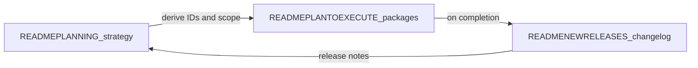

# READMEPLANTOEXECUTE — from strategy to shipped work

This file turns **[READMEPLANNING.md](READMEPLANNING.md)** into **traceable execution**: epics, work packages, acceptance criteria, primary code paths, and **status** you update until done. When a package ships, record it in **[READMENEWRELEASES.md](READMENEWRELEASES.md)** and optionally tick the cross-link in READMEPLANNING.

**Marketplace and “ready-to-bake” verticals:** the **Go-To** commercial story depends on shipping **catalog + install + proof** (see [READMEPLANNING.md](READMEPLANNING.md) §6). Track that work under epic **MK-01** below—not only the workflow editor (**WE-01**). Together they position a fork (e.g. **FulliO**) as **easy business voice**, not only infrastructure.

**Three experience tiers** (beautified no-code, minimal-code builders, full **agentic dev kit** with API + MCP + IDE): strategy in [READMEPLANNING.md](READMEPLANNING.md) §8; step-by-step journeys and **quality bar** in **[READMEEXPERIENCE.md](READMEEXPERIENCE.md)**; doc index in **[DOCS.md](DOCS.md)**; packages under epic **DX-01** below.

## Table of contents

- [Documentation workflow](#documentation-workflow-use-for-all-major-efforts)
- [Operating model](#operating-model--upstream-repo-tasks-and-keeping-scope-small) — upstream, tasks, WIP, checklist
- [Epic MK-01](#epic-mk-01--marketplace-ready-to-bake-vertical-packs)
- [Epic WE-01](#epic-we-01-workflow-editor-layout-and-feature-parity-reference-ui)
- [Epic DX-01](#epic-dx-01-three-tier-experience-nocode-builder-agentic-adk)
- [Epic index](#epic-index-add-rows-as-new-epics-appear)
- [Changelog of this file](#changelog-of-execution-doc-itself)

## Documentation workflow (use for all major efforts)

1. **Plan** — Add or refine themes in [READMEPLANNING.md](READMEPLANNING.md) (pillars, competitive rows, growth bets). Keep aspirations honest with **Shipped / Partial / Gap**.
2. **Execute** — In **this file**, add an **Epic** with stable **work item IDs** (e.g. `WE-01-…`). Each item: goal, acceptance criteria, key files, dependencies, status.
3. **Ship** — When merged to your release branch, append **[READMENEWRELEASES.md](READMENEWRELEASES.md)** with version/date, what changed, and which IDs closed.
4. **Retro** — Optionally adjust READMEPLANNING (scores, near-term bullets) so planning stays aligned with reality.

**Status values:** `NotStarted` | `InProgress` | `Blocked` | `Done` (when `Done`, mirror into READMENEWRELEASES).

---

## Operating model — upstream repo, tasks, and keeping scope small

This section **buttons up** how your fork stays merge-friendly with the **external repo you cloned** (e.g. `dograh-hq/dograh`) while using **this file** as the **source of feature work**—with **[READMEPLANNING.md](READMEPLANNING.md)** feeding new ideas **incrementally**, not as a dump.

### Source of truth (read this once)

| Layer | Role | What changes how often |
|-------|------|-------------------------|
| **[READMEPLANNING.md](READMEPLANNING.md)** | Strategy, pillars, vertical catalog, growth bets | Quarterly or when strategy shifts; **do not** turn every paragraph into a task overnight. |
| **READMEPLANTOEXECUTE.md (this file)** | **Actionable backlog**: epics, package IDs, acceptance criteria, status | **Weekly** (or per sprint): add packages, move one item to `InProgress`, close to `Done`. |
| **[READMENEWRELEASES.md](READMENEWRELEASES.md)** | Proof of what shipped | **Per release** when IDs close. |
| **[READMEBUILDME.md](READMEBUILDME.md) §6** | Git: remotes, merge vs rebase, submodule, conflict zones | When pulling upstream or bumping `pipecat`. |
| **External task system** (Linear, Jira, GitHub Issues/Projects, etc.) | Day-to-day assignees, dates, dependencies | **Mirror** the same IDs (`MK-01-CATALOG`, `WE-01-SHELL`, …) in titles or labels so nothing lives only in chat. |

**Rule:** New work **lands in READMEPLANNING** as narrative first; it **moves to READMEPLANTOEXECUTE** only when you are willing to staff it (add a package under an epic or create a new epic). If it is not in this file with an ID, it is **not** a committed feature—just intent.

### Bringing in the external repo (cadence with features)

Follow [READMEBUILDME.md](READMEBUILDME.md) **§6 Fork and upstream sync playbook** in spirit:

1. **Dedicated upstream integration** — merge `upstream/main` (or your vendor branch) on a **branch by itself** (e.g. `chore/merge-upstream-2026-04-17`). Run tests and a quick voice smoke (WebRTC + one PSTN path if you use it).
2. **Do not mix** a large upstream merge with a big **MK-01** / **WE-01** feature in the same PR unless unavoidable; you want a clean bisect if something breaks.
3. **`pipecat` submodule** — bump on its own commit; note the commit hash in READMENEWRELEASES when you ship it.
4. **Your fork-only code** stays in predictable paths ([READMEBUILDME.md](READMEBUILDME.md) §5) so rebases/merges touch fewer files.

### Project / task system (how it maps here)

- **Epic** = section **MK-01**, **WE-01**, **DX-01**, or a future `XX-NN` block in this file.
- **Task** = a **package** under an epic (`MK-01-CATALOG`, `WE-01-PALETTE`, …).
- In Jira/Linear/GitHub: one issue per package **or** one issue per epic with sub-tasks per package—**either way**, the **ID string** matches this doc.

### WIP limits — “not too much at once”

- Prefer **one** `InProgress` package per epic (e.g. only `WE-01-SHELL` **or** only `MK-01-CATALOG`, not five at once) unless you have multiple engineers and explicit ownership.
- When **READMEPLANNING** grows (new §6 rows, new bets), **do not** add ten packages the same day—pick **the next smallest shippable slice** (e.g. catalog schema + one vertical seed before `MK-01-BROWSE`).
- If scope creeps, **split** a package (`WE-01-TEST-A`, `WE-01-TEST-B`) rather than leaving one giant `InProgress` forever.

### Current focus (optional; edit each sprint)

| Active packages (`InProgress`) | Owner | Notes |
|--------------------------------|-------|-------|
| _None — set when you start work_ | | |

### Checklist before you add work from READMEPLANNING

- [ ] The idea is **already** in READMEPLANNING (or you added a short paragraph there first).
- [ ] You created or updated a **package** here with acceptance criteria—not just a bullet in planning.
- [ ] You are **not** duplicating the same work under two IDs.
- [ ] Upstream merge is **either** done **or** scheduled; you know if this work touches `pipecat/` or generated `ui/src/client/`.

---

## Epic MK-01 — Marketplace: ready-to-bake vertical packs

**Epic owner:** _TBD_  
**Strategy anchor:** [READMEPLANNING.md](READMEPLANNING.md) §6 (vertical catalog, differentiation) and [READMEBUILDME.md](READMEBUILDME.md) §0 / §10.  
**Goal:** buyers **discover**, **try**, and **install** opinionated voice workflows per industry with minimal engineering—supporting the **marketplace row** in READMEPLANNING’s competitive table (**Gap** today).

### MK-01-CATALOG — Template catalog schema and seed data

**Status:** `NotStarted`

**Goal:** For each vertical row in READMEPLANNING §6, define a **template record**: slug, industry, use cases[], languages[], supported modes (`webrtc` | `pstn`), compliance tags, preview audio URL, cost/latency **estimate band**, `workflow_definition_id` or packaged JSON.

**Acceptance criteria:**

- [ ] At least **three** vertical packs documented as JSON or DB seeds (healthcare, retail, B2B SaaS suggested first).
- [ ] Each pack links to a **runbook** (markdown) checked into repo or docs site.

**Key files:** [api/db/models.py](api/db/models.py) `WorkflowTemplates`, [api/db/workflow_template_client.py](api/db/workflow_template_client.py), [api/routes/workflow.py](api/routes/workflow.py).

---

### MK-01-INSTALL — One-click “install into my org”

**Status:** `NotStarted`

**Goal:** API + UI: user picks pack → clone workflow + variables + optional tools stub list → lands in editor with **read-only** graph until user clicks “Customize”.

**Acceptance criteria:**

- [ ] No cross-org data leak; new workflow `organization_id` is caller’s org.
- [ ] Variables surface in dashboard for non-technical editing.

**Key files:** [api/routes/workflow.py](api/routes/workflow.py), UI workflow list/create flows under [ui/src/app/workflow/](ui/src/app/workflow/).

---

### MK-01-TRY — Try flow from catalog (Web + persona)

**Status:** `NotStarted`

**Goal:** From template detail: launch **Web call** or **simulated user** without full publish (sandbox org or flagged run).

**Acceptance criteria:**

- [ ] Costs labeled (LLM vs telephony); no surprise PSTN charges on “Try”.
- [ ] Reuse or extend [api/routes/looptalk.py](api/routes/looptalk.py) where applicable.

**Dependencies:** may overlap **WE-01-TEST**; coordinate so one backend path serves editor and marketplace.

---

### MK-01-BROWSE — Discover UI (industry / use case / filters)

**Status:** `NotStarted`

**Goal:** Marketplace browse page (or section of dashboard) with filters aligned to READMEPLANNING §6 table.

**Acceptance criteria:**

- [ ] Filter by industry, use case tag, language, compliance tag.
- [ ] SEO-friendly public page **optional** (static export or Next route).

**Key files:** new routes under [ui/src/app/](ui/src/app/).

---

### MK-01-PARTNER — Partner submit + review pipeline

**Status:** `NotStarted`

**Goal:** Partners submit packs; internal or community **review** checklist before `published`; optional revenue share fields (roadmap).

**Acceptance criteria:**

- [ ] Documented review criteria (safety, PII, telephony compliance copy).
- [ ] Version semver on pack updates.

---

## Reference: competitor-style workflow editor (screenshot baseline)

**Goal:** Extend our workflow editor **layout and capabilities** toward the UX shown in the **April 2026 reference screenshot** (patient screening template): persistent **left palette** (nodes + components), **dense header** (metadata, cost/latency/token hints, Create vs Simulation, autosave, publish), **right rail** (Global settings + in-editor test agent: audio/LLM tests, manual chat, AI-simulated user), **canvas** tools, and **subflow / component** tabs in a footer bar.

**Current implementation (ground truth):**

| Area | Today | Primary paths |
|------|--------|----------------|
| Layout | Full-width canvas under header; **no** persistent left/right rails | [ui/src/app/workflow/[workflowId]/RenderWorkflow.tsx](ui/src/app/workflow/[workflowId]/RenderWorkflow.tsx) |
| Header | Name, save, publish, run/phone, version history | [ui/src/app/workflow/[workflowId]/components/WorkflowEditorHeader.tsx](ui/src/app/workflow/[workflowId]/components/WorkflowEditorHeader.tsx) |
| Add nodes | Modal / panel from floating **+** (not a docked palette) | [ui/src/components/flow/AddNodePanel.tsx](ui/src/components/flow/AddNodePanel.tsx) |
| Settings | Separate **settings** route, not right rail | [ui/src/app/workflow/[workflowId]/settings/page.tsx](ui/src/app/workflow/[workflowId]/settings/page.tsx) |
| Test / simulate | **Web call** dialog; not the same as inline “Test Agent” + AI user simulator | [ui/src/app/workflow/[workflowId]/components/PhoneCallDialog.tsx](ui/src/app/workflow/[workflowId]/components/PhoneCallDialog.tsx) |
| Node types | `startCall`, `agentNode`, `endCall`, `globalNode`, `trigger`, `webhook`, `qa` | [ui/src/components/flow/types.ts](ui/src/components/flow/types.ts), [RenderWorkflow.tsx](ui/src/app/workflow/[workflowId]/RenderWorkflow.tsx) `nodeTypes` |
| Backend graph | Pipecat / workflow engine consumes persisted JSON | [api/services/workflow/pipecat_engine.py](api/services/workflow/pipecat_engine.py), [api/routes/workflow.py](api/routes/workflow.py) |

**READMEPLANNING alignment:** Pillar 1 (dual-mode editors, templates, non-technical UX), competitive row **Authoring**, growth bet **18** (embeddable concierge — share patterns with in-editor test).

---

## Epic WE-01 — Workflow editor: layout and feature parity (reference UI)

**Epic owner:** _TBD_  
**Target:** iterative releases; do not block shipping on full parity.

### WE-01-SHELL — Three-column resizable shell

**Status:** `NotStarted`

**Goal:** Persistent **left rail** (palette width ~240–280px), **center** React Flow canvas, **right rail** (inspector / test ~320–400px), all **resizable** with persisted widths (localStorage or user prefs API later).

**Acceptance criteria:**

- [ ] Layout works at 1280px width without horizontal scroll on canvas controls.
- [ ] Rails collapse to icons on narrow breakpoints (optional follow-up: document breakpoint in READMENEWRELEASES).
- [ ] No regression: save, publish, version history, read-only historical version still reachable.

**Key files:** [RenderWorkflow.tsx](ui/src/app/workflow/[workflowId]/RenderWorkflow.tsx), new layout component under `ui/src/app/workflow/[workflowId]/components/` (suggested: `WorkflowEditorShell.tsx`).

---

### WE-01-PALETTE — Docked node + component palette

**Status:** `NotStarted`

**Goal:** Replace floating-only add flow with a **left dock** matching reference: tabs **Nodes | Components**; grouped draggable entries (colors/icons optional parity).

**Acceptance criteria:**

- [ ] All **existing** node types reachable from palette without opening a separate modal, or modal only for “advanced add”.
- [ ] Drag-to-canvas or click-to-add at viewport center — pick one pattern and document it.
- [ ] Keyboard: focus trap / Escape behavior documented.

**Key files:** [AddNodePanel.tsx](ui/src/components/flow/AddNodePanel.tsx), [useWorkflowState](ui/src/app/workflow/[workflowId]/hooks/useWorkflowState.ts) (or equivalent) for `handleNodeSelect`.

**Parity map (reference → current / new):**

| Reference node | Approach |
|----------------|----------|
| Conversation | Extend **Agent** node UX/copy; same `NodeType.AGENT_NODE` unless product renames. |
| Subagent | **New** node type or subgraph call — needs [api](api) graph validation + Pipecat support (likely **Blocked** until backend design). |
| Function | Overlap with **tools** on agent nodes + **Webhook**; clarify product: dedicated “inline function” node vs tool. |
| Call Transfer | Tool-based transfer today — optional dedicated node for discoverability. |
| Press Digit | **New** — DTMF / gather digit path; telephony + Pipecat. |
| Logic Split | Partially **edges with conditions** (`CustomEdge`); may need “split” visual node. |
| Agent Transfer | **New** or subgraph — backend routing. |
| In-Call SMS | **New** — provider + compliance. |
| Extract Variable | Partially **extraction** fields on `FlowNodeData` — surface as first-class palette entry. |
| Code | **New** — sandboxed expression step (high risk); phase later. |
| MCP | **New** — surface MCP tools / servers in graph ([api/app.py](api/app.py) MCP mount exists). |
| Ending | Maps to **End Call**. |
| Note | **New** — canvas-only annotation, not executed. |

---

### WE-01-HEADER — Header metadata and modes

**Status:** `NotStarted`

**Goal:** Richer header: **template source** label, optional **Agent/workflow IDs** (non-secret), **estimated cost / latency / token** band (from last N runs or dry-run — **Gap** until API exists), **Create | Simulation** tabs, **autosave** indicator, feedback entry point.

**Acceptance criteria:**

- [ ] “From template **X**” when `workflow` was created from `WorkflowTemplates` (API field may need exposing — **Partial** check backend).
- [ ] Simulation tab switches right rail to test-focused UI without losing canvas (coordinate with WE-01-TEST).
- [ ] No PII in header diagnostics.

**Key files:** [WorkflowEditorHeader.tsx](ui/src/app/workflow/[workflowId]/components/WorkflowEditorHeader.tsx), workflow GET payloads from [api/routes/workflow.py](api/routes/workflow.py).

---

### WE-01-RIGHT-INSPECTOR — Global settings + node inspector in rail

**Status:** `NotStarted`

**Goal:** Move or **mirror** key flows from [settings/page.tsx](ui/src/app/workflow/[workflowId]/settings/page.tsx) into **Global Settings** tab on right rail; second tab or accordion for **selected node** properties (reduce double-click modal only workflow).

**Acceptance criteria:**

- [ ] Changing global settings updates same store/API as today’s settings page (single source of truth).
- [ ] Deep link `/workflow/:id/settings` still works for power users (or redirects to editor with tab).

**Key files:** settings page components, [WorkflowProvider](ui/src/app/workflow/[workflowId]/contexts/WorkflowContext.tsx).

---

### WE-01-TEST — In-editor Test Agent (manual + AI user)

**Status:** `NotStarted`

**Goal:** Right-rail **Test Agent**: **Test Audio**, **Test LLM**, **raw JSON** toggle, **manual** message thread, **AI-simulated user** with configurable persona (align with [READMEPLANNING](READMEPLANNING.md) LoopTalk / eval direction).

**Acceptance criteria:**

- [ ] Manual text path does not place PSTN charges; cost label honest (LLM-only if applicable).
- [ ] Simulated user uses a defined API (may reuse or extend [api/routes/looptalk.py](api/routes/looptalk.py) patterns).
- [ ] Raw view shows run request/response for debugging (redact secrets).

**Dependencies:** WE-01-SHELL, likely backend endpoints for “headless” graph run.

---

### WE-01-SUBFLOWS — Main flow vs component tabs

**Status:** `NotStarted`

**Goal:** Footer (or sub-header) tabs: **Main Flow**, **Component S1**, … backed by either multiple React Flow stores or subgraph IDs in `workflow_json`.

**Acceptance criteria:**

- [ ] Published graph round-trips through API validation unchanged for single-flow workflows.
- [ ] Multi-tab requires **backend** story — mark **Blocked** until [api/services/workflow](api/services/workflow) accepts nested graphs or references.

**Key files:** [types.ts](ui/src/components/flow/types.ts) `WorkflowDefinition`, [api/services/workflow](api/services/workflow).

---

### WE-01-DUALMODE — Form vs raw code tab (nodes + tools)

**Status:** `NotStarted`

**Goal:** Per READMEPLANNING Pillar 1: **Form** and **Raw** (JSON/YAML) tabs for node payload and tool wiring, with schema validation and diff vs last saved.

**Acceptance criteria:**

- [ ] Invalid JSON blocks save with actionable errors.
- [ ] Switching tabs does not drop unsaved changes (dirty state).

**Key files:** [NodeEditDialog.tsx](ui/src/components/flow/nodes/common/NodeEditDialog.tsx), tool config under [ui/src/app/tools](ui/src/app/tools).

---

### WE-01-A11Y-QA — Accessibility and editor QA

**Status:** `NotStarted`

**Goal:** Focus order, ARIA for rails, contrast on dark theme parity with reference.

**Acceptance criteria:**

- [ ] Core author path keyboard-only smoke test documented in READMENEWRELEASES for the release that ships WE-01-SHELL.

---

## Epic DX-01 — Three-tier experience (no-code, builder, agentic ADK)

**Epic owner:** _TBD_  
**Strategy anchor:** [READMEPLANNING.md](READMEPLANNING.md) §8.  
**Goal:** Ship a **cohesive** story: **Tier 1** beautified no-code UI, **Tier 2** minimal-code recipes for entrepreneurs, **Tier 3** full **agentic dev kit** (OpenAPI, MCP, IDE, generated client)—without three separate products. Same backend; different **entry points** and **documentation depth**.

### DX-01-NOCODE — Beautified operator experience

**Status:** `NotStarted`

**Goal:** Template-first dashboard, strong empty states, publish validation copy, accessibility; **hide complexity** until “Advanced” (coordinates with **WE-01** shell + dual-mode). Marketplace install path when **MK-01** lands.

**Acceptance criteria:**

- [ ] New user can reach **Web test** from template or blank workflow without reading JSON.
- [ ] Validation errors are **human-readable** on publish/save (audit current `WorkflowError` surfacing in UI).
- [ ] Documented **happy path** screenshot or Loom script for GTM.
- [ ] [READMEEXPERIENCE.md](READMEEXPERIENCE.md) no-code journey stays accurate after UI changes.

**Delight (optional but on-brand):** empty states with one primary CTA; success toast copy that confirms “you can share embed / phone next” without jargon.

**Dependencies:** overlaps **WE-01-SHELL**, **MK-01-INSTALL**; prioritize shared design tokens / layout first.

---

### DX-01-BUILDER — Minimal-code entrepreneur path

**Status:** `NotStarted`

**Goal:** **Recipes** not novels: Twilio/Vonage attach, webhook URLs, embed snippet, campaign CSV—each as a **single doc page** or in-app drawer with **copy buttons**. Link from dashboard “Connect” or “Recipes.”

**Acceptance criteria:**

- [ ] At least **three** recipes (inbound PSTN, outbound campaign, embed widget) with env vars listed explicitly.
- [ ] Each recipe lists **exact** API paths from [READMELEARNME.md](READMELEARNME.md) §3 (or OpenAPI tags).
- [ ] Optional: Postman / OpenAPI import link.
- [ ] [READMEEXPERIENCE.md](READMEEXPERIENCE.md) builder journey links to each shipped recipe.
- [ ] [recipes/README.md](recipes/README.md) index lists every recipe file with one-line purpose.

**Key files:** [recipes/](recipes/) (markdown per recipe); Mintlify or public docs can mirror; deep links from [ui/src/app/](ui/src/app/) later.

---

### DX-01-ADK — Agentic dev kit (IDE + API + MCP)

**Status:** `NotStarted`

**Goal:** First-class **developer** surface: OpenAPI URL prominent in [READMEBUILDME.md](READMEBUILDME.md) / dev setup; **MCP** documented with auth (`X-API-Key` per [api/app.py](api/app.py)); `npm run generate-client` in CI docs; **Cursor/IDE** rules file optional (`.cursor/rules` or link to [AGENTS.md](AGENTS.md)); local **split stack** one screen.

**Acceptance criteria:**

- [ ] **[READMEADK.md](READMEADK.md)** kept accurate as the single entry point (base URL, `/api/v1/openapi.json`, `/api/v1/mcp`, WebSocket routes, auth headers).
- [ ] Example: **MCP** tool call + **REST** workflow publish in **Python or curl**—minimal copy-paste.
- [ ] Statement on **generated client** regeneration after API change ([ui/AGENTS.md](ui/AGENTS.md)).
- [ ] [READMEEXPERIENCE.md](READMEEXPERIENCE.md) ADK journey points to READMEADK + upstream §.

**Key files:** [READMEADK.md](READMEADK.md) (maintain on each API surface change).

**Note:** Does **not** require new backend unless you add CLI; leverage existing [api/mcp/](api/mcp/) and OpenAPI.

---

## Epic index (add rows as new epics appear)

| ID | Title | READMEPLANNING anchor |
|----|--------|------------------------|
| MK-01 | Marketplace: ready-to-bake vertical packs | §6 Marketplace and GTM |
| WE-01 | Workflow editor parity (reference UI) | §2 Pillar 1, §1 Authoring row |
| DX-01 | Three-tier experience (no-code, builder, ADK) | §8 Experience tiers |
| _TBD_ | (next epic) | … |

---

## Changelog of execution doc itself

| Date | Change |
|------|--------|
| 2026-04-17 | DX-01 stack: READMEEXPERIENCE (decision/FAQ/quality bar), READMEADK, recipes, ui/AGENTS; DOCS.md map; prior MK-01/WE-01/planning/ops. |
